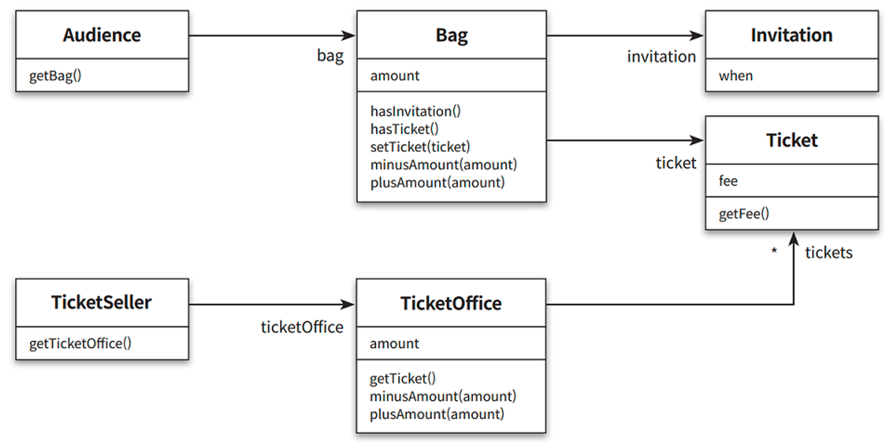
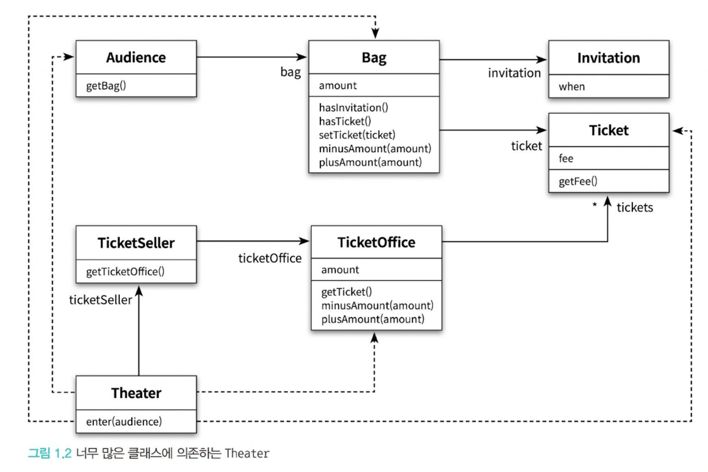
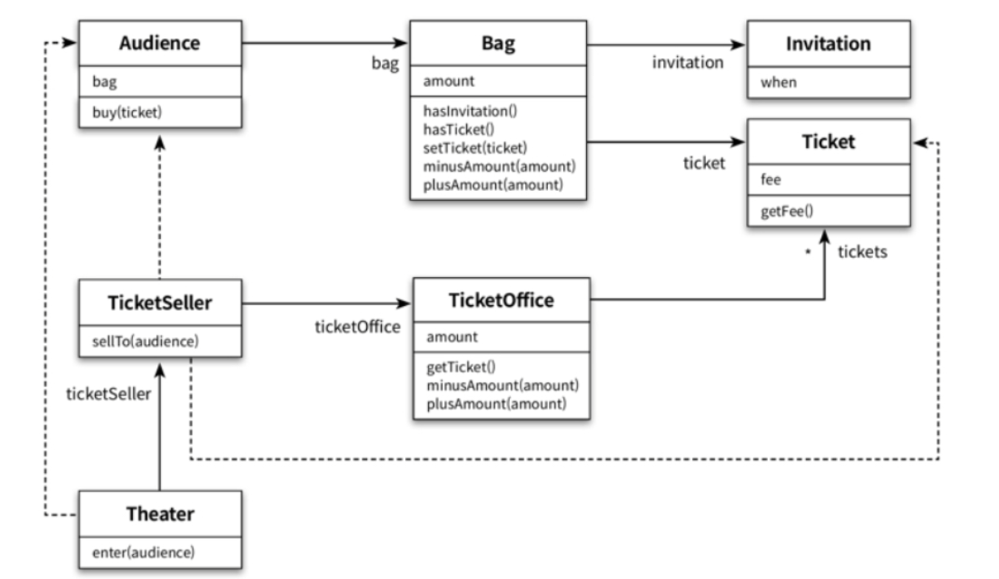
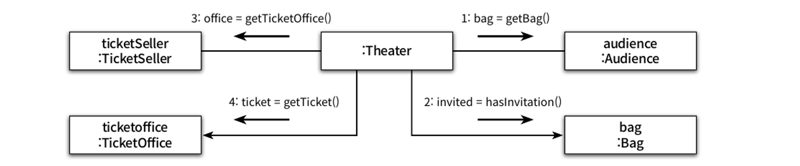
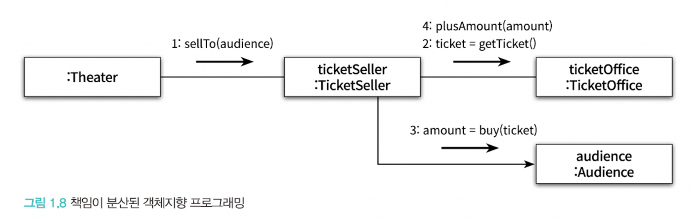
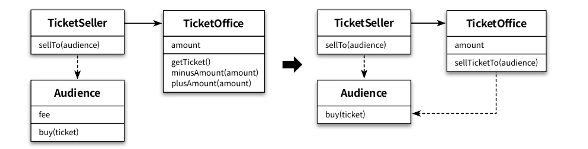

# 1장 객체, 설계

# 티켓 판매 애플리케이션

---

- 무료로 관람할 수 있는 **초대장**을 이용한 고객과 **현금 구매를** 통해 관람하는 고객를 구분 후 티켓을 판매하고, 공연을 관람할 수 있도록 하는 어플리케이션를 만들어보자

```java
public class Invitation {
    private LocalDateTime when; // 초대 일자
}
```

- 이벤트 당첨자에게 발송되는 초대장(Invitation)을 구현

```java
public class Ticket {
    private Long fee;

    public Long getFee() {
        return fee;
    }
}

```

- 공연을 관람하기 원하는 사람들을 위한 티켓 클래스
    - 이벤트 당첨자는 티켓을 교환할 초대장을, 당첨 되지 않은 사람은 현금을 보유함.
    - 관람객이 가지는 소지품은 초대장, 현금, 티켓 뿐이다.


```java
public class Bag {
    private Long amount;
    private Invitation invitation;
    private Ticket ticket;

    public Bag(Long amount) {
        this(amount,null);
    }

    public Bag(Long amount, Invitation invitation) {
        this.amount = amount;
        this.invitation = invitation;
    }

    public boolean hasInvitation() {
        return invitation != null;
    }

    public boolean hasTicket() {
        return ticket != null;
    }

    public void setTicket(Ticket ticket) {
        this.ticket = ticket;
    }

    public void plusAmount(Long amount) {
        this.amount += amount;
    }

    public void minusAmount(Long amount) {
        this.amount -= amount;
    }
}
```

- 관람객이 소지품을 보관할 Bag 클래스
    - 여기에는 초대장(Invitation), 티켓(ticket), 현금(amount)을 소지품을 변수로 포함하고, 각 소지품 소유 여부를 판단하는 메서드, 현금을 증가,감소 시키는 메서드를 가짐.

```java
public class Audience {
    private Bag bag;

    public Audience(Bag bag) {
        this.bag = bag;
    }

    public Bag getBag() {
        return bag;
    }
}

```

- 관람객을 나타내는 클래스
    - 관람객은 소지품을 보관할 수 있어야 하기 때문에, 소지품을 보관할 Bag을 가짐

```java
public class TicketOffice {
    private Long amount;
    private List<Ticket> tickets = new ArrayList<>();

    public TicketOffice(Long amount, Ticket... tickets) {
        this.amount = amount;
        this.tickets.addAll(Arrays.asList(tickets));
    }

    public Ticket getTicket() {
        return tickets.remove(0);
    }

    public void plusAmount(Long amount) {
        this.amount += amount;
    }

    public void minusAmount(Long amount) {
        this.amount -= amount;
    }
}
```

- 관람객이 소극장에 입장하기 위해 매표소에서 초대장을 티켓으로 교환하거나, 현금으로 구매해야함.
    - 따라서 매표소에는 판매할 티켓과 티켓 판매 금액을 가지고 있어야함.

```java
public class TicketSeller {
    private TicketOffice ticketOffice;

    public TicketSeller(TicketOffice ticketOffice) {
        this.ticketOffice = ticketOffice;
    }

    public TicketOffice getTicketOffice() {
        return ticketOffice;
    }
}
```

- 판매원을 나타내는 클래스
    - 초대장을 티켓으로 교환해주거나, 티켓을 판매하는 역할을 수행한다.
    - 판매원을 구현한 TicketSeller 클래스는 자신이 일하는 매표소(TicketOffice)를 알고 있어야 함.



애플리케이션의 핵심 클래스

위 클래스들을 조합해서 관람객을 소극장에 입장 시키는 로직을 완성시키면 됨.

```java
public class Theater {
    private TicketSeller ticketSeller;

    public Theater(TicketSeller ticketSeller) {
        this.ticketSeller = ticketSeller;
    }

    public void enter(Audience audience) {
        if (audience.getBag().hasInvitation()) {
            Ticket ticket = ticketSeller.getTicketOffice().getTicket();
            audience.getBag().setTicket(ticket);
        } else {
            Ticket ticket = ticketSeller.getTicketOffice().getTicket();
            audience.getBag().minusAmount(ticket.getFee());
            ticketSeller.getTicketOffice().plusAmount(ticket.getFee());
            audience.getBag().setTicket(ticket);
        }
    }
}

```

1. 소극장은 관람객의 가방안에 초대장이 들어있는지 확인한다
    1. 초대장이 들어있다면, 이벤트에 당첨된 사람을 판매원에게서 받은 티켓을 관람객의 가방에 넣어준다.
    2.  초대장이 없다면, 티켓을 판매한다.
        1. 이때, 관람객의 가방에서 티켓 금액만큼 현금을 차감 후 매표소에서 티켓 판매금액을 증가시킨다.
        2. 그리고, 가방안에 티켓을 넣어주고, 관람객의 입장 절차를 끝낸다.

위 코드는 예상대로 동작하지만, 몇가지 문제점을 가지고 있다.

# 여기서 무엇이 문제인가?

### 로버트 마틴이 말하는 소프트웨어 모듈이 가져야 하는 세가지 기능

1. 실행중 제대로 동작하는것
2. 변경을 위해 존재하는것
    - 대부분의 모듈은 생명주기 동안 변경되기 때문에 간단한 작업만으로도 변경이 가능해야함.
3. 코드를 읽는 사람과 의사소통 하는것

> 결론 : 모든 모듈은 제대로 실행되어야하고, 변경에 용이해야하며, 이해하기 쉬워야함
>

→ 하지만 앞서 구현한 티켓 판매 애플리케이션은 동작은 정상적으로 실행시킬뿐, 변경 용이성과 가독성은 좋지 않다.

## 예상을 빗나가는 코드

- 해당 Theater 클래스의 enter 코드를 말로 해보면
    - 소극장은 관객의 가방을 열어 그 안에 초대장이 있는지 확인한다.
    - 가방안에 초대장이 있으면 판매원은 매표소에 보관돼 있는 티켓을 관람객의 가방 안으로 옮긴다.
    - 가방 안에 초대장이 들어 있지 않다면 관객의 가방안에서 티켓 금액만큼의 현금을 꺼내, 매표소에 적립 후 매표소에 보관되어 있는 티켓을 관객의 가방으로 옮긴다.

> 이 때 문제점이 무엇인가? → 관람객과 판매원은 소극장의 통제를 받는 `수동적인 존재`이다.
>

### 그래서 코드를 이해하기 어려운 이유?

1. 이해 가능한 코드란 그 동작이 우리의 예상에서 크게 벗어 나지 않는 코드다.
- 위 코드에서는 소극장이 관람객의 가방을 마음대로 열어보고 초대장이 있는지 확인한다.
- 반대로, 현실에서는 관람객이 직접 자신의 가방에서 초대장을 꺼내 판매원에게 건넨다.

> 현재 코드는 상식과는 다르게 동작하기 때문에 코드를 읽는 사람과 제대로 의사소통 하지 못한다.
>
1. 여러가지 세부적인 내용들을 한꺼번에 기억하고 있어야 한다.
- Theater의 enter 메서드를 이해하기 위해서는 Audience가 Bag을 가지고 있고, Bag에는 현금과 티켓이 있고, TicketSeller가 TicketOffice에서 티켓을 판매하고, TicketOffice안에 돈과 티켓이 보관되어 있는 사실을 모두 기억하고 있어야 한다.

> 하나의 클래스나 메서드에 너무 많은 세부사항을 다루기 때문에 코드 작성자 뿐만 아니라, 코드를 읽는 사람도 이해하는 사람에게 큰 부담을 준다.
>

## 변경에 취약한 코드



- 만야, 이 상황에서 수정이 필요하다면 어떻게 될까?
    - 관람객이 가방을 들고 있지 않으면 어떻게 해야할까?
        - Audience클래스에서 Bag을 제거하고, Theater에서 enter 메서드도 수정해야한다.
    - Theater는 관람객이 가방을 들고있고, 판매원이 매표소에서만  티켓을 판매하고.. 등 세부적인 사실에 의존해서 동작한다.
        - 그래서, 이 세부적인 사실 중 한가지라도 바뀌면 해당 클래스 뿐만 아니라, 이 클래스에 의존하는 Theater도 함께 변경해야 한다.
        - 이렇게 다른 클래스가 Audience를 많이 알면 알수록 Audience는 수정하기 어려워진다.

> 이것은 객체 사이의 **의존성** 관련된 문제다.
>

### 의존성

- 의존성은 변경과 관련되어있다.
- 의존성은 변경에 대한 영향을 암시한다.
    - 어떤 객체가 변경 될 때, 그 객체에게 의존하는 다른 객체도 함께 변경될 수 있다는 사실이 내포되어 있다.

> 그렇다고, 객체 사이의 의존성을 완전히 없애는 것이 정답은 아니다.
객체지향 설계는 서로 의존하면서 협력하는 객체들의 공동체를 구축하는 것이다.
따라서, 우리의 목표는 **애플리케이션의 기능을 구현하는데 필요한 최소한의 의존성만 유지하고, 불필요한 의존성을 제거하는것이 중요**하다.
>

객체 사이의 의존성을 **`결합도(Coupling)`**라고 한다.

- 객체 사이의 의존성이 과한 경우 결합도가 높다고 말한다.
- 객체들이 합리적인 수준으로 의존할 경우 결합도가 낮다고 말한다.

> 객체 사이의 결합도가 높으면 높을수록 함께 변경될 확률도 높아지기 때문에 변경하기 어려워진다.
>

# 설계 개선하기

예제 코드는 두가지 조건을 만족시키지 못한다.

- 이해하기 어렵고, 변경하기 쉽지 않다.

코드를 이해하기 어려운 이유는 ⇒ 관람객과 판매원이 자신의 일을 스스로 하지 않고, Theater에 의해 움직이는 수동적인 존재이다.

- Audience와 TicketSeller에 대해서 변경이 일어나면, Theater도 함께 변경해야 하기 때문에, 코드를 변경하기 어려워진다.
- Theater가 Audience와 TicketSeller에 대해서 세부적인 내용을 알지 못하도록 정보를 차단하면 해결 할 수 있다.

> 관람객이 가방을 가진다는 사실과 판매원이 매표소에서 티켓을 판매한다는 것을 Theater가 알아야 할 필요 없다.
관람객 스스로 가방의 현금과 초대장을 처리하고, 판매원이 매표소의 티켓과 요금을 다루면 해결할 수 있다.
⇒ 관람객과 판매원을 **`자율적인 존재`**로 만들면 된다.
>

### 자율성을 높이자

관람객과 판매원이 스스로 일을 처리하는 자율적인 존재가 되도록 설계를 변경

**Theater에서 TicketOffice로의 의존성 제거**

1. Theater의 enter에서 TicketOffice에 접근하는 모든 코드를 TicketSeller 내부로 숨긴다.

```java
public class Theater {
    private TicketSeller ticketSeller;

    public Theater(TicketSeller ticketSeller) {
        this.ticketSeller = ticketSeller;
    }
    
    // Theater에서 TicketSeller 코드 내부로 이동하고 이를 호출할 뿐이다.
    public void enter(Audience audience) {
        ticketSeller.sellTo(audience);
    }
}

```

```java
public class TicketSeller {
    private TicketOffice ticketOffice;

    public TicketSeller(TicketOffice ticketOffice) {
        this.ticketOffice = ticketOffice;
    }
    
    // 제거
//    public TicketOffice getTicketOffice() {
//        return ticketOffice;
//    }

		// 추가
    public void sellTo(Audience audience) {
        if (audience.getBag().hasInvitation()) {
            Ticket ticket = ticketOffice.getTicket();
            audience.getBag().setTicket(ticket);
        } else {
            Ticket ticket = ticketOffice.getTicket();
            audience.getBag().minusAmount(ticket.getFee());
            ticketOffice.plusAmount(ticket.getFee());
            audience.getBag().setTicket(ticket);
        }
    }
}
```

- TicketSeller 에서 getTicketOffice 메서드가 제거 되었다. (내부 구현 캡슐화)
    - 이는 ticketOffice의 접근 제어가 private이고, 퍼블릭 메서드가 없기 때문에 외부에서 직접 접근할 수 없다는 뜻이다.
    - 티켓을 판매하는 등의 일을 할 때, ticketOffice에 대한 접근은 오직 TicketSeller가 스스로 수행할 수 밖에 없다.

> 이처럼 개념적이나 물리적으로 객체 내부의 세부적인 사항을 감추는 것을 **`캡슐화(encapsulation)`**이라고 부른다.
>

수정한 코드의 Theater는 오직 TicketSeller의 인터페이스에만 의존한다.

- Theater는 단지 TicketSeller의 sellTo 메서드를 통해 메시지를 이해하고, 응답할 수 있고, **`인터페이스(Interface)`**에만 의존한다.
- TicketSeller가 내부에 TicketOffice 인스턴스를 포함하고 있다는 사실은 **`구현(Implementation)`**의 영역에 속한다.

> 객체를 인터페이스와 구현으로 나누고, 인터페이스만을 공개하는 것은 객체 사이의 결합도를 낮추고, 변경하기 쉬운 코드를 작성하기 위해 따라야 하는 가장 기본적인 설계 원칙이다.
>

```java
public class Audience {
    private Bag bag;

    public Audience(Bag bag) {
        this.bag = bag;
    }

//    public Bag getBag() {
//        return bag;
//    }

		// 추가
    public Long buy(Ticket ticket) {
        if (bag.hasInvitation()) {
            bag.setTicket(ticket);
            return 0L;
        } else {
            bag.setTicket(ticket);
            bag.minusAmount(ticket.getFee());
            return ticket.getFee();
        }
    }
}
```

- 변경된 코드에서 Audience는 자신의 가방안에 초대장이 들어있는지 스스로 확인한다.
    - 외부의 제 3자가 자신의 가방을 열어보도록 허용하지 않고, 그럴 이유도 없다.
    - Bag의 존재를 내부로 캡슐화 할 수 있게 되었고, 좀 더 자율적인 객체가 되었다.

```java
public class TicketSeller {
    private TicketOffice ticketOffice;

    public TicketSeller(TicketOffice ticketOffice) {
        this.ticketOffice = ticketOffice;
    }
		
		// audience의 인터페이스에만 의존하고, Bag에는 직접 의존하지 않도록 함.
    public void sellTo(Audience audience) {
        ticketOffice.plusAmount(audience.buy(ticketOffice.getTicket()));
    }
}
```

- TicketSeller가 Audience의 buy라는 인터페이스에만 의존하도록 변경했다.
    - 둘 사이의 결합도가 낮아지고, 내부 구현이 캡슐화가 되면서, Audience의 구현을 수정하더라도 TicketSeller에는 영향을 미치지 않는다.



그림 1.6 자율적인 Audience와 TicketSeller로 구성된 설계

- 캡슐화를 개선 후 Audience와 TicketSeller가 내부 구현을 외부에 노출하지 않고 자신의 문제를 스스로 책임지고 해결한다.

### 무엇이 개선되었나

1. Audience와 TicketSeller는 자신이 가지고 있는 소지품을 스스로 관리한다.
    1. 이는 예상과 일치하고, 코드를 읽는 사람과의 의사소통이라는 관점에서 개선이 되었다.
2. 또 ,Audience와 TicketSeller의 내부 구현을 변경하더라도 Theater를 함께 변경할 필요가 없어졌다.
    1. 따라서, 변경 용이성의 측면에서도 확실히 개선되었다.

### 어떻게 한것인가?

1. 판매자가 티켓을 구매하기 위해 TicketOffice를 사용하는 모든 부분을 TicketSeller 내부로 옮기고, 관람객이 티켓을 구매하기 위해 Bag을 사용하는 부분을 모두 Audience 내부로 옮긴 것이다.
    1. **자기 자신의 문제를 스스로 해결하도록 코드를 변경한것이다.**
    2. 한마디로, **객체의 자율성을 높이는 방향으로 설계를 개선하였고**, 그 결과 이해하기 쉽고 유연한 설계를 얻을 수 있었다.

### 캡슐화와 응집도

- 핵심은 **객체 내부의 상태를 캡슐화**하고 **객체 간에 오직 메시지를 통해서만 상호작용**하도록 만드는 것이다.
    - Theater는 TicketSeller의 내부에 대해서는 전혀 알지 못하고, TicketSeller가 sellTo메시지를 이해하고 응답할 수 있다는 사실만 알고 있다.
    - TicketSeller도 Audience의 내부는 모르고, buy 메시지가 자신이 원하는 결과를 반환할 것 이라는 사실만 알고 있을 뿐이다.

밀접하게 연관된 작업만을 수행하고 연관성 없는 작업은 다른 객체에게 위임 객체를 가리켜 `응집도(cohesion)`가 높다고 말합니다.

자신의 데이터를 스스로 처리하는 자율적인 객체를 만들면 결합도를 낮출 수 있을뿐더러 응집도를 높일 수 있다.

### 절차지향과 객체지향

수정 전 코드는 Thearter의 enter 메서드 안에서 Audience, TicketSeller, Bag, TicketOffice에서 필요한 정보를 제공하고, 이를 이용해서 관람객 입장을 위한 모든 처리를 하였습니다.

- 여기서 Theater의 enter 메서드는 `프로세스(process)`이며, Audience, TicketSeller, Bag, TicketOffice는 `데이터(Data)`다.
- 이처럼 프로세스와 데이터를 별도의 모듈에 위치시키는 방식을 `절차적 프로그래밍(Procedural Programming)` 이라고 부른다.

**절차 지향 프로그래밍**

> 프로세스와 데이터를 별도의 모듈에 위치시키는 방식
>
- 직관을 위배하며, 직관을 위배한 코드는 코드를 읽는 사람과 원활하게 의사소통 하지 못하게 한다. (가독성이 좋지 않음)
- 데이터의 변경으로 인한 영향을 지역적으로 고립시키기 어렵다.
    - Audience와 TicketSeller의 내부 구현을 변경하려면 Theater의 enter 메서드를 함께 변경해야 한다.
    - 변경은 버그를 만들 수 있고, 버그에 대한 두려움은 코드를 변경하기 어렵게 만들기 때문에 절차적 프로그래밍은 변경하기 어려운 코드를 양산하는 경향이 있다.

**객체 지향 프로그래밍**

> 데이터와 프로세스를 동일한 모듈 내부에 위치하여 프로그래밍 하는 방식
>
- 변경된 코드에서는 Theater는 오직 TicketSeller만 의존한다.
    - TicketSeller는 Audience에 대한 의존성이 추가됐지만, 적절한 트레이드오프의 결과로 볼 수 있다.
    - 그림 1.6을 보면 의존성이 통제되면서 하나의 변경으로 인한 여파가 여러 클래스로 전파되는 것을 억제한다.
    - **훌륭한 객체지향 설계의 핵심은 캡슐화를 이용해서 의존성을 적절히 관리함으로써, 객체 사이의 결합도를 낮추는 것이다.**
        - 일반적으로 절차지향에 비해 객체지향이 더 변경에 유연하다고 말하는 이유가 바로 이것이다.

## 책임의 이동

객체지향과 절차지향 방식 사이에 근본적인 차이를 만드는 것은 **책임의 이동(Shift of Responsibility)** 이다.





- 변경 전 코드에서는 Theater가 모든 일을 책임 졌지만, 변경 후 코드에서는 각 객체가 자신이 해야할 일을 스스로 **책임**졌다.
    - **책임의 이동 (Theater → 각각의 객체)**
- 객체지향 설계의 핵심은 적절한 객체에 적절한 책임을 할당하는 것이다.
    - 그래서 객체가 어떤 데이터를 가지느냐보다, 객체에 어떤 책임을 할당할 것이냐에 초점을 맞춰야한다.
- 설계를 어렵게 하는것은 의존성이며, 해결 방법은 불필요한 의존성을 제거하여 객체 사이의 **결합도**를 낮추는것이다.
    - 결합도를 낮추기 위한 방법이 세부 사항을 내부로 감추는 **캡슐화이다 → 자율성을 높이고, 응집도 높은 객체들의 공동체를 창조하자**

### 더 개선해보기

1. **Audience에게 끌려다니는 Bag 개선하기**

```java
public class Bag {
    private Long amount;
    private Invitation invitation;
    private Ticket ticket;

    public Bag(Long amount) {
        this(amount,null);
    }

    public Bag(Long amount, Invitation invitation) {
        this.amount = amount;
        this.invitation = invitation;
    }
    
		// 추가
    public Long hold(Ticket ticket) {
        if (hasInvitation()) {
            setTicket(ticket);
            return 0L;
        } else {
            setTicket(ticket);
            minusAmount(ticket.getFee());
            return ticket.getFee();
        }
    }

    // 가시성 변경
    private void setTicket(Ticket ticket) {
        this.ticket = ticket;
    }

    private boolean hasInvitation() {
        return invitation != null;
    }

    private void minusAmount(Long amount) {
        this.amount -= amount;
    }
}
```

```java
public class Audience {
    private Bag bag;

    public Audience(Bag bag) {
        this.bag = bag;
    }

    public Long buy(Ticket ticket) {
        return bag.hold(ticket);
    }
}
```

- Bag의 내부 상태에 접근하는 모든 로직을 Bag 안에 옮기고, Audience는 이 hold 메서드를 호출하도록 변경한다.
    - Audience는 Bag의 구현이 아닌 인터페이스에만 의존한다.
- Bag은 관련된 상태와 행위를 함께 가지는 응집도 높은 클래스가 됐다.
    - 또, 외부에서 더이상 사용하지 않는 메서드들은 public → private으로 변경한다.

1. **TicketSeller, TicketOffice 사이 의존성 개선하기**

```java
public class TicketOffice {
    private Long amount;
    private List<Ticket> tickets = new ArrayList<>();

    public TicketOffice(Long amount, Ticket... tickets) {
        this.amount = amount;
        this.tickets.addAll(Arrays.asList(tickets));
    }
    
    public void sellTicketTo(Audience audience) {
        plusAmount(audience.buy(getTicket()));
    }

    private Ticket getTicket() {
        return tickets.remove(0);
    }

    private void plusAmount(Long amount) {
        this.amount += amount;
    }
}

```

- TicketOffice에 sellTicketTo 메서드를 만들어주고 TicketSeller의 sellTo 메서드를 옮겨줬다.

```java
public class TicketSeller {
    private TicketOffice ticketOffice;

    public TicketSeller(TicketOffice ticketOffice) {
        this.ticketOffice = ticketOffice;
    }

    public void sellTo(Audience audience) {
        ticketOffice.sellTicketTo(audience);
    }
}
```

- ticketOffice의 sellTicketTo 인터페이스에만 의존하도록 변경하였다.



- 이제 TicketSeller는 TicketOffice의 인터페이스에만 의존하게 되었는데, 문제는 기존에 없던 TicketOffice와 Audience 사이의 의존성이 추가되어 버렸다.
- TicketOffice의 자율성은 높였지만, 전체 설계의 관점에서 결합도가 상승되었다.
- 이 경우, TicketOffice의 자율성과 Audience의 결합도를 낮추는 것 중 더 중요하다고 생각하는 것을 선택해야한다.

**결론**

> 어떤 기능을 설계하는 방법은 한가지 이상일 수 있다.
>

> 동일한 기능을 한가지 이상의 방법으로 설계할 수 있기 때문에 결국 설계는 트레이드오프의 산물이다.
>
>
> 어떤 경우에도 모든 사람들을 만족 시킬 수 있는 설계를 만들 수는 없다.
>

### 그래, 거짓말이다!

Audience와 TicketSeller는 실세계에서 자율적인 존재가 맞지만, Theater, Bag, TicketOffice는 실세계에서는 자율적인 존재가 아니다.

- ex) 가방에서 돈을 꺼내는 것은 관람객이지 가방이 아니다.

하지만 , 이런 무생물 역시 스스로 행동하고 자기 자신을 책임지는 자율적인 존재로 취급한 것이다.

현실에서는 수동적인 존재여도 객체지향의 세계에서는 능동적이고 자율적인 존재로 바뀐다.

이런 능동적이고, 자율적인 존재로 소프트웨어 객체를 설계하는 원칙을 `의인화(anthropomorphism)` 이라고 한다.

`휼륭한 객체지향 설계`를 위해선 `생명이 없는 수동적인 존재`라고 하더라도 `객체지향의 세계`로 넘어오는 순간 `생명과 지능을 가진 싱싱한 존재`로 다시 태어난다.

# 객체지향 설계

### 설계가 필요한 이유

> 설계란 코드를 배치하는 것이다.
>
- 설계를 구현과 떨어뜨려서 이야기하는것은 불가능하다.
    - 설계는 코드를 작성하는 매순간 코드를 어떻게 배치할 것인지를 결정하는 과정에서 나온다.
    - 설계는 코드 작성의 일부이며, 코드를 작성하지 않고서는 검증할 수 없다.

### 좋은 설계란?

- `오늘 완성해야 하는 기능을 구현하는 동시에 내일의 변경을 매끄럽게 수용할 수 있는 설계다.`

**변경을 수용할 수 있는 설계가 중요한 이유**

- 첫째, 개발을 하는 시점에 구현에 필요한 모든 요구사항을 수집하는것은 불가능에 가깝고, 수집하더라도 중간에 바뀔수 밖에 없다.
- 두번째, 코드 수정은 버그가 발생할 가능성을 높인다.
    - 코드 수정을 회피하려는 가장 큰 원인은 `두려움`이다. 그리고 그 두려움은 요구사항 변경으로 인해 버그를 추가할지도 모른다는 `불확실성`에 기인한다.

### 객체지향 설계

- 변경에 유연하게 대응할 수 있는 코드를 작성해야 하는데, 객체지향 프로그래밍은 의존성을 효율적으로 통제할 수 있는 다양한 방법을 제공하고, 요구사항 변경에 좀 더 수월하게 대응할 수 있는 가능성을 높여준다.
- 변경 가능한 코드란 이해하기 쉬운 코드이며, 객체지향 패러다임은 세상을 바라보는 방식대로 코드를 작성할 수 있게 한다.
    - **세상에 존재하는 모든 자율적인 존재처럼 객체 역시 자신의 데이터를 스스로 책임지는 자율적인 존재다.**
- 단순하게 데이터와 프로세스를 객체라는 덩어리에 넣었다고 변경하기 쉬운 설계를 얻는것은 아니며, 객체지향에서 애플리케이션은 객체로 구성되며, 기능은 객체들간의 상호 작용을 통해 구현되고, 객체들 사이의 상호작용은 객체 사이에 주고받는 메시지로 표현된다.
    - 메시지를 전송하기 위한 두 객체를 결합시키고 이 결합이 객체 사이의 의존성을 만든다.
- 훌륭한 객체지향 설계란 협력하는 객체사이의 의존성을 적절하게 관리하는 설계며, 실행되는 주변 환경에 강하게 결합될수록 변경하기 어려워진다.
    - 객체간의 의존성은 애플리케이션을 수정하기 어렵게 만드는 주범이다.