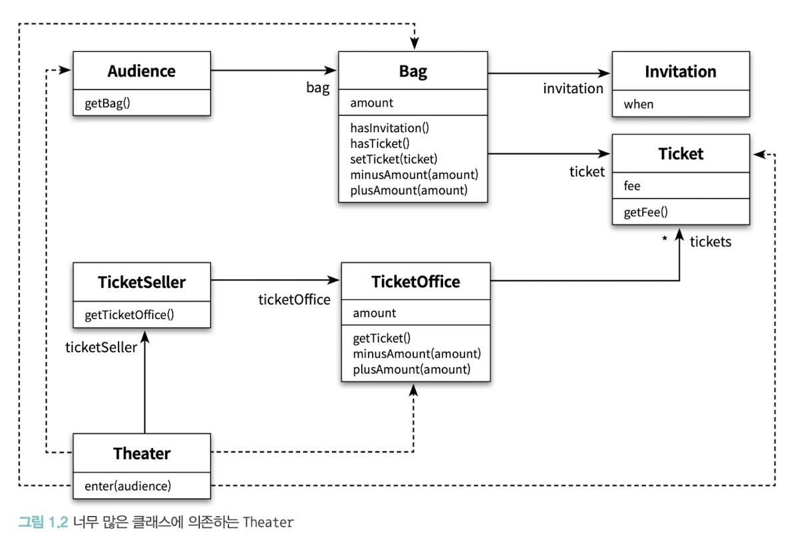

# 0. 서론

해당 책을 첫번째 읽었을때 부끄럽지만 ***“아.. 이런 내용이 객체지향이구나?”*** 그냥 당연하게 받아들이기만 했었고 해당 문장들과 글들에 대해 깊게 고민하지 않았었다.

그러다보니 해당 책에서 이야기했던 것중 내가 얻어갈 수 있는건 제한적이지 않았을까란 생각이 들었다.

이번 스터디를 통해 내가 생각하며 공감하며 읽었던 포인트를 정리해보고 이를 1회독때 읽었던 내용과 비교하며 나의 생각이 어떻게 달라졌는지 비교하며 체크해보고자 한다.

> 해당 정리에서는, 기억에 남는 내용들을 위주로 정리를 진행하였습니다.

순서는 다음과 같이 진행됩니다.
1. 책 내용 정리
2. 나의 생각

# 1. 이론 vs 실무

로버트 L. 글래스는 아래와 같은 질문을 던졌다.

**“이론이 먼저일까? 실무가 먼저일까?”**

해당 책을 기준으로 대부분의 사람들은 **이론 → 실무**가 먼저라고 한다고 하지만, 사실 이 책에서 이야기하고있는것처럼 컴퓨터가 세상에 출범한 이후 많은 설계와 개발을 통해 발전되고 있을때 즈음 1970년대가 되서야 비로소 세상에 출범했다.

추상적인 개념과 이론은 훌륭한 코드를 작성하는데 필요한 도구일 뿐이다.

프로그래밍을 통해 개념과 이론을 배우는 것이 개념과 이론을 통해 프로그래밍을 배우는것보다 더 훌륭한 학습방법이라고 생각한다.

**“개발자는 구체적인 코드를 만지며 손을 더럽힐 때 가장 많은것을 얻어가는 존재”** 이다.

**나의 생각**

---

여러가지 정의된 이론들이나 규칙들의 경우 개발이나 실무를 진행하며 여러가지 시행착오끝에 제일 좋은 **Best Prectice**들을 토대로 정의되어지고 지금까지 이어져 온다고 생각한다.

또한, 이전 **Kafka**의 탄생배경에 대해서 얼핏 봤던 기억이 해당 글들을 보며 떠올랐다.

**RabbitMQ**의 경우 2007년 최초 발표가 되었고 **Kafka**의 경우 Linkedin 개발자 3분을 통해 2011년 최초 공개되었다고 알고 있다.

**RabbitMQ**가 존재했음에도 왜 **Kafka**개발을 고려했을까를 생각해보았다.

여러가지 포인트들이 있겠지만 아마 내생각엔 당시 때 많던 데이터를 핸들링하기엔 역부족이라고 생각이 들어서이지 않았을까?란 생각이 들었다.

이렇듯, **여러가지 문제상황들에 직면하고 해당 문제를 해결하고 ( 실무 )** → **해결한 내용에 대한 제일 좋은 상황들이나 예제 또는 개념들을 정리 ( 이론 )** 순서로 진행되는게 어쩌면 당연한 수순일수도 있겠다란 생각이 들었었고 다시한번 생각하게 된 포인트가 되었다.

# 2. 변경에 취약함?

- 모듈에는 세가지의 목적이 있다.
    - 실행중에 제대로 동작하는 것
    - 변경을 위해 존재하는것
    - 코드를 읽는 사람과 의사소통이 되어야하는 것

변경에 취약한 코드라는건 결국 **각 객체들간의 의존성(dependency)** 와 관련된 문제이며, 강하게 결합되어있는 객체구조일수록 변경에 취약하다는 단점이 있다.

의존성이라는 말속에는 어떤 객체가 변경될 때 그 객체에게 의존하는 다른 객체도 함께 변경될 수 있다는 사실이 내포되어있다.

**해당 문제를 해결하기위한 해결법**

- 객체간의 결합도를 낮추기
- 각 객체들을 자율적인 존재로 만든다.
- 객체의 응집도를 높여야 한다.
- 캡슐화

**나의 생각**

---

실제로 업무를 경험하며 객체들간에 의존성이 강하게 결합되어진 프로젝트를 마주했었을때 책에서 이야기했던것과 같이 유지보수하기 쉽지 않고 코드 파악또한 어려웠던 경험을 가지고 있다.

해당 챕터를 읽으며, 변경되는 요구사항들 또는 개선해야하는 상황들에 직면하고 이를 빠르게 대응해야 할때 이러한 요소들이 빠르게 대응할 수 없도록 만드는 포인트들이 되겠구나란 생각을 하고 있었다.

개발을 진행하며 **Best Prectice**로 명확한 정답이 있는 개발을 할 수 있다면 정말좋겠지만 현실은 그렇지 않았다.

그렇기에, 적절하게 트레이드오프를 하며 언제든지 요구사항에 유연하게 대처할 수 있는 구조를 가져가는게 포인트지 않을까란 생각이 들었다.

# 3. 이해하기 쉬운코드

이해하기 쉬운코드란 결국 변경 가능한 코드를 이야기한다.

만약, 여러분이 어떤 코드를 변경해야하는데 그 코드를 이해할 수 없다면 변경에 유연하다 하더라도 아마 코드를 수정하겠다는 마음이 선뜻 들진 않을것이다.

객체지향의 세계에서 애플리케이션은 객체들로 구성되며 애플리케이션의 기능은 객체들 간의 상호작용을 통해 구현된다.

훌륭한 객체지향 설계란 협력하는 객체 사이의 의존성을 적절하게 관리하는 설계다.

세상에 많은것이 엮인 사람일수록 변하기 어려운 것처럼 객체가 실행되는 주변 환경에 강하게 결합될수록 변경하기 어려워진다.

객체간의 의존성은 애플리케이션을 수정하기 어렵게 만드는 주범이다.

변경을 수용할 수 있는 설계가 중요한 이유는 요구사항이 항상 변경되기 때문이다.

**나의 생각**

---

얼마전(?) 객체지향 패러다임에 대해 다시한번 생각해봤었다.

이론적인 원리보다 좀 더 와닿는 이야기가 필요했었고 당시때 아래 블로그글을 말씀해주셔서 보았던 기억이 있다.

[객체지향 프로그래밍에 관한 고찰 바로가기](https://hyeon9mak.github.io/consider-oop/)

오브젝트 1회독을 진행했을 당시때는 이론적인 내용들과 그저 이해하려고 했었기에, 분명 읽었지만 기억이나질 않는걸보면 잊었던게 아니었을까란 생각을 한번 해봤다.

본론으로 돌아와 해당 블로그 글, 책 1장에서 이야기를 하듯 결국 개발을 함께하는 **“동료들이 유지보수하기 좋고, 명확한 설계”** 를 이야기 하고싶었던게 아니었을까란 생각이 들었다.

각 회사들과 문화에 따라 개발문화도 많이 다를것이란 생각을 한다.

그렇기에, 무엇이 맞고 그른지를 명확하게 판단할 수는 없겠으나 **팀의 컨벤션 ( 코드 스타일, 도메인 정의 등등 .. )** 함께 일을 하는 팀원들이 파악하기 좋고 변경하기 쉽도록 노력하는게 포인트란 생각을 했다.

