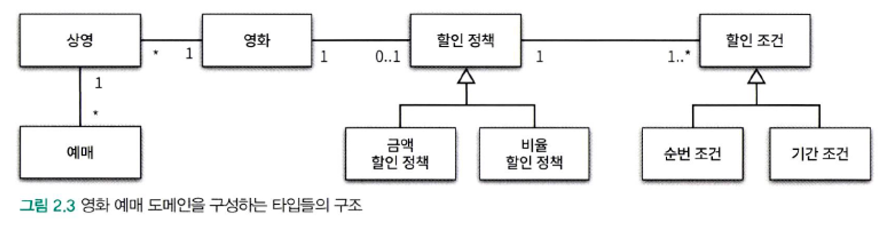
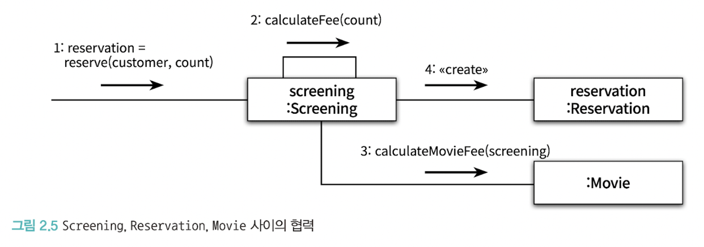
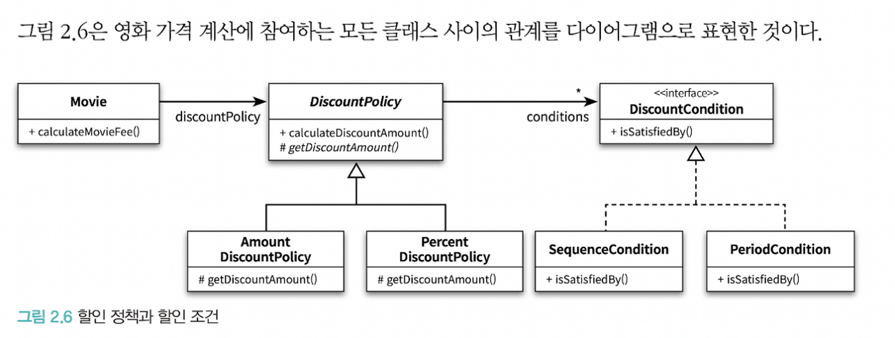
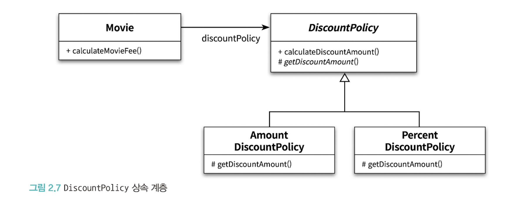
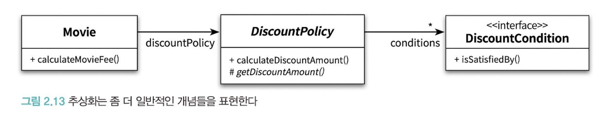
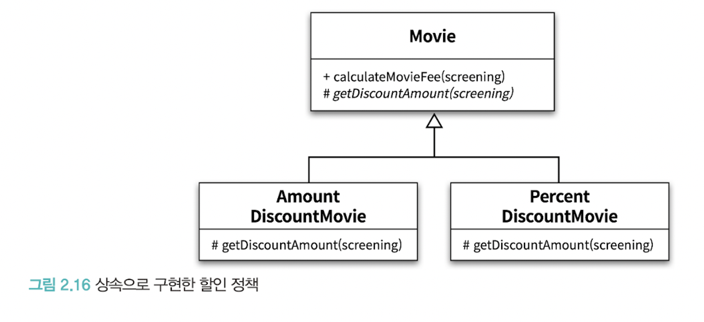

### 영화 예매 시스템

할인액을 결정하는 두 가지 규칙, 할인 조건(DiscountCondition), 할인 정책(DiscountPolicy)이 존재

# 객체지향 프로그래밍을 향해

### **협력, 객체, 클래스**

객체지향 언어에 익숙한 사람이라면 가장 먼저 어떤 `클래스가` 필요한지 고민할 것이다. 대부분의 사람들은 클래스를 결정한 후에 클래스에 `어떤 속성`과 `메서드`가 필요한지 고민한다.

안타깝게도 이것은 객체지향의 본질과는 거리가 멀다. 진정한 객체지향 패러다임으로의 전환은 클래스가 아닌 `객체에 초점을 맞출 때에만 얻을 수 있다.`

프로그래밍하는 동안 두 가지에 집중해야 한다.

- 첫째, `어떤 클래스가 필요한지를 고민하기 전에 어떤 객체들이 필요한지 고민하라 클래스는 공통적인 상태와 행동을 공유하는 객체들을 추상화한 것이다.` 따라서 클래스의 윤곽을 잡기 위해서는 어떤 객체들이 어떤 상태와 행동을 가지는지를 먼저 결정해야 한다. 객체를 중심에 두는 접근 방법은 설계를 단순하고 깔끔하게 만든다.
- 둘째, `객체를 독립적인 존재가 아니라 기능을 구현하기 위해 협력하는 공동체의 일원으로 봐야 한다.` 훌륭한 협력이 훌륭한 객체를 낳고 훌륭한 객체가 훌륭한 클래스를 낳는다.

### **도메인의 구조를 따르는 프로그램 구조**

문제를 해결하기 위해 사용자가 프로그램을 사용하는 분야를 `도메인`이라고 부른다.

요구사항과 프로그램을 객체라는 동일한 관점에서 바라볼 수 있기 때문에 도메인을 구성하는 개념들이 프로그램의 객체와 클래스로 매끄럽게 연결될 수 있다.



일반적으로 클래스의 이름은 대응되는 도메인 개념의 이름과 동일하거나 적어도 유사하게 지어야 한다. `클래스 사이의 관계도 최대한 도메인 개념 사이에 맺어진 관계와 유사하게 만들어서 프로그램의 구조를 이해하고 예상하기 쉽게 만들어야 한다.`

### **클래스 구현하기**

영화를 예매하는 대상인 상영 구현

```java
public class Screening {
    private Movie movie;
    private int sequence;
    private LocalDateTime whenScreened;

    public Screening(Movie movie, int sequence, LocalDateTime whenScreened) {
        this.movie = movie;
        this.sequence = sequence;
        this.whenScreened = whenScreened;
    }

    public LocalDateTime getStartTime() {
        return whenScreened;
    }

    public boolean isSequence(int sequence) {
        return this.sequence == sequence;
    }

    public Money getMovieFee() {
        return movie.getFee();
    }
}
```

변수의 가시성은 private 이고, 메서드의 가시성은 public이다.

클래스는 내부와 외부로 구분되며 훌륭한 클래스를 설계하기 위한 핵심은 어떤 부분을 외부에 공개하고 어떤 부분을 감출지를 결정하는 것이다.

그렇다면 클래스의 내부와 외부를 구분해야 하는 이유는 무엇일까? `그 이유는 경계의 명확성이 객체의 자율성을 보장하기 때문이다.` → 이로 인해, 프로그래머에게 구현의 자유를 제공해 줄 수 있다.

### 자율적인 객체

1. 객체는 상태와 행동을 함께 가지는 복합적인 존재다.
2. 객체가 스스로 판단하고 행동하는 자율적인 존재다.

→ 객체를 상태와 행동을 함께 포함하는 식별 가능한 단위로 정의하고, 문제 영역의 아이디어를 적절하게 표현할 수 있게했다.(데이터와 기능을 객체 내부로 함꼐 묶는 것을 캡슐화라고 한다.)

그래서 접근 제어자를 통해 객체 내부에 대한 접근을 통제하는 이유는 객체를 `자율적인 존재`로 만들기 위해서다.

- 외부에서 객체가 어떤 상태에 놓여 있는지, 알아서는 안되고, 개입해서는 안된다.
- 객체에게 원하는 것을 요청하고 객체가 스스로 최선의 방법을 결정할 수 있을것이라는 것을 믿고 기다려야 한다.

외부에서 접근 가능한 부분을 **`퍼블릭 인터페이스(Public Interface), 내부에서만 접근 가능한 부분을 구현(Implementation)`** 이라고 부른다.

### 프로그래머의 자유

- 클래스 작성자와 클라이언트 프로그래머로 구분
- 클래스 작성자: 새로운 데이터 타입을 프로그램에 추가
- 클라이언트 프로그래머의 목표: 필요한 클래스들을 엮어서 애플리케이션을 빠르고 안정적으로 구축
    - 숨겨 놓은 부분에 마음대로 접근할 수 없도록 방지 --> **구현 은닉**

구현은닉은 클라이언트 프로그래머가 알아야 할 지식을 줄여주고, 클래스 작성자가 외부에 미치는 영향을 걱정하지 않고, 내부 구현을 마음대로 변경할 수 있게 해준다.

**클래스를 개발할 때마다 인터페이스와 구현을 깔끔하게 분리하기 위해 노력해야 함**

### **협력하는 객체들의 공동체**

Screening의 reserve 메서드는 영화를 예매한 후 예매 정보를 담고 있는 Reservation의 인스턴스를 생성해서 반환한다.

```java
public class Screenning {
    public Reservation reserve(Customer customer, int audienceCount){
        return Reservation(customer, this, calculateFee(audienceCount), audienceCount);
    }

    private Money calculateFee(int audienceCount) {
        return movie.calculateMovieFee(this).times(audienceCount);
    }

}
```

```java

public class Money {
    public static final Money ZERO = Money.wons(0);

    private final BigDecimal amount;

    public static Money wons(long amount) {
        return new Money(BigDecimal.valueOf(amount));
    }

    public static Money wons(double amount) {
        return new Money(BigDecimal.valueOf(amount));
    }

    Money(BigDecimal amount) {
        this.amount = amount;
    }

    public Money plus(Money amount) {
        return new Money(this.amount.add(amount.amount));
    }

    public Money minus(Money amount) {
        return new Money(this.amount.subtract(amount.amount));
    }
    // ...
}

```

금액을 구현하기 위해 Long을 사용하면 변수의 크기와 같은 구현과 관련된 제약은 표현할 수 있지만, Money 타입처럼 저장하는 값이 금액과 관련되어 있다는 의미는 전달 할 수 없음.

- 또한, 금액과 관련된 로직이 서로 다른곳에 중복되어 구현되는 것을 막기 힘듬.

Money처럼 도메인의 의미를 표현할 수 있다면 해당 개념을 구현하는 것이 좋고, 이는 전체적인 설계의 명확성과 유연성을 높이는 첫걸음이 된다.

영화를 예매하기 위해 Screening, Movie, Reservation 인스턴스들은 서로의 메서드를 호출하며 상호작용한다. 이처럼 시스템의 어떤 기능을 구현하기 위해 객체들 사이에 이뤄지는 상호작용을 `협력`이라고 부른다



### 협력에 관한 짧은 이야기

- 객체는 다른 객체의 인터페이스에 공개된 행동을 수행하도록 `요청` 할 수 있고, 요청 받은 객체는 `자율적인 방법에 따라` 요청을 처리 한 후 `응답`한다.
- 다른 객체와 상호작용하는 방법은 `메시지를 전송`하는 것뿐이다.
    - 다른 객체에게 요청이 도착할 때 해당 객체가 메시지를 수신 했다고 이야기한다.
    - 메시지를 수신한 객체는 스스로 자율적으로 메시지를 처리할 방법을 결정하는데, 이 자신만의 방법을 메서드라고 한다.
    - 메세지와 메서드의 구분에서부터 다형성의 개념이 출발한다.
- 예제의 Screening 이 Movie의 calculateMovieFee 메서드를 호출한다보다는 메시지를 전송한다가 더 적절한 표현이다.

## **할인 요금 구하기**

### **할인 요금 계산을 위한 협력 시작하기**

```java
public class Movie {
    private Money fee;
    private DiscountPolicy discountpolicy

    // ...

    public Money calculateMovieFee(Screening screnning) {
        return fee.minus(discountPolicy.calculateDiscountAmount(screening));
    }
}
```

이 메서드 안에는 한 가지 이상한 점이 있다. 어떤 할인 정책을 사용할 것인지 결정하는 코드가 어디에도 존재하지 않는다는 것이다. 단지 discountPolicy에게 메시지를 전송할 뿐이다.

→ 여기에는 `상속`과 `다형성`이라는 객체지향의 중요한 개념이 숨겨져 있다. 그 기반에는 `추상화` 라는 원리가 존재한다.

### **할인 정책과 할인 조건**

할인 정책은 금액 할인 정책과 비율 할인 정책으로 구분된다.

두 가지 할인 정책을 각각 `AmountDiscountPolicy`와 `PercentDiscountPolicy`라는 클래스로 구현할 것이다.

여기서는 부모 부모 클래스인 DiscountPolicy 안에 중복 코드를 두고 AmountDiscountPolicy와 PercentDiscountPolicy가 이 클래스를 상속받게 할 것이다.

```java
public abstract class DiscountPolicy {
    private List<DiscountCondition> conditions = new ArrayList<>();

    public DiscountPolicy(DiscountCondition ... conditions) {
        this.conditions = Arrays.asList(conditions);
    }

    public Monet calculateDiscountAmount(Screening screening) {
        for(DiscountCondition each : conditions) {
            if (each.isSatisfiedBy(screening)) {
                return getDiscountAmount(screening);
            }
        }
        return Money.ZERO;
    }

    abstract protected Money getDiscountAmount(Screeing screening);
}
```

이처럼 부모 클래스에 기본적인 알고리즘의 흐름을 구현하고 중간에 필요한 처리를 자식 클래스에게 위임하는 디자인 패턴을 `TEMPLATE METHOD 패턴`이라고 부른다.

- 여기서는 `getDiscountAmount` 한테 할인 요금 계산에 대한 구현을 위임함.

영화 예매 시스템에는 순번 조건과 기간 조건의 두 가지 할인 조건이 존재한다.

두 가지 할인 조건은 각각 `SequenceCondition`과 `PeriodCondition`이라는 클래스로 구현할 것이다.

```java
public interface DiscountCondition {
    boolean isStisfiedBy(Screening screening);
}
```

```java
public class SequenceCondition implements DiscountCondition {
    private int sequence;

    public SequenceCondition(int sequence) {
        this.sequence = sequence;
    }

    public boolean isSatisfiedBy(Screening screening) {
        return screening.isSequence(sequence);
    }
}
```

```java

public class PeriodCondition implements DiscountCondition {
    private DayOfWeek dayOfWeek;
    private LocalTime startTime;
    private LocalTime endTime;

    public PeriodCondition(DayOfWeek dayOfWeek, LocalTime startTime, LocalTime endTime) {
        this.dayOfWeek = dayOfWeek;
        this.startTime = startTime;
        this.endTime = endTime;
    }

    public boolean isSatisfiedBy(Screening screening) {
        return screening.getStartTime().getDayOfWeek().equals(dayOfWeek) &&
                startTime.compareTo(screening.getStartTime().toLocalTime()) <= 0 &&
                endTime.compareTo(screening.getStartTime().toLocalTime()) >= 0;
    }
}
```

```java
public class AmountDiscountPolicy extends DiscountPolicy {
    private Money discountAmount;

    public AmountDiscountPolicy(Money discountAmount, DiscountCondition... conditions) {
        super(conditions);
        this.discountAmount = discountAmount;
    }

    @Override
    protected Money getDiscountAmount(Screening screening) {
        return discountAmount;
    }
}
```

```java
public class PercentDiscountPolicy extends DiscountPolicy {
    private double percent;

    public PercentDiscountPolicy(double percent, DiscountCondition... conditions) {
        super(conditions);
        this.percent = percent;
    }

    @Override
    protected Money getDiscountAmount(Screening screening) {
        return screening.getMovieFee().times(percent);
    }
}

```

```java
Movie avatar = new Movie("아바타",
        Duration.ofMinutes(120),
        Money.wons(10000),
        new AmountDiscountPolicy(Money.wons(800),
            new SequenceCondition(1),
            new SequenceCondition(10),
            new PeriodCondition(DayOfWeek.MONDAY, LocalTime.of(10,0), LocalTime.of(11,59)),
            new PeriodCondition(DayOfWeek.THURSDAY, LocalTime.of(10,0), LocalTime.of(11,59)));
```



## **상속과 다형성**



코드 상에서 Movie는 DiscountPolicy에 의존한다.

- 코드를 샅샅이 조사해 봐도 Movie가 AmountDiscountPolicy나 PercentDiscountPolicy에 의존하는 곳을 찾을 수는 없다.
- 그러나 실행 시점에는 Movie의 인스턴스는 AmountDiscountPolicy나 PercentDiscountPolicy의 인스턴스에 의존하게 된다.

**코드의 의존성과 실행 시점의 의존성은 다를 수 있다.**

유연하고, 쉽게 `재사용`할 수 있으며, `확장 가능한` 객체지향 설계가 가지는 특징은 코드의 의존성과 실행 시점의 의존성이 다르다는 것이다.

단, 코드의 의존성과 실행 시점의 의존성이 다르면 다를수록 `코드를 이해하기 어려워진다는 것이다.` 이와 같은 `의존성의 양면성`은 설계가 `트레이드 오프의 산물`이라는 사실을 잘 보여준다.

훌륭한 객체지향 설계자로 성장하기 위해서는 항상 `유연성`과 `가독성` 사이에서 고민해야 한다.

**코드 가독성과 디버깅 ↔ 재사용성과 확장 가능성**

### 차이에 의한 프로그래밍

부모 클래스와 다른 부분만을 추가해서 새로운 클래스를 쉽고, 빠르게 만드는 방법을 차이에 의한 프록그래밍이라고 부른다.

- 예시) DiscountPolicy, AmountDiscountPolicy, PercentDiscountPolicy

### **상속과 인터페이스**

상속이 가치 있는 이유는 부모 클래스가 제공하는 모든 인터페이스를 자식 클래스가 물려받을 수 있기 때문이다.
인터페이스는 객체가 이해할 수 있는 메시지의 목록을 정의한다는 것을 기억하라.

- 결과적으로 자식은 부모 클래스가 수신할 수 있는 모든 메시지를 수신할 수 있기 때문에, 외부 객체는 자식 클래스를 부모 클래스와 동일한 타입으로 간주 할 수 있다.

### **다형성**

동일한 메시지를 전송하지만, 어떤 클래스가 처리하느냐에 따라 실제로 실행되는 메서드가 다를 수 있는데 이를 `다형성`이라고 한다.

- `다형성`은 객체지향 프로그램의 `컴파일 시간` 의존성과 `실행 시간` 의존성이 다를 수 있는 사실을 기반으로 한다.

**지연 바인딩, 동적 바인딩** : 메시지에 응답하기 위해 실행될 메서드를 실행 시점에 결정.
**초기 바인딩, 정적 바인딩** : 컴파일 시점에 실행될 함수나 프로시저를 결정.

> **구현 상속과 인터페이스 상속**
순수하게 코드를 재사용하기 위한 목적으로 상속을 사용하는 것을 구현 상속이라고 부른다.
다형적인 협력을 위해 부모 클래스와 자식 클래스가 인터페이스를 공유할 수 있도록 상속을 이용하는 것을 인터페이스 상속이라고 부른다.
상속은 구현 상속이 아니라 인터페이스 상속을 위해 사용해야 한다. 구현 상속은 변경에 취약한 코드를 낳게 될 확률이 높다.
>

### **추상화와 유연성**

### **추상화의 힘**



추상화를 사용할 경우의 두 가지 장점을 보여준다.

- 추상화의 계층만 따로 떼어 놓고 살펴보면 요구사항의 정책을 `높은 수준`에서 서술할 수 있다는 것이다.
    - 영화 예매 요금은 최대 하나의 할인 정책과 다수의 할인 조건을 이용해서 계산할 수 있다. 를 나타냄
- 추상화를 이용하면 설계가 좀 더 `유연`해 진다는 것이다.

### 유연한 설계

```java
public class NoneDiscountPolicy implements DiscountPolicy {
    @Override
    public Money calculateDiscountAmount(Screening screening) {
        return Money.ZERO;
    }
}

Movie starWars = new Movie("스타워즈",...,new NoneDiscountPolicy());
```

- 기존의 코드는 수정하지 않고, 확장할 수 있다 → **OCP**

### 코드 재사용



- 코드 재사용을 위해서는 상속 보다는 **합성이** 더 좋은 방법이다.
- 위 그림처럼 상속을 사용하면 기존 합성을 사용한 방법과 기능적인 면에서 동일한데 상속대신 합성을 사용하는 이유는 무엇일까?

### **상속**

상속의 가장 큰 문제점은 `캡슐화를 위반`한다는 것이다.

상속을 이용하기 위해서는 부모 클래스의 내부 구조를 잘 알고 있어야 한다. `결과적으로 부모 클래스의 구현이 자식 클래스에게 노출되기 때문에 캡슐화가 약화된다.`

캡슐화의 약화는 자식 클래스가 부모 클래스에 `강하게 결합`되도록 만들기 때문에 부모 클래스를 변경할 때 자식 클래스도 함께 변경될 확률을 높인다.

`결과적으로 상속을 과도하게 사용한 코드는 변경하기도 어려워진다.`

상속의 두 번째 단점은 설계가 유연하지 않다는 것이다.

`상속은 부모 클래스와 자식 클래스 사이의 관계를 컴파일  시점에 결정한다.` 따라서 실행 시점에 객체의 종류를 변경하는 것이 불가능하다.

반면 합성을 사용하면 이를 해결할 수 있다.

```java
public class Movie {
    private DiscountPolicy discountpolicy;

    public void changeDiscountPolicy(DiscountPolicy discountPolicy) {
        this.discountPolicy = discountPolicy;
    }
}
```

### **합성**

합성은 상속이 가지는 두 가지 문제점을 모두 해결한다.

인터페이스에 정의된 메시지를 통해서만 재사용이 가능하기 때문에 구현을 `효과적으로 캡슐화`할 수 있다.

또한 의존하는 `인스턴스를 교체`하는 것이 비교적 쉽기 때문에 설계를 유연하게 만든다.

그렇다고 해서 상속을 절대 사용하지 말라는 것은 아니다.

이전 처럼 코드를 재사용하는 경우에는 상속보다는 합성을 선호하는 것이 옳지만 다형성을 위해 인터페이스를 재사용하는 경우에는 상속과 합성을 함께 조합해서 사용할 수밖에 없다.

프로그래밍 관점에 치우쳐서 객체지향을 바라볼 경우 객체지향의 본질을 놓치기 쉽다.

객체지향의 핵심은 적절한 협력을 식별하고 협력에 필요한 역할을 정의한 후 역할을 수행할 수 있는 적절한 객체에게 적절한 책임을 할당하는 것이다.