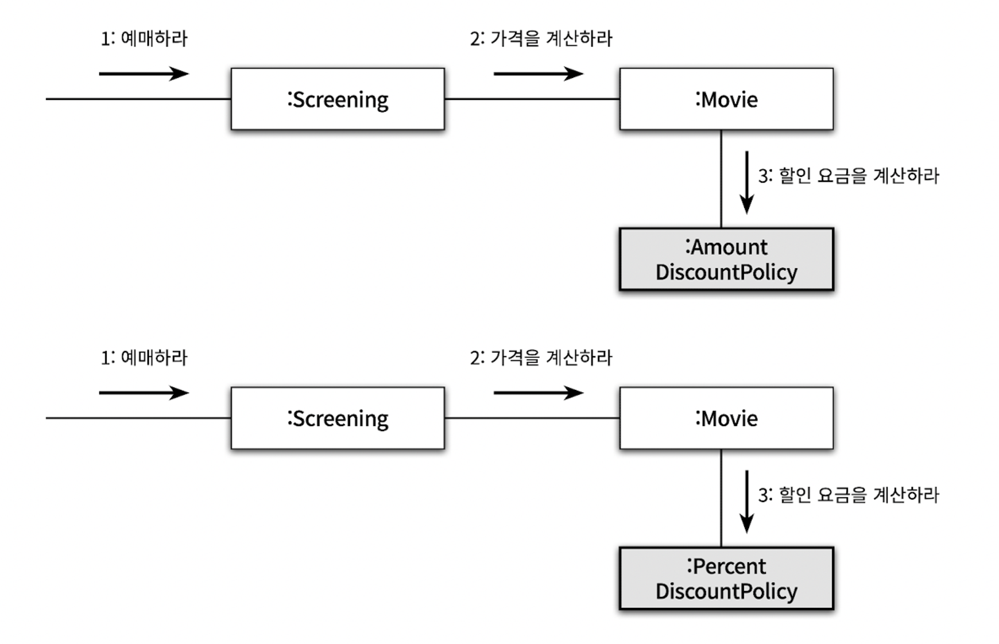
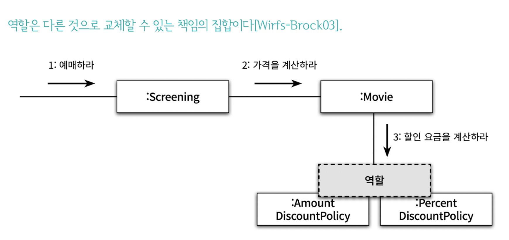

# 3장 역할, 책임, 협력

객체지향 패러다임의 관점에서 핵심은 3가지로 표현할 수 있다.

- `협력(collaboration)` : 객체들이 애플리케이션의 기능을 구현하기 위해 수행하는 상호작용
- `책임(responsibility)` : 객체가 협력에 참여하기 위해 수행하는 로직
- `역할(role)` : 객체들이 협력 안에서 수행하는 책임들이 모여 객체가 수행

애플리케이션의 기능을 구현하기 위해 어떤 `협력`이 필요하고 협력을 위해 어떤 `역할`과 `책임`이 필요한지를 고민하지 않은 채 너무 이른 시기에 구현에 초점을 맞추는 것은 변경하기 어렵고 유연하지 못한 코드를 낳는 원인이 된다.

## 협력

### **협력이란 무엇인가**

객체지향 시스템은 자율적인 객체들의 공동체다.

협력은 객체지향의 세계에서 기능을 구현할 수 있는 유일한 방법이다.

두 객체 사이의 협력은 하나의 객체가 다른 객체에게 도움을 요청할때 시작되고, 메시지 전송은 객체 사이의 협력을 위해 사용할 수 있는 유일한 커뮤니케이션 수단이다.

`자율적인 객체`란 자신의 상태를 직접 관리하고 스스로의 결정에 따라 행동하는 객체다. 객체의 자율성을 보장하기 위해서는 `필요한 정보`와 `정보에 기반한 행동`을 같은 객체 안에 모아놓아야 한다.

자신이 할 수 없는 일을 다른 객체에게 `위임`하면 협력에 참여하는 객체들의 전체적인 자율성을 향상시킬 수 있다.

결과적으로 객체를 자율적으로 만드는 가장 기본적인 방법은 내부 구현을 `캡슐화`하는 것이다.

### **협력이 설계를 위한 문맥을 결정한다**

객체가 가질 수 있는 상태와 행동을 어떤 기준으로 결정해야 할까?

객체를 설계할 때 어떤 행동과 상태를 할당했다면 그 이유는 무엇인가?

애플리케이션 안에 어떤 객체가 필요하다면 그 이유는 단 하나여야 한다. 그 객체가 어떤 `협력`에 참여하고 있기 때문이다. 그리고 객체가 협력에 참여할 수 있는 이유는 협력에 필요한 `적절한 행동`을 보유하고 있기 때문이다.

행동을 결정하는 것이 협력이라면, 객체의 상태를 결정하는 것은 행동이다.

객체의 상태는 그 객체가 행동을 수행하는데 필요한 정보가 무엇인지로 결정된다.

⇒ 상태는 객체가 행동하는데 필요한 정보에 의해 결정되고, 행동은 협력안에서 객체가 처리할 메시지로 결정됨.

결과적으로 객체가 참여하는 협력이 객체를 구성하는 행동과 상태를 모두 결정함.

따라서, 협력은 객체를 설계하는데 필요한 일종의 문맥(Context)을 제공한다.

## 책임

### **책임이란 무엇인가**

협력이 갖춰지면, 협력에 필요한 행동을 수행할 객체를 찾아야하는데 이때, 객체가 수행하는 행동을 `책임`이라고 부른다.

책임이란 객체에 의해 정의되는 `응집도` 있는 행위의 집합으로, 객체가 유지해야 하는 정보와 수행할 수 있는 행동에 대해 개략적으로 서술한 문장이다. 즉, 객체의 책임은 객체가 '`무엇을 알고 있는가`'와 '`무엇을 할 수 있는가`'로 구성된다.

- 하는 것
    - 객체를 생성하거나 계산을 수행하는 등의 스스로 하는 것
    - 다른 객체의 행동을 시작시키는 것
    - 다른 객체의 활동을 제어하고 조절하는 것
- 아는 것
    - 사적인 정보에 관해 아는 것
    - 관련된 객체에 관해 아는 것
    - 자신이 유도하거나 계산할 수 있는 것에 관해 아는 것

ex) Screening의 영화를 예매하기는 하는것, 자신이 상영할 영화를 알고 있어야 하는것은 아는것과 관련된 책임

책임의 관점에서 '`아는 것`'과 '`하는 것`'이 밀접하게 연관돼 있다는 점이다.

- 객체는 자신이 맡은 책임을 수행하는데 필요한 정보를 알고 있을 책임이 있고, 할 수 없다면 이를 도와줄 객체를 알고 있을 책임이 있다.

“객체지향 개발에서 가장 중요한 능력은 책임을 능숙하게 소프트웨어 객체에 할당하는것”

객체에게 얼마나 `적절한 책임`을 할당하느냐가 설계의 전체적인 품질을 결정한다.

### 책임 할당

자율적인 객체를 만드는 가장 기본적인 방법은 책임을 수행하는 데 `필요한 정보`를 가장 잘 알고 있는 전문가에게 그 책임을 할당하는 것이다.

이를 책임 할당을 위한 `INFORMATION EXPERT(정보 전문가) 패턴`이라고 부른다.

객체들 역시 협력에 `필요한 지식`과 `방법`을 가장 잘 알고 있는 객체에게 도움을 요청한다. 요청에 응답하기 위해 필요한 이 행동이 객체가 `수행할 책임`으로 이어지는 것이다.

객체에게 책임을 할당하기 위해서는 먼저 협력이라는 문맥을 정의한다.

협력을 설계하는 출발점은 시스템이 사용자에게 제공하는 기능을 시스템이 담당할 하나의 책임으로 바라보고 객체지향 설계는 시스템의 책임을 완료하는데 필요한 더 작은 책임을 찾아내고 객체에게 할당을 하고 이를 반복하는 과정임.

ex) 예매하라 → screening → 가격을 계산하라 → Movie...

협력을 설계하면서 객체의 책임을 식별해 나가는 과정에서 최종적으로 얻게 되는 결과물은 시스템을 구성하는 객체들의 `인터페이스`와 `오퍼레이션의 목록`이다.

물론 모든 책임 할당 과정이 이렇게 단순한 것은 아니다. 어떤 경우에는 응집도와 결합도의 관점에서 정보 전문가가 아닌 다른 객체에게 책임을 할당하는 것이 더 적절한 경우도 있다.

### **책임 주도 설계(Responsibility-Driven Design)**

어떤 책임을 선택하느냐가 전체적인 설계의 `방향`과 `흐름`을 결정한다.

이처럼 책임을 찾고 책임을 수행할 적절한 객체를 찾아 책임을 할당하는 방식으로 협력을 설계하는 방법을 `책임 주도 설계(Responsibility-Driven Design, RDD)`라고 부른다.

**책임 주도 설계 과정**

- 시스템이 사용자에게 제공해야 하는 기능인 시스템 책임을 파악한다.
- 시스템 책임을 더 작은 책임으로 분할한다.
- 분할될 책임을 수행할 수 있는 적절한 객체 또는 역할을 찾아 책임을 할당한다.
- 객체가 책임을 수행하는 도중 다른 객체의 도움이 필요한 경우 이를 책임질 적절한 객체 또는 역할을 찾는다
- 해당 객체 또는 역할에게 책임을 할당함으로써 두 객체가 협력하게 한다

협력은 객체를 설계하기 위한 구체적인 문맥을 제공한다.

협력이 책임을 이끌어내고, 책임이 협력에 참여할 객체를 결정한다 → 자연스럽게 객체의 구현이 아닌 책임에 집중할 수 있게한다.

구현이 아닌 책임에 집중하는 것이 중요한 이유는 유연하고 견고한 객체지향 시스템을 위해 가장 중요한 재료가 바로 책임이기 때문이다.

### 책임을 할당할때 고려해야 하는 두가지 요소

### 1. 메시지가 객체를 결정한다.

객체에게 책임을 할당하는데 필요한 메시지를 먼저 식별하고, 이를 처리할 객체를 나중에 선택했다.

메시지가 객체를 선택하게 해야 하는 두 가지 중요한 이유가 있다.

- 첫째, 객체가 최소한의 인터페이스를 가질 수 있게 된다.
    - 객체는 필요한 크기의 퍼블릭 인터페이스를 가질 수 있다.
- 둘째, 객체는 충분히 추상적인 인터페이스를 가질 수 있게 된다.
    - 메시지를 먼저 식별하면 무엇을 수행할지에 초점을 맞추는 인터페이스를 얻을 수 있다.

### 2. 행동이 상태를 결정한다.

객체가 존재하는 이유는 협력에 참여하고, 필요한 행동을 제공하기 때문이다.

객체를 객체답게 만드는 것은 `객체의 상태가 아니라 객체가 다른 객체에게 제공하는 행동이다.`

초보자들은 먼저 객체에 필요한 상태가 무엇인지를 결정하고, 그 후에 상태에 필요한 행동을 결정한다.

이런 방식은 객체의 내부 구현이 객체의 퍼블릭 인터페이스에 노출되도록 만들기 때문에 캡슐화를 저해한다. 객체의 내부 구현에 초점을 맞춘 설계 방법을 `데이터-주도 설계(Data-Driven Design)`이라고 부르기도 했다.

캡슐화를 위반하지 않도록 구현을 뒤로 미루면서 객체의 행위를 고려하기 위해서는 항상 협력이라는 문맥 안에서 객체를 생각해야 한다.

개별 객체의 상태와 행동이 아닌, 시스템의 기능을 구현하기 위한 협력에 초점을 맞춰야만 응집도가 높고, 결합도가 낮은 객체를 만들수있다.

상태는 단지 정상적인 행동을 수행하기 위한 재료일 뿐이다.

## 역할

### 역할과 협력

객체의 목적은 협력 안에서 객체가 맡게 되는 `책임의 집합`으로 표시된다.

이처럼 객체가 어떤 특정한 협력 안에서 수행하는 책임의 집합을 `역할` 이라고 부른다.

역할이 중요한 이유는 역할을 통해 유연하고 재사용 가능한 협력을 얻을 수 있기 때문이다.

Movie 가 가격을 계산하기 위해 **"할인 요금을 계산해라"** 라는 메시지를 보내면, AmountDiscountPolicy 와 PercentDiscountPolicy 인스턴스 2가지가 **메시지**에 응답할수 있다.

하지만 책임의 관점에서는 둘 다 할인 요금 계산이라는 동일한 책임을 수행한다.

이 동일한 책임을 수행할 대표자가 `역할`이 된다.

역할이 두 종류 이상의 구체적인 객체를 포괄하는 **추상화**이다.

AmountDiscountPolicy 와 PercentDiscountPolicy 를 포괄하는 추상적인 이름으로 DiscountPolicy를 정할수 있다.

DiscountPolicy 역할을 수행할 수 있는 어떤 객체라도 이 협력에 참여할 수 있게 된다.

→ 책임과 역할을 중심으로 협력을 바라보는 것이 변경과 확장이 용이한 유연한 설계가 됨.

ex) NoneDiscount를 추가로 만들어도 기존의 책임을 하는 AmountDiscountPolicy와 PercentDiscountPolicy와는 상관없이 확장이 가능하게함. ⇒ OCP와 SRP를 자연스럽게 지키도록 함.

### **객체 대 역할**

오직 한 종류의 객체만 협력에 참여하는 상황에서 역할이라는 개념을 고려하는 것이 유용할까?

역할이라는 개념을 생략하고 직접 객체를 이용해 협력을 설계하는 것이 더 좋지 않을까?

이런 경우에 역할을 사용하는 것은 상황을 오히려 더 복잡하게 만드는 것은 아닐까?

- 협력에 참여하는 후보가 여러 종류의 객체에 의해 수행될 필요가 있다면 후보는 역할이 되지만, 한종류의 객체만이 협력에 참여한다면 후보는 객체가 된다.

협력은 역할들의 상호 작용으로 구성되고, 협력을 구성하기 위해 역할에 적합한 객체가 선택되며, 객체는 클래스를 이용해서 구현되고 생성된다.

대부분 어떤것이 역할이고, 어떤것이 객체인지가 또렷하게 드러나지는 않을것이다.

그래서 설계 초반에는 적절한 책임과 협력의 큰 그림을 탐색하는것이 가장 중요한 목표여야하고, 역할과 객체를 명확하게 구분하는 것은 그렇게 중요하지는 않다.

`애매하다면 단순하게 객체로 시작하고 반복적으로 책임과 협력을 정제해가면서 필요한 순간에 객체로부터 역할을 분리해내는 것이 가장 좋은 방법이다.`

다양한 시나리오를 탐색하고 유사한 협력들을 단순화하고 합치다 보면 자연스럽게 역할이 그 모습을 드러낼 것이다.

### 역할과 추상화

추상화를 이용한 설계가 가질 수 있는 장점

- 추상화 계층만을 이용하면 중요한 정책을 상위 수준에서 단순화 할 수 있다.
- 설계가 좀 더 유연해진다.

협력의 관점에서 역할도 동일하게 추상화의 장점을 가질 수 있다.

객체에게 중요한것은 행동이다. 역할이 중요한 이유는 동일한 협력을 수행하는 객체들을 추상화 할 수 있기 때문이다.