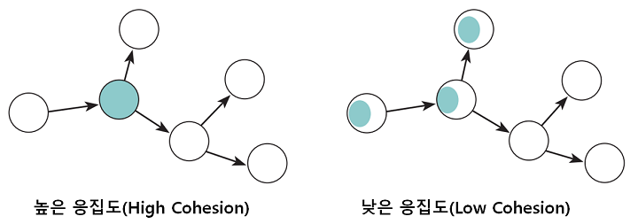
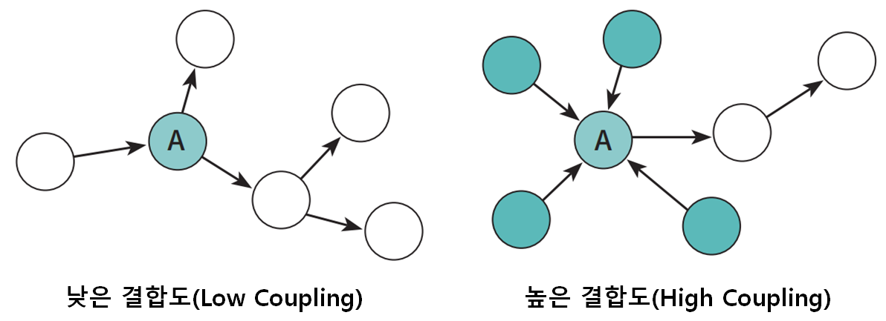

# 4장 설계 품질과 트레이드오프

### **객체지향 설계의 핵심은 역할, 책임, 협력이다.**

- `협력`은 애플리케이션의 기능을 구현하기 위해 메시지를 주고받는 객체들 사이의 상호작용이다.
- `책임`은 객체가 다른 객체와 협력하기 위해 수행하는 행동이고
- `역할`은 대체 가능한 책임의 집합이다.

이 중 가장 중요한 것은 책임이다.

적절한 책임 없이는 원활한 협력도 없고, 책임의 집합이 역할이기 때문이다.

결국 객체지향 애플리케이션에서 전체의 품질을 결정하는것은 책임이 된다.

설계는 변경을 위해 존재하고 변경에는 어떤 식으로든 비용이 발생한다.

훌륭한 설계란 합리적인 비용안에서 변경을 수용할 수 있는 구조를 만드는 것이다.

적절한 비용 안에서 쉽게 변경할 수 있는 설계는 응집도가 높고 서로 느슨하게 결합돼 있는 요소로 구성되어 있다.

객체를 단순한 `데이터의 집합`으로 바라보는 시각은 객체의 내부 구현을 퍼블릭 인터페이스에 노출시키는 결과를 낳기 때문에 결과적으로 설계가 `변경에 취약`해진다.

→ 가장 좋은 방법은 객체의 책임에 초점을 맞추는 것이다.

### **객체지향 설계 시스템 분할 기준**

- 상태를 중심 분할 : `객체는 자신이 포함하고 있는 데이터`를 조작하는 데 필요한 오퍼레이션을 정의
- 책임을 중심 분할 : 다른 객체가 요청할 수 있는 오퍼레이션을 위해 `필요한 상태`를 보관

책임에 초점을 맞추면 상대적으로 변경에 안정적인 설계를 얻을 수 있게 된다.

- 이유는 객체의 상태는 구현에 속하고 구현은 불안정하기 때문에 변하기 쉽고, 상태를 객체분할의 중심축으로 삼으면 구현에 관한 세부사항이 객체의 인터페이스에 스며들게 되어 캡슐화가 무너진다.

## **설계 트레이드오프**

데이터 중심 설계와 책임 중심 설계의 장단점을 비교하기 위해 `캡슐화`, `응집도`, `결합도` 측면에서 바라보자

### **캡슐화**

설계가 필요한 이유는 `요구사항이 변경`되기 때문이고, 캡슐화가 중요한 이유는 `불안정한 부분`과 `안정적인 부분`을 분리해서 구현과 인터페이스로 나누고 변경의 영향을 통제할 수 있기 때문이다.

- 불안정한 부분 : 변경 가능성이 높고, 외부에서 알 필요없는 부분
- 안정적인 부분 : 불안정한 부분에 비해 상대적으로 안정적인 부분

→ 즉, 캡슐화란 변경 가능성이 높은 부분을 객체 내부로 숨기는 추상화 기법이다.

### **응집도와 결합도**

**`응집도`** : 모듈에 포함된 내부 요소들이 연관돼 있는 정도를 나타낸다. 변경이 발생할 때 모듈 내부에서 발생하는 변경의 정도로 측정할 수 있다.



**`결합도`** : 의존성의 정도를 나타내며 다른 모듈에 대해 얼마나 많은 지식을 갖고 있는지를 나타내는 척도다. 한 모듈이 변경되기 위해서 다른 모듈의 변경을 요구하는 정도로 측정할 수 있다.



### **그렇다면 우리는 질문할 것이다.**

모듈 내의 얼마나 많은 요소가 강하게 연관돼 있어야 응집도가 높다고 말할 수 있는가?

모듈 사이에 어느 정도의 의존성만 남겨야 결합도가 낮다고 말할 수 있는가?

> 정답은 없다. 하지만 점검해 볼 수 있는 몇가지 요소는 있다.
>

### 데이터 중심의 영화 예매 시스템의 문제점

기능적인 측면은 2장의 설계와 동일하지만, 설계 관점에서는 다르다.

가장 큰 차이점은 캡슐화를 다루는 방식이며, 데이터 중심 설계는 캡슐화를 위반하고 객체 내부 구현을 인터페이스의 일부로 만든다.

책임 중심 설계는 객체의 내부 구현을 안정적인 인터페이스 뒤로 캡슐화 한다.

**데이터 중심 설계의 대표적인 문제점**

- 캡슐화 위반
- 높은 결합도
- 낮은 응집도

### **캡슐화 위반**

```java
public class Movie {
    private Money fee;

    public Money getFee() {
        return fee;
    }

    pubic void setfee(Money fee) {
        this.fee = fee;
    }
}
```

위 코드는 직접 객체의 내부에 접근할 수 없기 때문에 캡슐화의 원칙을 지키고 있는것처럼 보여진다.

하지만, getFee, setFee 메서드는 Movie 내부에 Money 타입의 fee라는 이름의 인스턴스 변수가 존재한다는 사실을 퍼블릭 인터페이스에 노골적으로 드러낸다.

객체가 사용될 문맥을 추측할 수 밖에 없는 경우 개발자는 어떤 상황에서도 해당 객체가 사용할 수 있게 최대한 많은 접근자 메서드를 추가하게 되면서 캡슐화를 위반하는 과도한 접근자와 수정자를 가지게 될 수 있다.

- 이런 방식을 **추측에 의한 설계 전략** 이라고 부른다.

캡슐화의 원칙을 어긴 근본적인 원인은 책임이 아닌 내부 데이터에 초점을 맞췄기 때문이다.

객체에게 중요한것은 책임이며, 구현을 캡슐화 할 수 있는 적절한 책임은 협력이라는 문맥을 고려할 때만 얻을 수 있다.

### **높은 결합도**

결합도가 높은 원인은 대부분 `캡슐화가 내부 구현을 그대로 노출`하기 때문이다.

객체 내부의 구현이 객체의 인터페이스에 드러난다는 것은 `클라이언트가 구현에 강하게 결합된다는 것을 의미`한다.

그리고 더 나쁜 소식은 단지 객체의 내부 구현을 변경 했음에도 이 인터페이스에 의존하는 모든 클라이언트들도 함께 변경해야 한다는 것이다.

영화 예매 시스템을 보면 대부분의 제어 로직을 가지고 있는 제어 객체인 ReservationAgency가 모든 데이터 객체에 의존한다.

DiscountCondition 의 데이터가 변경되면, ReservationAgency도 함께 변경된다.

ReservationAgency는 모든 의존성이 모이는 결합도의 집결지가 된다.

### **낮은 응집도**

서로 다른 이유로 변경되는 코드가 하나의 모듈 안에 공존할 때 모듈의 응집도가 낮다고 말한다.

**낮은 응집도는 두가지 측면에서 설계에 문제를 일으킨다.**

- 변경의 이유가 서로 다른 코드들을 하나의 모듈 안에 뭉쳐 놓았기 때문에 변경과 아무 상관이 없는 코드들이 영향을 받게 된다.
    - ex) ReservationAgency
- 하나의 요구사항 변경을 반영하기 위해 동시에 여러 모듈을 수정해야 한다. 응집도가 낮을 경우 다른 모듈에 의지해야 할 책임의 일부가 엉뚱한 곳에 위치하게 되기 때문이다.

## **자율적인 객체를 향해**

### **캡슐화를 지켜라**

객체에게 의미 있는 메서드는 객체가 책임져야 하는 무언가를 수행하는 메서드다.

속성의 가시성을 private으로 설정했다고 해도 접근자와 수정자를 통해 속성을 외부로 제공하고 있다면 캡슐화를 위반하는 것이다.

→ 객체는 스스로의 상태를 책임지고, 외부에서는 인터페이스에 정의된 메서드로만 상태에 접근할 수 있어야함.

### **아래와 같은 코드는 어떤 문제가 있을까?**

```java
public Rectangle {
    private int left;
    private int top;
    private int right;
    private int bottom;

    public int getLeft() { return left; }
    public void setLeft(int left) { this.left = left; }

    public int getTop() { return top; }
    public void setTop(int top) { this.top = top; }

    public int getRight() { return right; }
    public void setRight(int right) { this.right = right; }

    public int getBottom() { return bottom; }
    public void setBottom(int bottom) { this.bottom = bottom; }

}
```

첫 번째는 `코드 중복`이 발생할 확률이 높다는 것이다.

사각형의 너비와 높이를 증가시키는 코드가 필요하다면 아마 getRight, getBottom 메서드를 호출하고 setRight, setBottom 메서드를 수정하는 `유사한 로직`이 존재할 것이다. 따라서 코드 중복을 초대할 수 있다.

두 번째 문제점은 `변경에 취약`하다는 점이다.

Rectangle이 right와 bottom대신 length와 height를 이용해서 사각형을 표현하거나 type을 변경한다고 하면 해당 메서드를 사용하는 클라이언트들은 `모두 수정` 해주어야 한다.

```java
class Rectangle {
	public void enlarge(int multiple) {
		right *= multiple;
		bottom *= multiple;
	}
}
```

- 자신의 크기를 스스로 증가시키도록 `책임을 이동` 하면 캡슐화를 할 수 있고, 이는 위의 두가지 문제점을 해결한다.

> 캡슐화의 진정한 의미 캡슐화란 변할 수 있는 어떤 것이라도 감추는 것이다.
그것이 속성의 타입이건, 할인 정책의 종류건 상관 없이 내부 구현의 변경으로 인해 외부의 객체가 영향을 받는다면 캡슐화를 위반한 것이다.
설계에서 변하는 것이 무엇인지 고려하고 변하는 개념을 캡슐화해야 한다.
>

---

## 데이터 중심 설계의 문제점

- 데이터 중심 설계는 본질적으로 너무 이른시기에 데이터에 관해 결정하도록 강요한다.
- 데이터 중심의 설계는 협력이라는 문맥을 고려하지 않고 객체를 고립시킨채 결정한다.

### **데이터 중심 설계는 객체의 행동보다는 상태에 초점을 맞춘다.**

데이터 중심의 설계를 시작할때 데이터에 관해 결정하도록 강요하기 때문에 너무 이른 시기에 내부 구현에 초점을 맞추게 한다.

- 데이터 중심의 설계는 너무 이른 시기에 데이터에 대해 고민하기 때문에 캡슐화에 실패하게 된다.
- 데이터 중심의 관점에서는 객체는 그저 단순한 데이터의 집합체이며, 접근자와 수정자를 과도하게 추가하게 되고, 이 데이터 객체를 사용하는 절차를 분리된 별도의 객체에서 구현하게 된다. → 캡슐화는 완전히 무너질수 밖에 없다.

이는 객체 내부 구현이 인터페이스를 어지럽히고, 응집도와 결합도에 나쁜 영향을 끼치기 때문에 변경에 취약한 코드가 된다.

### **데이터 중심 설계는 객체를 고립시킨 채 오퍼레이션을 정의하도록 만든다.**

`올바른 객체지향 설계의 무게 중심은 항상 객체의 내부가 아니라 외부에 맞춰져 있어야 한다` 객체가 내부에 어떤 상태를 가지고 그 상태를 어떻게 관리하는가는 부가적인 문제다.

안타깝게도 데이터 중심 설계에서 초점은 객체의 외부가 아니라 내부로 향한다.

실행 문맥에 대한 깊이 있는 고민 없이 객체가 관리할 데이터의 세부 정보를 먼저 결정한다.

객체의 구현이 이미 결정된 상태에서 다른 객체와의 협력 방법을 고민하기 때문에 이미 구현된 객체의 인터페이스를 억지로 끼워맞출수밖에 없다.

→ 이는 인터페이스에 구현을 노출시키고 협력이 구현 세부사항에 종속돼 있고, 그에 따라 객체의 내부 구현이 변경됐을때 협력하는 객체 모두가 영향을 받을 수 밖에 없다.