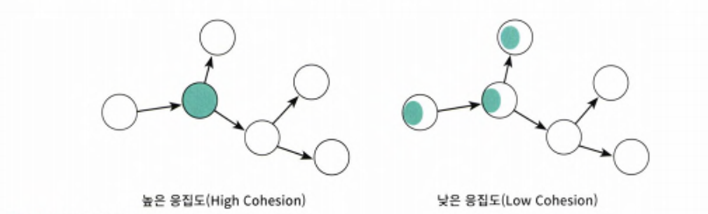

# 해당 장에서의 핵심

- 깨달음은 좋은 사례에서도 배울 수 있는게 많겠지만 나쁜 케이스에서도 깨닫는것이 많다.
- 해당 장에서는 데이터 중심 설계 방식으로 확인해보고 왜 나쁜지를 파악해보며 **‘상태’** 가 아닌 **‘행동’** 으로 설계를 진행하는것이 왜 좋은지를 알아보자.
- 캡슐화

# 0. 객체지향 설계에서 시스템을 객체로 분할하기

- 상태 ( 데이터 )를 분할의 중심축으로 삼는다.
    - 상태는 불안정하기 때문에 인터페이스 변경을 초래한다.
- 책임을 분할의 중심축으로 삼는다.
    - 책임은 인터페이스에 속하기 때문에 내부가 캡슐화되어 파장이 외부로 퍼져나감을 방지한다.
        - 내부상태에 대한 구현사항의 격리

# 1. 데이터 중심 설계

객체 내부에 저장되는 데이터를 기반으로 시스템을 분할하는 방법을 말한다.

- 해당 설계는 **객체가 내부에 저장해야하는 데이터가 무엇인가**를 묻는것으로 시작한다.
- 캡슐화를 지키기 위해 **접근자 ( accessor )**, **수정자 ( mutator )** 를 추가하는 방법이 있다.

**단점**

- **캡슐화 위반**
    - 객체의 내부 상태에 퍼블릭 인터페이스를 통해 노골적으로 접근하게 된다.
    - 협력에 관해 고민하지 않으면 캡슐화를 위반하는 과도한 접근자와 수정자를 갖게되는 경향이 발생한다.
    - 객체가 사용될 문맥을 추측할 수 밖에 없을 경우 해당 객체가 어떤 상황에서든 사용될 수 있게 최대한 많은 접근자 메서드를 추가하게 된다.
    - 이처럼 접근자와 수정자에 과도하게 의존하는 설계 방식을 **추측에 의한 설계 전략**이라고 부른다.
- **그 외**
    - 높은 결합도
    - 낮은 응집력

**왜 데이터 중심 설계가 설계의 변경에 취약할까?**

- 데이터 중심 설계는 본질적으로 이른시기 데이터에 관해 결정하도록 강요한다.

  ⇒ 이는 성급한 설계 및 추상화가 될 수도 있는 계기가 된다고 생각함

- 데이터 중심의 설계에서는 협력이라는 문맥을 고려하지 않고 객체를 고립시킨 채 오퍼레이션을 결정한다.

객체의 행동보다는 **상태**에 초점을 맞춰 설계를 진행해야한다.

- 접근자와 수정자는 public 속성과 큰 차이가 없으므로 **캡슐화가 무너진다.**
- 데이터를 처리하는 작업과 데이터를 같은 객체 안에 두더라도 **데이터에 초점이 맞춰져 있다면 만족스러운 캡슐화를 얻기 어렵다.**

객체를 고립시킨 채 **오퍼레이션을 결정하도록** 만들어야 한다.

- 올바른 객체지향 설계의 무게중심은 항상 객체의 내부가 아닌 외부에 맞춰져 있어야한다.

  ⇒ 이는 이전 협력 → 행동 → 상태 와 연관있는 말이라고 생각함

- 객체 내부에 어떤 상태를 가지고 그 상태를 어떻게 관리 할지는 부가적인 문제이다.
- 중요한 것은 객체가 다른 객체와 협력하는 방법

데이터 중심 설계 에서의 초점은 객체의 외부가 아닌 내부로 향한다.

실행 문맥에 대한 깊은 고민이 없이 객체가 관리할 데이터의 세부 정보를 먼저 결정한다.

# 2. 설계 트레이드 오프

데이터 중심 설계와 책임 중심 설계의 장단점 비교를 위해 **캡슐화, 응집도, 결합도**를 고려하자

**캡슐화, 설계의 첫번째 목**

- 상태와 행동을 하나의 객체안에 모으는 이유
    - 객체의 내부 구현을 외부로부터 감추기 위해

객체지향이 강력한 이유

- 한 곳에서 일어난 변경이 다른곳에 영향을 끼치지 않도록 파급효과를 적절하게 조절할 수 있기 때문

**구현**

- 변경될 가능성이 높은 부분

⇒ 컴파일

**인터페이스**

- 상대적으로 안정된 부분

⇒ 런타임

객체를 설계하기 위한 가장 기본적인 아이디어는 변경의 정도에 따라 구현과 인터페이스를 분리하고 외부에서는 인터페이스에만 의존하도록 관계를 조절하는 것이다.

⇒ 즉, 캡슐화는 변경 가능성이 높은 부분을 **객체 내부로 숨기는 추상화 기법**

**캡슐화 위반?**

- **private 하게 설정했다?**

속성의 가시성을 `private`하게 설정했다 하더라도 접근자와 수정자를 통해 속성을 외부로 제공하고 있다면 캡슐화를 위반하는 것이다.

- **파라미터를 통한 외부의 값 노출**
    - 파라미터로 데이터를 받는 것 만으로도 캡슐화를 위반할 가능성이 있다.
        - 영화 예매 시스템 예시에서 `isDiscountable(DayOfWeek dayOfWeek, LocalTime time)` 메서드의 시그니처만으로 객체 내부에 `DayOfWeek` 타입의 요일과 `LocalTime` 타입의 시간 정보가 인스턴스 변수로 포함돼 있다는 사실을 인터페이스를 통해 외부로 노출하는 것이다.

### 응집도 & 결합도

**응집도**

- 모듈에 포함된 내부 요소들이 연관되어 있는 정도
    - 모듈 내 요소들이 하나의 목적을 위해 **긴밀하게 협력**하는 것이 좋다.
    - 관련도가 높은 책임을 객체와 클래스에 할당하는 척도이다.
    - **변경이 발생할 때 모듈 내부에서 발생하는 변경의 척도**

**결합도**

- 의존성의 정도를 나타내며 다른 모듈에 대해 얼마나 많은 지식을 갖고 있는지를 나타내는 척도
- 어떤 모듈이 다른 모듈에 대해 너무 자세한 부분(내부 구현)까지 알고 있다면 높은 결합도를 갖게 된다.
- 한 모듈이 변경되기 위해서 다른 모듈의 변경을 요구하는 정도

캡슐화의 정도가 객체의 응집도와 결합도를 결정한다.

응집도의 높고 낮음의 척도는 어떻게 구분할까?

- 하나의 변경을 수용하기 위해 모듈 전체가 함께 변경된다면 높은편
- 일부만 변경된다면 응집도가 낮은편

응집도가 높을수록 변경 대상과 변경 대상의 범위가 명확해진다는 장점이 생긴다.

애플리케이션을 구성하는 각 요소의 **응집도가 높고 서로 느슨하게 결합이 되어있다면 그 애플리케이션은 좋은 설계를 가졌다고 할 수 있다.**

# 스스로 자신의 데이터를 책임지는 객체

객체를 설계할 때 **“이 객체가 어떤 데이터를 포함해야 하는가?”** 라는 질문은 다음 두 개의 개별적인 질문으로 분리되어야 한다.

1. 이 객체가 어떤 데이터를 포함해야 하는지?
2. 이 객체가 데이터에 대해 수행하는 오퍼레이션은 무엇인지?

캡슐화는 단순히 객체 내부의 데이터를 외부로부터 감추는 것 이상의 의미를 가진다.

**캡슐화는 변경될 수 있는 어떤 것이라도 감추는 것을 의미한다**. 내부 속성을 외부로부터 감추는 것은 `데이터 캡슐화` 라고 불리는 캡슐화의 한 종류일 뿐이다.
