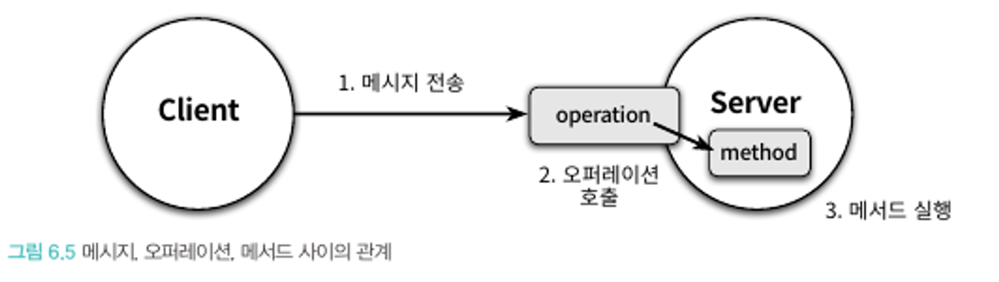

객체가 수신하는 메시지들이 객체의 퍼블릭 인터페이스를 구성한다.

훌륭한 퍼블릭 인터페이스를 만드는 방법은 책임주도 설계 방법을 따르는 것만으로는 부족하다.

그래서 유연하고 재사용 가능한 퍼블릭 인터페이스를 만드는데 도움이 되는 설계 원칙과 기법을 살펴보자.

### 협력과 메시지

**클라이언트-서버 모델**

메시지는 두 객체 사이의 협력을 가능하게 하는 매개체다.

객체가 다른 객체에게 접근할 수 있는 유일한 방법은 메시지를 전송하는 것뿐입니다.

두 객체 사이의 협력 관계를 설명하기 위해 사용되는 전통적인 메타포는 **클라이언트-서버 모델**이다.

클라이언트-서버 모델에서 클라이언트는 메시지 전송자, 서버는 메시지 수신자라고도 한다.

예매 시스템에서 Screening과 Movie 관계에서 예매하라 라는 메시지를 가지고, Screening은 클라이언트 역할을 수행하고, Movie는 서버의 역할을 수행한다.

‘할인 요금을 계산하라’ 라는 메시지를 처리하기 위해 Movie는 클라이언트, DiscountPolicy는 서버 역할을 하는데 Movie에서 알 수 있듯이 객체는 협력에 참여하는 동안 클라이언트와 서버 역할을 동시에 수행하는것이 일반적입니다.

한 객체가 다른 객체에게 도움을 요청하는 것을 **메시지 전송** 또는 **메시지 패싱** 이라고 합니다.

메시지는 오퍼레이션명과 인자로 구성되며 메시지 전송은 메시지 수신자를 포함한 것입니다.

```java
condition.isSatisfiedBy(screening)
 수신자      오퍼레이션명      인자
```

### 메시지와 메서드

메시지를 수신했을때, 실제 어떤 코드가 실행되는지는 메시지 수신자의 실제 타입이 무엇인가에 달려있습니다.

`condition.isSatisfiedBy(screening)`라는 메시지 전송 구문에서 condition의 타입은 DiscountCondition이지만, 실체화한 클래스 종류에 따라 PeriodCondition, SequenceCondition이 각각 실행 될 수 있다.

이렇게 메시지를 수신했을때, 실제로 실행되는 함수 또는 프로시저를 메서드라고 부릅니다.

- 중요한 것은 코드상에서 동일한 이름의 변수에게 동일한 메시지를 전송하더라도 객체의 타입에 따라 실행되는 메서드가 달라질 수 있다.
- 그래서 컴파일 시점과 실행 시점에 메시지와 메서드 라는 개념이 다를수 있다.

메시지 전송자는 그저 메시지에 응답할 수 있는 객체가 존재하고, 그 객체가 적절한 메서드를 선택해서 응답할 것이라고 믿을 수 밖에 없다.

메시지 전송자와 수신자는 서로에 대한 상세한 정보를 알지 못한 채 메시지라는 얇고 가는 끈을 통해 연결된다.

실행 시점에 메시지와 메서드를 바인딩하는 메커니즘은 두 객체 사이의 결합도를 낮춤으로써 유연하고 확장 가능한 코드를 작성할 수 있게 해준다.

### 퍼블릭 인터페이스와 오퍼레이션

객체가 의사소통을 위해 외부에 공개하는 메시지의 집합을 **퍼블릭 인터페이스** 라고 부른다.

프로그래밍 언어의 관점에서 퍼블릭 인터페이스에 포함된 메시지를 **오퍼레이션** 이라고 부른다.

오퍼레이션은 수행 가능한 어떤 행동에 대한 추상화이다.

- 오퍼레이션은 내부의 구현 코드를 제외하고 단순히 메시지와 관련된 시그니처를 가리키는 경우가 대부분이며, DiscountCondition의 isSatisfiedBy 를 예로 들 수 있다.

그에 비해 메시지를 수신했을 때 실제 실행되는 코드를 메서드라고 부른다.

- PeriodCondition, SequenceCondition의 isSatisfiedBy는 실제 구현을 포함하기 때문에 메서드라고 부른다.
- PeriodCondition, SequenceCondition의 isSatisfiedBy는 DiscountCondition 인터페이스에 정의된 isSatisfiedBy 오퍼레이션의 여러 가능한 구현 중 하나다.



퍼블릭 인터페이스와 메시지의 관점에서 '메서드 호출' 보다는 '오퍼레이션 호출'이라는 용어가 더 적절하다.

### 시그니처

오퍼레이션(또는 메서드)의 이름과 파라미터 목록을 합쳐 **시그니처**라고 부른다.

하나의 오퍼레이션에 대해 오직 하나의 메서드만 존재하는 경우 세상은 꽤나 단순해지고, 이런 경우에는 굳이 오퍼레이션과 메서드를 구분할 필요가 없다.

하지만 다형성의 축복을 받기 위해서는 하나의 오퍼레이션에 대해 다양한 메서드를 구현해야만 한다.

따라서 오퍼레이션의 관점에서 다형성이란 동일한 오퍼레이션 호출에 대해 서로 다른 메서드들이 실행되는것이라고 정의할 수 있다.

### 인터페이스와 설계 품질

좋은 인터페이스는 **최소한의 인터페이스**와 **추상적인 인터페이스** 라는 조건을 만족해야한다.

- 최소한의 인터페이스 : 꼭 필요한 오퍼레이션만 인터페이스에 포함한다.
- 추상적인 인터페이스 : 어떻게 수행하는지가 아니라 무억을 하는지를 표현한다.

좋은 인터페이스를 만들기 위한 가장 좋은 방법은 책임 주도 설계 방법을 따르는 것이다.

이는 메시지를 먼저 선택함으로써 협력과 무관한 오퍼레이션이 인터페이스에 포함되는 것을 방지하고, 메시지가 객체를 선택하게 함으로써 클라이언트의 의도를 메시지에 표현해서 추상적인 오퍼레이션이 인터페이스에 스며들게 한다.

퍼블릭 인터페이스의 품질에 영향을 미치는 원칙과 기법

- 디미터 법칙
- 묻지말고 시켜라(Tell, Don’t Ask)
- 의도를 드러내는 인터페이스
- 명령-쿼리 분리

### 디미터 법칙

```java
public class ReservationAgency {
    public Reservation reserve(Screening screening, Customer customer, int audienceCount) {
        Movie movie = screening.getMovie();

        boolean discountable = false;
        for(DiscountCondition condition : movie.getDiscountConditions()) {
            if (condition.getType() == DiscountConditionType.PERIOD) {
                discountable = screening.getWhenScreened().getDayOfWeek().equals(condition.getDayOfWeek()) &&
                        condition.getStartTime().compareTo(screening.getWhenScreened().toLocalTime()) <= 0 &&
                        condition.getEndTime().compareTo(screening.getWhenScreened().toLocalTime()) >= 0;
            } else {
                discountable = condition.getSequence() == screening.getSequence();
            }

            if (discountable) {
                break;
            }
        }
        ...
    }
}
```

이 코드의 단점은 Screening과의 결합도가 너무 높아 Screening의 내부 구현이 변경되면 ReservationAgency도 변경될 확률이 높고, 이는 screening 내부의 movie, DiscountCondition에도 직접 접근하기 때문이다.

이러한 문제를 해결하기 위해 제안된 원칙이 바로 **디미터 법칙(Law of Demeter)**이다.

디미터 법칙은 객체의 내부 구조에 강하게 결합되지 않도록 협력 경로를 제한 하라는 것이다.

디미터의 법칙은 ***"오직 인접한 이웃하고만 말하라"***로 요약할수가 있다.

디미터 법칙을 따르기 위해서는 클래스가 특정한 조건을 만족하는 인스턴스에만 메시지를 전송하도록 프로그래밍 해야 한다.

클래스 내부의 메서드가 아래 조건을 만족하는 인터스턴스에만 메시지를 전송하도록 프로그래밍 해야 한다.

**핵심**은 **자기 자신의 메서드**, **로컬 생성 객체** 에게만 메시지를 전달해야 한다.

- this 객체
- 메서드의 매개변수
- this의 속성
- this의 속성인 컬렉션의 요소
- 메서드 내에서 생성된 지역 객체

수정된 코드

```java
public class ReservationAgency {
    public Reservation reserve(Screening screening, Customer customer, int audienceCount) {
        Money fee = screening.calculateFee(audienceCount);
        return new Reservation(customer, screening, fee, audienceCount);
    }
}
```

- 메서드 인자로 전달된 screening에게 메시지를 전송할뿐, 내부에 대해서는 알지 못한다.
- 이는 Screening의 내부 구조에 결합돼 있지 않기 때문에 Screening의 내부가 변경되어도 ReservationAgency가 변경될 필요가 없다는 것을 뜻한다.

디미터 법칙을 위반하는 전형적인 코드

```java
Screening.getMovie().getDiscountConditions();
```

메시지 전송자가 수신자의 내부 구조에 대해 물어보고 반환받은 요소에 대해 연쇄적으로 다시 메시지를 전송한다.

이를 **기차 충돌(train wreck)**이라고 부른다.

- 이는 내부 구현이 외부로 노출되게 되고 메시지 수신자의 캡슐화가 무너지고, 내부 구현에 강하게 결합된다.

```java
Screening.calculateFee(audienceCount); // 개선
```

디미터의 법칙은 정보를 처리하는데 필요한 책임을 정보가 알고 있는 객체에게 할당하기 때문에 응집도가 높은 객체가 만들어 진다.

메시지를 보낼때는 내부 구조를 묻는 것이 아니라, 무언가를 시키는 메시지가 더 좋은 메시지 이다.

하지만 또 이러한 디미터 법칙을 무분별 하게 사용하다보면, 퍼블릭 인터페이스 관점에서 객체의 응집도가 낮아질수도 있다.

### 묻지 말고 시켜라

디미터 법칙은 훌륭한 메시지는 객체의 상태에 관해 묻지 말고 원하는 것을 시켜야 한다는 사실을 강조한다.

**묻지 말고 시켜라(Tell, Don't Ask)**는 이런 스타일의 메시지 작성을 장려하는 원칙을 가리키는 용어다.

객체의 외부에서 해당 객체의 상태를 기반으로 결정을 내리면 안된다.

- 자연스럽게 정보 전문가에게 책임을 할당하게 한다.

묻지말고 시켜라 원착과 디미터 법칙은 훌륭한 인터페이스를 제공하기 위해 포함해야 하는 오퍼레이션에 대한 힌트를 제공한다.

- 내부의 상태를 묻는 오퍼레이션을 인터페이스에 포함시킨다면 더 나은 방법이 없는지 고민해보고 내부의 상태를 이용해 어떤 결정을 내리는 로직이 객체 외부에 존재한다면 해당 객체가 책임져야하는 행동이 외부로 누수되고, 캡슐화에 위반된것임을 알 수 있다.

협력을 설계하고 객체가 수신할 메시지를 결정하는 매 순간 묻지 말고 시켜라 원칙과 디미터 법칙을 상기하자.

### 의도를 드러내는 인터페이스

켄트백은 메서드를 명명하는 두 가지 방법을 설명 했다.

1. 메서드가 작업을 **어떻게** 수행하는지를 나타내도록 이름 짓는것이다.
2. 메서드가 **무엇을** 하는지를 메서드 명에 드러내는 것이다.

어떻게 수행하는지 드러내는 메서드명

```java
public class PeriodCondition {
    public boolean isSatisfiedByPeriod(Screening screening) { ... }
}

public class SequenceCondition {
    public boolean isSatisfiedBySequence(Screening screening) { ... }
}
```

메서드가 어떻게 수행하는지를 나타내도록 이름을 짓게 되면 좋지 않은데 그 이유가 두 가지 존재한다.

- 두 메서드 모두 할인 조건을 판단하는 동일한 작업을 수행하지만, 메서드의 이름이 다르기 때문에 두 메서드의 내부 구현을 정확하게 이해하지 못한다면 두 메서드가 동일한 작업을 수행한다는 사실을 알아채기 어렵다.
- 메서드 수준에서 캡슐화를 위반한다. 메서드를 사용하는 클라이언트는 PeriodCondition을 사용하던 코드가 SequenceCondition을 사용하도록 변경하려면 단순히 참조하는 객체를 변경하는 것 뿐만 아니라, 호출하는 메서드를 변경해야 한다. 따라서 클라이언트 코드 또한 변경해야 한다.

메서드의 이름을 지을때는 **어떻게** 가 아니라, **무엇을** 하는지를 드러내는 것이 좋다.

- 무엇을 하는지를 드러내도록 메서드의 이름을 짓기 위해서는 객체가 협력 안에서 수행해야 하는 책임에 관해 고민해야 한다.
- 이는 외부의 객체가 메시지를 전송하는 목적을 생각하도록 하고, 협력하는 클라이언트의 의도에 부합하도록 메서드의 이름을 짓게 된다.

따라서 두 메서드 모두 클라이언트의 의도를 담을수 있도록 isSatisfiedBy로 변경하고 추가적으로 클라이언트가 두 메서드를 가진 객체를 동일한 타입으로 간주할 수 있도록 타입 계층을 인터페이스로 묶어야 한다.

```java
public interface DiscountCondition {
    boolean isSatisfiedBy(Screening screening);
}
```

이처럼 무엇을 하느냐에 따라 메서드의 이름을 짓는 패턴을 **의도를 드러내는 선택자(Intention Revealing Selector)**라고 부릅니다.

- 하나의 구현을 가진 메시지의 이름을 일반화하도록 도와주는 간단한 훈련방법
    - 매우 다른 두번째 구현을 상상하고 해당 메서드에 동일한 이름을 붙인다고 생각해봐라. 그러면 아마 그 순간에 할수있는 가장 추상적인 이름을 메서드에 붙일것이다.

객체에게 묻지 말고 시키되 구현 방법이 아닌 클라이언트의 의도를 드러내야 한다! → 클라이언트가 원하는 메시지가 있어서 이를 처리할 객체가 필요한 것이지, 이미 존재하는 객체에 메시지를 맞추면 안된다.

### 함께 모으기

디미터 법칙은 객체간의 협력을 설계할 때, 캡슐화를 위반하는 메시지가 인터페이스에 포함되지 않도록 제한한다.

묻지말고 시켜라 원칙은 디미터 법칙을 준수하는 협력을 만들기 위한 스타일을 제시한다.

의도를 드러내는 인터페이스 원칙은 객체의 퍼블릭 인터페이스에 어떤 이름이 드러나야 하는지에 대한 지침을 제공함으로써 코드의 목적을 명확하게 커뮤니케이션 할 수 있게 해준다.

- 결합도가 낮고, 의도를 명확히 드러내는 간결한 협력을 원한다면 이 세가지 원칙을 따르면 도움이 될것임!

## 원칙의 함정

설계는 트레이드오프의 산물이다.

초보자 일수록 맹목적으로 원칙을 추종하려 한다. 적용하려는 원칙들이 서로 충돌 나도 스스로 정당성을 부여하면서 억지로 끼워 맞춘다. → 결과적으로 설계는 일관성이 없어지고, 코드는 무질서속에 파묻힌다.

원칙이 현 상황에서 부적합 하다면 과감하게 원칙을 무시하라.

원칙을 아는것 보다 중요한 것은 언제 원칙이 유용하고, 유용하지 않은지를 판단할 수 있는 능력을 기르는 것이다.

### 위 원칙을 적용할때 고려해볼 만한 이슈 몇가지

1. **디미터 법칙은 하나의 도트(.)를 강제하는 규직이 아니다.**

```java
IntStream.of(1, 2, 15, 22, 7).filter(x -> x > 10).distinct().count();
```

위 코드를 디미터 법칙을 위반한다고 생각한다면 디미터 법칙을 제대로 이해하지 못한것이다.

of, filter, distinct, count 는 동일한 클래스의 IntStream을 단지 IntStream을 다른 IntStream으로 반환할 뿐 객체를 둘러싸는 캡슐은 그대로 유지된다.

디미터 법칙은 결합도와 관련된 것이며, 위 코드는 디미터의 법칙을 위반하지 않는다.

이 결합도가 문제 되는 것은 객체의 내부 구조가 외부로 노출되는 경우로 한정된다.

IntSream의 내부 구조가 외부로 노출되었는가? 아니다, 객체를 둘러싸고 있는 캡슐은 그대로 유지된다.

아무리 dot(.)를 여러번 사용하여 기차 충돌처럼 보이는 코드라도 객체의 내부 구현을 외부에 노출하지 않는다면 그것은 디미터의 법칙을 준수한 것이다.

1. **결합도와 응집도의 충돌**

일반적으로 어떤 객체에게 상태를 물어본 후 반환된 값을 기반으로 결정을 내리는 코드는 ***"묻지 말고 시켜라"*** 스타일로 변경해야 한다.

하지만, 모든 경우에 “묻지말고 시켜라” 원칙을 따르는것이 좋지는 않으며, 그럴 경우 퍼블릭 인터페이스 안에 어울리지 않는 오퍼레이션들이 공존하게 된다.

이는 해당 객체가 가져야하는 본질적인 책임을 떠안게 된다는 것이고, 그렇게 되면 자연스레 해당 객체의 응집도는 낮아지게 된다.

로버트 마틴은 **클린코드** 에서 디미터 법칙의 위반 여부는 묻는 대상이 객체인지, 자료구조 인지에 달려있다고 설명한다.

객체는 내부 구조를 숨겨야 하므로 디미터 법칙을 따르는 것이 좋지만, 자료 구조라면 당연히 내부 구조를 노출해야 하므로 디미터 법칙을 적용할 필요가 없다.

**소프트웨어 설계에 법칙이란 존재하지 않는다. 원칙을 맹신하지 마라.**

### 명령-쿼리 분리 원칙

명령-쿼리 분리 원칙은 퍼블릭 인터페이스에 오퍼레이션을 정의할 때 참고할 수 있는 지침을 제공한다.

어떤 절차를 묶어 호출 가능하도록 이름을 부여한 기능 모듈을 루틴(routine)이라고 부른다.

루틴은 다시 `프로시저(procedure)`와 `함수(function)`로 구분할 수 있다.

- `프로시저는 부수효과를 발생시킬 수 있지만 값을 반환할 수 없다`
- `함수는 값을 반환할 수 있지만 부수효과를 발생시킬 수 없다`

객체의 상태를 수정하는 오퍼레이션을 **명령(Command)**이라고 부르고 객체와 관련된 정보를 반환하는 오퍼레이션을 **쿼리(Query)**라고 부른다.

명령-쿼리 분리 원칙의 요지는 오퍼레이션은 명령, 쿼리 둘 중 하나여야 한다. 어떤 오퍼레이션도 명령인 동시에 쿼리여서는 안된다 라는 것이다.

- 객체의 상태를 변경하는 명령은 반환값을 가질 수 없다.
- 객체의 정보를 반환하는 쿼리는 상태를 변경할 수 없다.

### 명령과 쿼리를 분리해서 얻게 되는 장점

**반복 일정의 명령과 쿼리 분리하기**

주기적으로 이벤트를 추가하는 기능

해당 이벤트 클래스는 현재 정의한 스케쥴이 설정되어있는지 검사하는 isSatisfied 메서드를 제공한다고 가정.

```java
public class Event {
	public boolean isSatisfied(RecurringSchedule schedule) {
		if(form.getDayOfWeek() != schedule.getDayOfWeek() || !from.toLocalTime().equals(schedule.getFrom())) {
			reschedule(schedule);			
			return false;
		}
		return true;
	}
}
```

이 메서드는 만족하는 스케줄이 없을 경우 reschedule(현재 스케줄 수정)하면서 false를 리턴하게 된다.

예를 들어 매주 수요일마다 반복적으로 이벤트를 생성하는데 누군가 목요일까지 이벤트 진행하는 이벤트를 isSatisfied 메서드를 호출하여 확인하였다.

처음에 리턴한 결과값은 false 다. 그러나 한번 더 호출하게 되면 reschedule에 의해서 이벤트의 상태를 변경하기 때문에 true를 반환하게 된다.

버그를 찾기 어려운 이유는 isSatisfied가 명령과 쿼리의 두 가지 역할을 동시에 수행하고 있었기 때문이다.

- isSatisfied는 이벤트가 조건에 부합하는지 판단 후 true/false 를 반환한다. 개념적으로 쿼리다.
- 하지만, 이벤트가 조건에 부합하지 않는다면, 이벤트의 상태를 조건에 부합하도록 변경한다. 따라서 부수효과를 가지는 명령이다.

사실 isSatisfied 메서드가 처음 구현됐을 때는 그 안에서 reschdule 메서드를 호출하는 부분이 빠져 있었다.

기능을 추가하는 과정에서 누군가 Event가 조건에 맞지 않을 경우 Event 상태를 수정해야 한다는 요구사항을 추가했고, 프로그래머는 별다른 생각 없이 기존에 있던 isSatisfied 메서드에 reschdule 메서드를 호출하는 코드를 추가해 버린 것이다.

이는 명령과 쿼리를 동시에 수행하는 오퍼레이션을 만든것이고, 겉으로는 쿼리처럼 보이지만 부수효과를 가지는 메서드가 되어서, 버그를 양산하는 코드가 되었다.

가장 깔끔한 해결책은 명령과 쿼리를 명확하게 분리하는 것이다.

```java
public class Event {
    public boolean isSaisfied(RecurringSchedule schedule) { ... }
    public void reschedule(RecurringSchedule schedule) { ... }
}
```

반환 값을 돌려주는 메서드는 쿼리이므로 부수 효과에 대한 부담이 없다. 따라서 몇 번을 호출하더라도 다른 부분에 영향을 미치지 않는다.

### **명령-쿼리 분리와 참조 투명성**

명령과 쿼리를 분리함으로써 명령형 언어의 틀 안에서 **참조 투명성(referential transparency)**의 장점을 제한적이나마 누릴 수 있다.

그럼 참조 투명성이란 무엇일까?

컴퓨터의 세계와 수학의 세계를 나누는 가장 큰 특징은 **부수효과**이다.

프로그램에서는 대입문과 함수를 통해 부수효과를 발생시킬수가 있다.

수학의 경우 x의 값을 초기화 한 후에는 변경이 불가능 하지만, 프로그램에서는 대입문을 이용해 다른 값으로 변경이 가능하다.

함수는 내부에 부수효과를 포함할 경우 동일한 인자를 전달하더라고 결과값이 매번 다를 수 있다.

참조 투명성이란, **"어떤 표현식 e가 있을 때 e의 값으로 e가 나타나는 모든 위치를 교체하더라도 결과가 달라지지 않는 특성"**을 의미한다.

함수 f(n)이 있을때, 예를 들어 f(1)이 3이라고 가정하자.

f(1) + f(1) = 6

f(1) * 2 = 6

f(1) - 1 = 2

f(1)의 결과값을 3으로 바꾸면 식의 결과는 변하지 않는다. 이것이 바로 참조 투명성 이다.

위 식에서 표현식 e는 f(1) 이고, 값은 3이다. 모든 표현식을 3이라는 값으로 바꿔도 결과는 달라지지 않는다.

참조 투명성을 만족하는 식은 두가지 장점을 제공한다.

- 모든 함수를 이미 알고있는 하나의 값으로 대체할 수 있기 때문에 식을 쉽게 계산할 수 있다.
- 모든 곳에서 함수의 결과값이 동일하기 때문에 식의 순서를 변경하더라도 결과는 동일하다.

명령 쿼리 분리 원칙을 적용하면 제한적으로나마 이러한 참조 투명성의 혜택을 누릴수 있게 된다.

---

### **책임에 초점을 맞춰라**

- 디미터 법칙 : 협력이라는 컨텍스트 안에서 객체보다 메시지를 먼저 결정하면 두 객체 사이의 `구조적인 결합도를 낮출 수 있다.` 수신할 객체를 알지 못한 상태에서 메시지를 먼저 선택하기 때문에 객체의 내부 구조에 대해 고민할 필요가 없어진다. 따라서 메시지가 객체를 선택하게 함으로써 의도적으로 디미터 법칙을 위반할 위험을 최소화할 수 있다.
- 묻지 말고 시켜라 : 메시지를 먼저 선택하면 묻지 말고 시켜라 스타일에 따라 협력을 구조화하게 된다. 클라이언트의 관점에서 메시지를 선택하기 때문에 필요한 정보를 물을 필요 없이 `원하는 것을 표현한 메시지를 전송하면 된다.`
- 의도를 드러내는 인터페이스 : 메시지를 먼저 선택한다는 것은 메시지를 전송하는 클라이언트의 관점에서 메시지의 이름을 정한다는 것이다. 당연히 `그 이름에는 클라이언트가 무엇을 원하는지 그 의도가 분명하게 드러날 수 밖에 없다.`
- 명령-쿼리 분리 원칙 : 메시지를 먼저 선택한다는 것은 협력 이라는 문맥 안에서 객체의 인터페이스에 관해 고민한다는 것을 의미한다. 객체가 단순히 어떤 일을 해야 하는지 뿐만 아니라 협력 속에서 객체의 상태를 예측하고 이해하기 쉽게 만들기 위한 방법에 관해 고민하게 된다. `따라서 예측 가능한 협력을 만들기 위해 명령과 쿼리를 분리하게 될 것이다.`