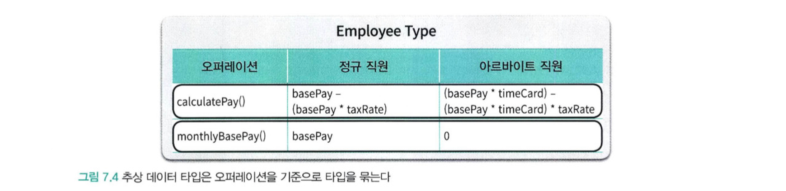
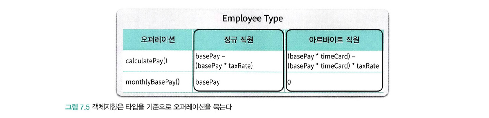
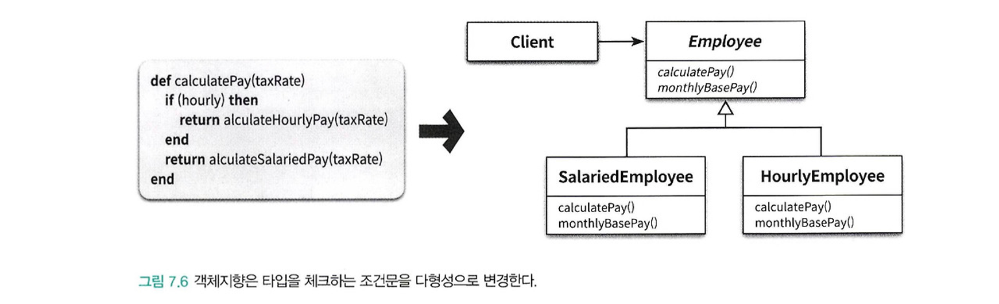

인간의 기억은 장기기억과 단기기억으로 나눌 수 있습니다.

단기기억은 '매직넘버 7'이라는 제한을 가지고 있어 한 번에 5에서 9개의 항목만 저장할 수 있습니다.

또한, 새로운 정보를 처리하는 데 약 5초가 소요됩니다.

하지만, 문제 해결 과정에서 필요한 정보의 양이 단기기억의 용량을 초과하면 **인지 과부하**가 발생하여 문제 해결 능력이 저하됩니다.

인지 과부하를 방지하기 위해 단기 기억에 저장할 정보의 양을 조절하는 것이 좋습니다.

이는 불필요한 세부사항을 제거하고 본질적인 정보만 남겨 문제를 단순화하는 과정을 말하며, 이러한 과정을 **추상화**라고 합니다.

가장 일반적인 추상화 방법은 한번에 다뤄야 하는 문제의 크기를 줄이는 것으로 큰문제를 해결 가능한 작은 문제로 나누는 작업을 **분해**라고 합니다.

추상화를 더 큰 규모의 추상화로 압축시켜 단기 기억의 한계를 초월할 수 있다.

---

### 프로시저 추상화와 데이터 추상화

모든 프로그래밍 패러다임은 추상화와 분해의 관점에서 설명할 수 있다.

현대적인 프로그래밍 언어를 특징 짓는 중요한 두 가지 추상화 메커니즘은 **프로시저 추상화**와 **데이터 추상화** 이다.

프로그래밍 패러다임은 적절한 추상화의 윤곽을 따라 시스템을 어떤 식으로 나눌것인지를 결정하는 원칙과 방법의 집합입니다.

**프로시저 추상화**

- 프로시저 추상화를 중심으로 시스템을 분해하는 것은 기능 분해(functional decomposition)을 통해 추상화 하는 기법이다.
- 기능 분해는 알고리즘 분해(algorithmic decomposition)이라고 부르기도 한다.

**데이터 중심 추상화**

데이터 중심으로 추상화 하는 방법은 타입 추상화와 프로시저 추상화 두 가지가 있다.

- **타입 추상화(type abstraction)**
    - 추상 데이터 타입이라 부른다.
- **프로시저 추상화(procedure abstraction)**
    - 객체지향이라 부른다.
    - 역할과 책임을 수행하는 객체

객체지향이 전통적인 기능 분해 방법에 비해 효과적인 이유는 무엇일까??

전통적인 기능 분해 방법에서 시작해서 객체지향 분해방법에 이르는 방법을 알아보자.

### 프로시저 추상화와 기능분해

먼저 전통적인 분해 방법은 **하향식 접근법**을 따른다.

하향식 접근법이란 시스템을 구성하는 최상위 기능을 정의하고 최상위 기능을 좀 더 작은 단계의 하위 기능으로 분해해 나가는 방법입니다.

분해는 세분화된 마지막 하위 기능이 프로그래밍 언어로 구현 가능한 수준이 될 때까지 계속되고 각 세분화 단계는 바로 위 단계보다 구체적이어야 한다. (상위 기능보다 덜 추상적이어야 한다.)

하향식 접근법의 예시

```java
직원의 급여를 계산한다.
	사용자로부터 소득세율을 받는다.
		"세율을 입력하세요 : "라는 문장을 출력한다.
		키보드를 통해 세율을 입력받는다.
	직원의 급여를 계산한다.
		전역 변수에 저장된 직원의 기본급 정보를 얻는다.
		급여를 계산한다.
	양식에 맞게 결과를 출력한다.
		"이름 : {직원명}, 급여: {계산된 금액}" 형식에 따라 출력 문자열을 생성한다.
```

최상위 기능을 수행하는데 필요한 절차를 세분화해서 하위 단계의 목차로 구체적인 내용을 포함시킨다.

이는 유지보수에 다양한 문제를 야기하고, 이 문제를 이해하는것은 객체지향의 장점을 이해할 수 있는 좋은 출발점입니다.

### 하향식 접근법의 문제점

하향식 기능 분해 방법은 겉으로는 이상적일 수 있지만, 실제로 설계에 적용하다 보면 다음과 같은 다양한 문제에 직면한다.

- 시스템은 하나의 메인 함수로 구성돼 있지 않다.
- 기능 추가나 요구사항 변경으로 인해 메인 함수를 빈번하게 수정해야 한다.
- 비지니스 로직이 사용자 인터페이스와 강하게 결합된다.
- 하향식 분해는 너무 이른 시기에 함수들의 실행 순서를 고정시키기 때문에 유연성과 재사용성이 저하된다.
- 데이터 형식이 변경될 경우 파급효과를 예측할 수 없다.

소프트웨어는 항상 변하게 되고 하향식 접근법과 기능 분해가 가지는 근본적인 문제점은 변경에 취약한 설계를 낳게한다.

**하나의 메인함수라는 비현실적인 아이디어(**시스템은 하나의 메인 함수로 구성돼 있지 않다.)

어떤 시스템도 최초에 릴리즈됐던 당시의 모습을 그대로 유지하지는 않는다.

시간이 지나고 사용자를 만족시키기 위한 새로운 요구사항을 도출해나가면서 지속적으로 새로운 기능을 추가하게 된다.

이것은 시스템이 오직 하나의 메인 함수만으로 구현된다는 개념과는 완전히 모순된다.

- 하나의 시스템의 전체 기능을 트리로 정리했을 때 모든 기능을 자식노드로 가지는 메인 기능을 선택하는것은 어려울것이다.

하향식 접근법은 하나의 알고리즘을 구현하거나 배치 처리를 구현하기에는 적합하지만 현대적인 상호작용 시스템을 개발하는 데는 적합하지 않다.

**메인함수의 빈번한 재설계 (**기능 추가나 요구사항 변경으로 인해 메인 함수를 빈번하게 수정해야 한다.)

시스템 안에는 여러 개의 정상급 함수가 존재하기 때문에 결과적으로 하나의 메인 함수를 유일한 정상으로 간주하기 어렵다.

하향식 기능 분해의 경우에는 새로운 기능을 추가할 때마다 매번 메인 함수를 수정해야 한다.

**기존 로직과는 아무런 상관이 없는 새로운 함수의 적절한 위치를 확보해야 하기** 때문에 메인 함수의 구조를 급격하게 변경하거나 새로 짤 수 밖에 없다.

코드의 빈번한 수정으로 인한 버그 발생 확률이 높아지고 시스템은 변경에 취약 해질 수 밖에 없다.

- 이는 기존 코드를 수정하는데 필요한 용기를 꺾게 된다.

**비즈니스 로직과 사용자 인터페이스의 결합**

하향식 접근법은 비지니스 로직을 설계하는 초기 단계부터 입력 방법과 출력 양식을 함께 고민하도록 강요한다.

결과적으로 코드 안에서 비즈니스 로직과 사용자 인터페이스 로직이 밀접하게 결합된다.

사용자 인터페이스 로직과 비즈니스 로직을 한데 섞기 때문에 사용자 인터페이스를 변경하면 비즈니스 로직까지 영향을 받게 된다.

하향식 접근법은 기본적으로 변경에 불안정한 아키텍처 구조를 갖게 된다.

**성급하게 결정된 실행 순서**

하향식으로 기능을 분해하는 과정에서 함수는 더 작은 함수들로 분해되고, 분해된 함수들의 실행 순서를 결정하는 작업으로 요약된다.

- 이것은 설계를 시작하는 시점부터 시스템이 무엇을 해야하는지가 아니라 어떻게 동작해야 하는지에 집중하게 한다

처음부터 구현을 염두에 두기 때문에 자연스럽게 함수들의 시간적 실행 순서를 강조한다.

결과적으로 모든 중요한 제어 흐름의 결정이 상위 함수에서 이뤄지고 하위 함수는 상위 함수의 흐름에 따라 적절한 시점에 호출된다.

결과적으로 기능을 추가하거나 변경하는 작업은 기존의 함수 제어 구조를 변경하게 만든다.

분해된 함수를 재사용하기 어렵다.

- 재사용이라는 개념은 **일반성**이라는 의미를 내포한다. (상위 함수보다 일반적이다)
- 하향식 접근법에서는 하위 함수는 상위 함수에 비해 일반적일 수 없다. (재사용이 어렵다.)

하향식 설계와 관련된 모든 문제의 원인은 **결합도**다.

- 함수는 상위 함수가 강요하는 문맥, 절차에 강하게 경합된다.
- 이는 사소한 변경에도 전체 시스템에 영향을 미치고, 다른 문맥으로 옮겼을때 재사용하기 어렵다.

**데이터 형식이 변경될 경우 파급효과를 예측할 수 없다.**

하향식 기능분해의 가장 큰 문제점은 어떤 데이터를 어떤 함수가 사용하고 있는지를 추적하기 어렵다.

- 이로 인해 데이터 변경이 발생했을때 어떤 함수가 영향 받을지 예상하기 어렵다.
- 이는 의존성과 결합도의 문제이면서 테스트의 문제이기도 하다.

데이터의 변경으로 인한 영향은 데이터를 직접 참조하는 모든 함수로 퍼져나간다.
따라서 데이터 변경으로 인해 발생하는 함수에 대한 영향도를 파악하는 것은 예측할 수 없다.

그래서 데이터 변경으로 인한 영향을 최소화하려면 데이터와 함께 변경되는 부분과 그렇지 않은 부분을 명확하게 분리해야 한다.

데이터와 함께 변경되는 부분을 하나의 구현 단위로 묶고 외부에서는 **퍼블릭 인터페이스**를 통해서만 데이터에 대한 접근을 통제한다.

변경에 대한 영향을 최소화하기 위해 영향을 받는 부분과 받지않는 부분을 명확하게 분리하고 잘 정의된 퍼블릭 인터페이스를 통해 변경되는 부분에 대한 접근을 통제해야 한다.

이와 같은 기능 분해가 가진 본질적인 문제를 해결하기 위해 정보 은닉과 모듈이라는 개념을 제시하게 되었다.

### 정보은닉과 모듈

시스템의 변경을 관리하는 기본적인 전략은 함께 변경되는 부분을 하나의 구현단위로 묶고 퍼블릭 인터페이스를 통해서만 접근하도록 만드는 것이다.
기능을 기반으로 시스템을 분해하는 것이 아니라 **변경의 방향에 맞춰 시스템을 분해**하는 것이다.

정보 은닉은 시스템을 모듈 단위로 분해하기 위한 기본 원리로 시스템에서 **자주 변경되는 부분을 상대적으로 덜 변경되는 안정적인 인터페이스 뒤로 감춰야 한다는 것**이 핵심이며 이는 시스템을 분할하는 모듈 분할의 원리이다.

모듈과 기능 분해는 상호 배타적인 관계가 아니다.

감춰야 하는 비밀을 결정 후 모듈을 분해한 후에는 기능 분해를 이용해서 모듈에 필요한 퍼블릭 인터페이스를 구현할 수 있다.

시스템이 감춰야하는 비밀? → 모듈은 다음과 같은 두 가지 비밀을 감춰야 한다.

- **복잡성**
    - 모듈이 너무 복잡한 경우 이해하고 사용하기 어렵다.
    - 외부에 모듈을 추상화할 수 있는 간단한 인터페이스를 제공해서 모듈의 복잡도를 낮춘다.
- **변경 가능성**
    - 변경 가능한 설계 결정이 외부에 노출될 경우 실제로 변경이 발생했을 때 파급효과가 커진다.
    - 변경 발생 시 하나의 모듈만 수정하면 되도록 변경 가능한 설계 결정을 모듈 내부로 감춘다.
    - 외부에는 쉽게 변경되지 않을 인터페이스를 제공한다.

### 모듈의 장점과 한계

**모듈의 장점**

모듈 내부의 변수가 변경되더라도 모듈 내부에만 영향을 미친다

- 모듈을 사용하면 모듈 내부에 정의된 변수를 직접 참조하는 코드의 위치를 모듈 내부로 제한할 수 있다.
- 어떤 데이터가 변경됐을 때 영향을 받는 함수를 찾기 위해 해당 데이터를 정의한 모듈만 검색하면 된다.
- 모듈은 데이터 변경으로 인한 파급효과를 제어할 수 있기 때문에 코드를 수정하고 디버깅하기 용이하다

비즈니스 로직과 사용자 인터페이스에 대한 관심사를 분리한다.

전역 변수와 전역 함수를 제거함으로써 네임스페이스 오염을 방지한다.

- 모듈의 한가지 용도는 네임스페이스를 제공하는 것이다.
- 변수와 함수를 모듈 내부에 포함시키기 때문에 다른 모듈에서도 동일한 이름을 사용할 수 있다.
- 따라서 모듈은 전역 네임스페이스의 오염을 방지하는 동시에 이름 충돌의 위험을 완화한다.

모듈은 기능이 아니라 변경의 정도에 따라 시스템을 분해하게 한다.

- 이는 외부에 감춰야 하는 비밀과 관련이 높은 데이터와 함수의 집합을 의미한다.
- 따라서, 모듈 내 응집도는 높이고 퍼블릭 인터페이스로만 통신하기 때문에 모듈간 결합도는 낮게 유지할 수 있다.

모듈은 데이터와 함수가 통합된 한 차원 높은 추상화를 제공하는 설계 단위가 된다.

**모듈의 단점**

모듈이 프로시저 추상화 보다는높은 추상화를 제공하지만 한계가 명확하며, 인스턴스의 개념을 제공하지 않는다.

### 데이터 추상화와 추상 데이터 타입

프로그래밍 언어에서 **타입(Type)** 이란 변수에 저장할 수 있는 내용물의 종류와 변수에 적용될 수 있는 연산의 가짓수를 의미한다.

프로그래밍 언어는 다양한 형태의 내장 타입(built-in type)을 제공한다.

- 기능 분해 시대에 사용되던 절차형 언어들은 적은 수의 내장 타입만을 제공
- 새로운 타입을 추가하는 것이 불가능하거나 제한적이었다.

프로시저 추상화로는 프로그램의 표현력을 향상시키는데 한계가 있다는 사실을 발견했고 이를 보완하기 위해 데이터 추상화의 개념을 제안했다.

추상 데이터 타입을 구현하려면 다음과 같은 특성을 위한 프로그래밍 언어의 지원이 필요하다.

- 타입 정의를 선언할 수 있어야 한다.
- 타입의 인스턴스를 다루기 위해 사용할 수 있는 오퍼레이션의 집합을 정의할 수 있어야 한다.
- 제공된 오퍼레이션을 통해서만 조작할 수 있도록 데이터를 외부로부터 보호할 수 있어야 한다.
- 타입에 대해 여러 개의 인스턴스를 생성할 수 있어야 한다

추상 데이터 타입은 사람들이 세상을 바라보는 방식에 좀 더 근접해지도록 추상화 수준을 향상 시키지만, 데이터와 기능을 분리해서 바라본다.

추상 데이터 타입은 시스템의 상태를 저장할 데이터를 표현한다.

- 하지만, 이를 이용해서 구현하는 로직은 추상 데이터 타입 외부에 존재한다. 이는 데이터와 기능을 분리하는 절차적인 설계의 틀에 갇혀있다는 뜻이다.

리스코프가 이야기한 추상 데이터 타입의 기본 의도는 프로그래밍 언어가 제공하는 타입처럼 동작하는 사용자 정의 타입을 추가할 수 있게 하는 것이다.

프로그래밍 언어의 관점에서 추상 데이터 타입은 프로그래밍 언어의 내장 데이터 타입과 동일하다.

- 다만 개발자가 정의할 수 있다는 점이 다를 뿐이다.

그럼 다음 질문이 이어질 수 있다 “클래스는 추상 데이터 타입인가?“

### **클래스는 추상 데이터 타입인가?**

대부분의 프로그래밍 서적에서는 클래스를 추상 데이터 타입으로 설명한다.

- 클래스와 추상데이터 타입 모두 데이터 추상화를 기반으로 시스템을 분해하기 때문에 틀린것만은 아니다.

그러나 명확한 의미에서 추상 데이터 타입과 클래스는 동일하지 않다.

가장 핵심적인 차이는 클래스는 상속과 다형성을 지원하는데 비해 추상 데이터 타입은 지원하지 못한다는 점이다.

- 상속과 다형성을 지원하는 프로그래밍 기법을 객체지향 프로그래밍 (Object-Oriented Programming)이라 한다.
- 상속과 다형성을 지원하지 않는 추상 데이터 타입 기반의 프로그래밍 기법을 객체기반 프로그래밍(Object-Based Programming)이라 한다.

추상 데이터 타입과 객체지향 차이

**추상 데이터 타입 Employee**



- 정규 직원과 아르바이트 직원이 하나의 타입에서 직원 유형에 따라 서로 다른 방식으로 동작한다.

하나의 타입처럼 보이는 Employee 내부에는 정규직원과 아르바이트 직원이라는 두 개의 타입이 공존한다

- 설계 관점에서 Employee 타입은 구체적인 직원 타입을 외부에 캡슐화 하는 것이다.
- 이처럼 하나의 대표 타입이 다수의 세부타입을 감추기 때문에 **타입 추상화** 라고 불렀다.

타입 추상화는 오퍼레이션을 기준으로 타입을 통합하는 데이터 추상화 기법이다.

- Employee 를 사용하는 클라이언튼느 calculatePay와 monthlyBasePay 오퍼레이션을 호출할 수 있지만, 정규 직원이나 아르바이트 직원이 있다는 사실은 알 수 없다.

추상 데이터 타입이 오퍼레이션을 기준으로 타입을 묶는다면, 객체지향은 타입을 기준으로 오퍼레이션을 묶는다.

**객체지향**



객체지향은 타입을 기준으로 오퍼레이션을 묶는다.

- 정규직원과 알바를 두개의 타입을 명시적으로 정의 후 각 오퍼레이션의 실행 절차를 두 타입에 맞게 적절하게 구현한다.

두가지 이상의 클래스로 분리할 경우 공통 로직을 어디에 둘지가 이슈가 된다.

- 가장 간단한 방법은 부모클래스에 공통로직을 정의하고 상속시킨다.
- 이후 클라이언트는 부모 클래스 참조자에 메시지를 전송하면 실제 클래스가 무엇인지에 따라 적절한 절차가 실행된다.
    - 동일한 메시지에 대해 다르게 반응하고 이것이 다형성이다.
- 실제 내부에서 수행되는 절차는 다르지만 클래시를 이용한 다형성은 절차에 대한 차이점을 감춘다.
    - 따라서 객체지향은 **절차 추상화**다.

추상 데이터 타입

- 오퍼레이션을 기준으로 타입을 추상화

클래스

- 타입을 기준으로 절차들을 추상화한다.

이것이 추상 데이터 타입과 클래스의 차이점이다.

### 변경을 기준으로 선택하라

단순히 클래스를 구현 단위로 사용한다는 것이 객체지향 프로그래밍을 한다는 것을 의미하지 않는다.

비록 클래스를 사용하고 있더라도 타입을 기준으로 절차를 추상화하지 않았다면 그것은 객체지향 분해가 아니다.

클래스가 추상 데이터 타입의 개념을 따르는지 확인하는 방법은 내부에 인스턴스의 타입을 표현하는 변수가 있는지 확인하는 것이다.

- 인스턴스 변수에 저장된 값을 기반으로 메서드 내에서 타입을 명시적으로 구분하는 방식은 객체지향을 위반하는 것으로 간주된다.

객체지향은 타입 변수를 이용한 조건문을 다형성으로 대체한다.



조건문을 사용하는 방식을 기피하는 이유 역시 변경 떄문이며, 추상 데이터 타입을 기반으로 한 Employee에 새로운 직원 타입을 추가하려면 hourly 값을 체크하는 조건문을 다 수정해야한다.

하지만 객체지향은 새로운 직원 유형을 구현하는 클래스를 Employee를 상속하게 하고 필요한 메서드를 오버라이딩하면된다.

- 기존 코드에 아무 영향을 미치지 않고, 새로운 객체 유형과 행위를 추가할 수 있게 하는 특성을 **OCP(개방-폐쇄 원칙)**이라고 부른다.

항상 절차를 추상화하는 객체지향 설계 방식을 따라야하는가?

추상 데이터 타입은 모든 경우 최악인가?

**설계는 변경과 관련된 것이다!**

설계의 유용성은 변경의 방향성과 발생 빈도에 따라 결정된다.

변경이 ‘타입 추가’에 관한것인지, ‘오퍼레이션 추가’에 관한 것인지에 따라 달라진다.

타입 추가가 빈번하다면 객체지향 설계를 해야한다.

- 추상데이터 타입의 경우 일일이 새로운 타입에 대해 체크하는 클라이언트 코드를 수정해야 한다.
- 객체지향의 경우 코드 수정없이 새로운 클래스를 상속 계층에 추가하면 된다.

오퍼레이션 추가가 빈번하다면 추상 데이터 타입처럼 설계를 해야한다.

- 객체지향의 경우 새로운 오퍼레이션을 추가하기 위해서는 상속 계층에 속하는 모든 클래스를 한번에 수정해야 한다.
- 추상 데이터 타입의 경우에는 전체 타입에 대한 구현 코드가 하나의 구현체에 포함되어 있다.
- 따라서 새로운 오퍼레이션을 추가하는 작업이 상대적으로 간단하다

**은총알은 없다….**