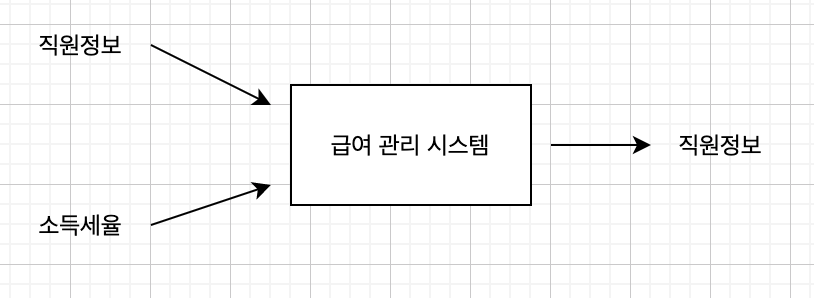
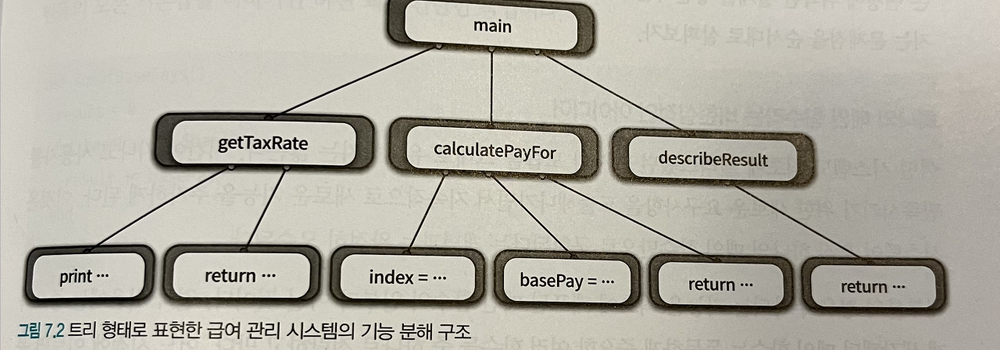

# 프로시저 추상화와 데이터 추상화

- 현대 프로그래밍 언어를 짓는 두 가지 추상화 메커니즘은 **프로시저 추상화 ( procedure abstraction )** 와  **데이터 추상화 ( data abstraction )** 가 있다.

- 객체지향은 **데이터 추상화**와 **프로시저 추상화**를 함께 포함한 클래스를 이용해 **시스템을 분해하는 개발 기법**이다.

**프로시저 추상화**

- 소프트웨어가 **무엇을 해야 하는지를** 추상화한다.

**데이터 추상화**

- 소프트웨어가 **무엇을 알아야 하는지를** 추상화한다.

시스템을 분해하는 방법을 **결정하기 위해선** 먼저 **프로시저 추상화를 중심**으로 할 것인지, **데이터 추상화 중심으로 할 것인지**를 결정해야 한다.

객체 지향은 **데이터 추상화**와 **프로시저 추상화**를 함께 포함한 클래스를 이용해 **시스템 분해**하는 개발 기법이다.

# 프로시저 추상화와 기능분해

## 메인 함수로서의 시스템

- 기능 분해의 관점에서 추상화의 단위는 **프로시저**이며 시스템은 **프로시저를 단위로 분해**한다.

**프로시저**

- 반복적으로 실행되거나 거의 유사하게 실행되는 작업들을 **하나의 장소에 모아놓음으로써** 로직을 재사용하고 **중복을 방지할 수 있는 추상화 방법이다.**
- 추상화라고 부르는 이유는 **내부의 상세 구현 내용**을 모르더라도 **인터페이스만 안다면 프로시저를 사용할 수 있기 때문**이다.

전통적인 기능 분해 **하향식 접근법 ( Top - Down Approach )** 를 따른다.

**하향식 접근법**

- 시스템을 구성하는 가장 **최상위(Topmost)** 기능을 정의한다.
- 이렇게 정의한 최상위 기능을 기준으로 **작은 단계의 하위 기능으로 분해해가는 과정**

# 급여 관리 시스템 

다음 그림을 살펴보자

기능 분해 방법에서는 **기능을 중심으로** 필요한 데이터를 **결정**한다.

하향식 기능 분해 방식이 가지는 문제를 이해하는 것은 유지보수 관점에서 **객체지향의 장점**을 이해할 수 있는 **좋은 출발점**이다.

## 급여관리 시스템 구현

해당 파트는 하향식 기능 분해 방식의 문제점을 이야기하고 있었다.

해당 파트에서는 Rubby 코드를 이용해 설명을 이어갔고, 하향식 기능 분해 방식의 **결론적인 분해 구조는 다음과 같다.**

보이는 것과 같이 트리 구조로 하여 촘촘하고 **세부적으로 구조 설계가 가능**하다. 하지만, 이렇게 진행될 확률이 얼마나 될까?

책에서도 문제점으로 다음과 같이 이야기하고 있다.

- 시스템은 하나의 **메인 함수**로 구성돼 있지 않다.
- 기능 추가나 요 규사항 변경으로 인해 메인 함수를 **빈번하게 수정**해야 한다.
- 비즈니스 로직이 사용자 인터페이스와 **강하게 결합**된다.
- 하향식 분해는 너무 이른 시기에 함수들의 실행 순서를 고정시키기 때문에 **유연성과 재사용성이 저하**된다.
- 데이터 형식이 변경될 경우 **파급효과를 예측**할 수 없다.

공감한다. 어떠한 서비스를 제공할 시, 초기 서비스와 고도화 이후 더욱더 발전된 서비스를 업데이트한다 가정할 시 다음과 같이 촘촘하게 세부적으로 구현을 만들어 놓았을 때 이후 추가할 서비스가 들어갈 공간이 있을까 싶었다. 이는 유연성이 떨어지는 요인이라 생각했다.

업무를 진행하면서도 항상 말씀해주시는 이야기도 기억이 났다. **"확장성을 고려해야 한다."**

맞다. 추후 일어날 일에 대해서는 **아무도 모른다.** 하지만 이를 위해 항상 대비하고 **열어두는 설계**를 하는 것이 좋은 설계가 아닐까 싶었다.

### **언제 하향식 분해가 그럼 유용할까?**

책에서 이야기하는 유용한 경우는 **다음과 같다.**

- 하향식은 이미 완전한 사실을 서술하기 **적합한 방법**
- 새로운 것을 **개발**하고 **설계**하고 **발견하는 데는** 적합한 방법은 **절대 아니다.**
- 이미 해결된 알고리즘을 **문서화**하고 **서술하는 데**는 **훌륭한 기법**이다.
- **BUT**
    - 하향식 분해를 적용한 설계는 근본적으로 재사용하기 어렵다.
    - 데이터에 대한 영향도를 파악하기 어렵게 한다.

### **모듈**

- 시스템의 변경을 관리하는 **기본적인 전략**은 함께 변경되는 부분을 하나의 **구현 단위로 묶고** 퍼블릭 인터페이스를 통해서만 접근하도록 만드는 것
- **기능을 기반**으로 시스템을 분해하는 것이 아닌 **변경의 방향에 맞춰** 시스템을 분해하는 것이다.

해당 파트에서는 정보은닉에 대해 이야기를 하고 있다.

**정보은닉**

- 시스템을 모듈 단위로 분해하기 위한 **기본 원리**로 시스템에서 자주 변경되는 부분을 상대적으로 덜 변경되는 **안정적인 인터페이스 뒤로 감춰야 한다는 것이 핵심**이다.
- 시스템을 모듈로 분할을 할 때 외부에 유출되서는 안 되는 **비밀의 윤곽**을 따라야 한다.

시스템을 모듈단위로 분리할 때 **다음과 같은 원칙**을 꼭 지켜야 한다라고 한다.

- **복잡성**
    - 모듈이 너무 복잡한 경우 **이해하고 사용하기가 어렵다.**
    - 외부에 모듈을 추상화할 수 있는 **간단한 인터페이스를 제공해서 모듈의 복잡도를 낮춘다.**
- **변경 가능성**
    - 변경 가능한 설계 결정이 **외부에 노출될 경우** 실제로 변경이 발생했을 대 **파급효과가 커진다.**
    - 변경 발생 시 하나의 모듈만 수정하면 되도록 **변경 가능한 설계 결정을 모듈 내부로 감추고** 외부에는 쉽게 변경되지 않을 **인터페이스를 제공한다.**

### **모듈의 장점과 한계**

**장점**

- 모듈 내부의 변수가 변경되더라도 **모듈 내부에만 영향을 미친다.**
- 비즈니스 로직과 사용자 인터페이스에 대한 **관심사를 분리**한다.
- 전역 변수와 전역 함수를 제거함으로써 **네임스페이스 오염을 방지**한다.

**한계**

- 인스턴스의 개념을 **제공하지 않는다**는 점
- 좀 더 높은 수준의 추상화를 위해서는 **직원 전체가 아닌 개별 직원을 독립적인 단위**로 다룰 수 있어야 한다.

이러한 한계를 만족시키기 위해 등장한 개념이 바로 **추상 데이터 타입**이다.

### **데이터 추상화와 추상 데이터 타입**

**타입**

- 변수에 저장할 수 있는 **내용물의 종류**와 변수에 적용될 수 있는 **연산의 가짓수**

**추상 데이터 타입을 구현 하려면 다음과 같은 특성을 위한 프로그래밍 언어의 지원이 필요하다고 한다.**

- 타입 정의를 **선언**할 수 있어야 한다.
- 타입의 인스턴스를 다루기 위해 사용할 수 있는 오퍼레이션의 **집합을 정의할 수 있어야 한다.**
- 제공된 오퍼레이션을 통해서만 조작할 수 있도록 **데이터를 외부로부터 보호할 수 있어야 한다.**
- 타입에 대해 여러 개의 **인스턴스를 생성할 수 있어야 한다.**

### **클래스**

**클래스는 추상 데이터 타입인가?**

해당 챕터 중 초반엔 **객체지향 프로그래밍**과 **객체 기반 프로그래밍**에 대해 설명하고 있다.

**객체지향 프로그래밍 ( Object-Oriented Programming )**

- 상속과 다형성을 지원한다.

**객체 기반 프로그래밍 ( Object - Based Programming )**

- 상속과 다형성을 지원하지 않는 **추상 데이터 타입 기반**의 프로그래밍 패러다임

또한 **클래스**와 **추상 데이터 타입**의 공통점 및 차이점은 다음과 같다.

- **공통점**
    - 두 가지 모두 데이터 추상화를 기반으로 **시스템을 분해한다.**
    - 외부에서는 객체의 내부 속성에 접근할 수 없으며 오직 **퍼블릭 인터페이스**를 통해서만 의사소통이 가능하다.
- **차이점**
    - 클래스는 위에서 이야기했던 것처럼 **상속과 다형성을 지원**하지만 **추상 데이터 타입**은 그렇지 못한다.
    - 타입을 기준으로 절차를 **추상화**를 한 것과, **오퍼레이션을 기반**으로 타입을 추상화했다는 것이 다르다.

클래스를 이용한 다형성은 절차에 대한 차이점을 감춘다. 즉, 객체 지향은 **절차 추상화**라고도 이야기가 가능하다.

### **변경을 기준으로 선택하라**

**타입을 기준으로 절차를 추상화하지 않았다면 그것은 객체지향 분해가 아니다**

**객체지향에서는 타입 변수를 이용한 조건문을 다형성으로 대체한다. 여기서 마틴 파울러는 다음과 같이 이야기한다.**

- 타입을 나타내는 코드를 다형성으로 바꾸는 리 펙터 링을 **"Replace Type Code with Class"**

인스턴스 변수에 저장된 값을 기반으로 메서드 내의 타입을 **명시적으로 구분하는 방식**은 **객체지향에 위반된다**라고 한다.

설계의 요구되는 입력이 **'타입 추가'** or **'오퍼레이션 추가'** 에 따라 설계 방향이 달라진다.

- 만약, 새로운 타입을 지속적으로 추가 할시, 클래스
- 오퍼레이션 추가 시에는 추상 데이터

변경의 축을 찾아 이에 맞는 설계를 이행해야 한다.

### **협력이 중요하다.**

- 객체가 참여할 협력을 결정하고 협력에 필요한 책임을 수행하기 위해 어떤 객체가 필요한지에 관해 고민해야 한다.
- 그 책임을 다양한 방식으로 수행해야 할 때 만 타입 계층 안 각 절차를 추상화하라
- 타입 계층과 다형성은 협력이라는 문맥 안에서 책임을 수행하는 방법에 관해 고민한 결과물이지, 그 자체가 목적이 되어서는 안 된다.