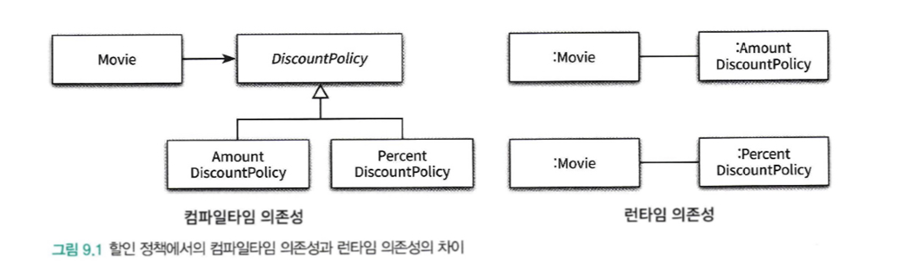
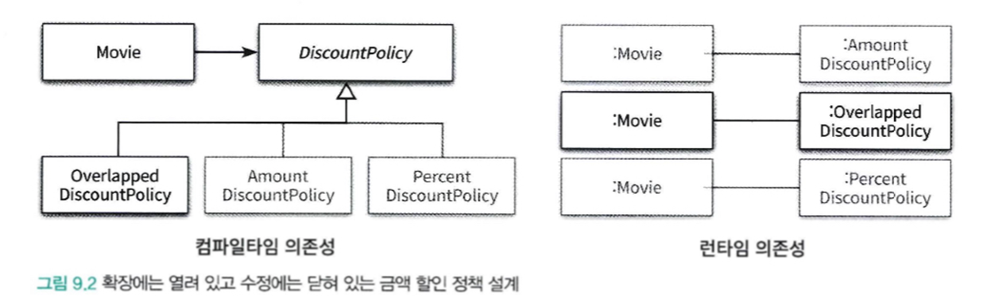
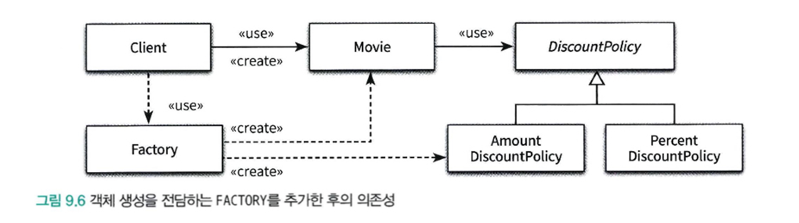
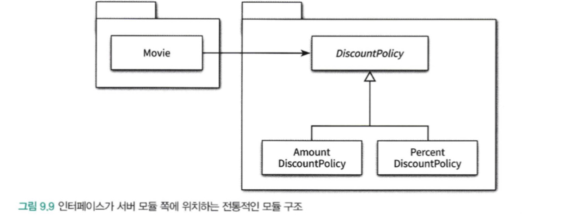
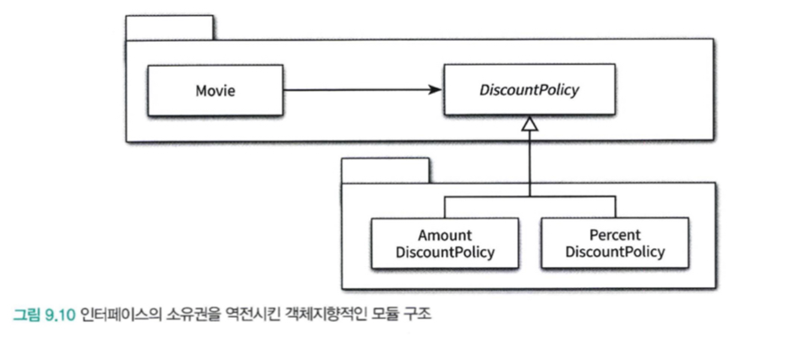

다양한 의존성 관리 기법을 원칙 관점에서 살펴보자.

### 개방-폐쇄 원칙(OCP)

개방-폐쇄 원칙은 소프트웨어 개체(클래스, 모듈, 함수 등등)는 확장에 대해 열려 있어야 하고, 수정에 대해서는 닫혀 있어야 한다.

여기서 키워드는 **확장과 수정** 이다.

확장에 열려 있다 : 애플리케이션의 요구사항이 변경될 때, 이 변경에 맞게 새로운 ‘동작’을 추가해서 애플리케이션의 기능을 확장할 수 있다.

수정에 닫혀 있다. : 기존의 ‘코드’를 수정하지 않고도 애플리케이션의 동작을 추가하거나 변경할 수 있다.

어떻게 코드를 수정하지 않고 새로운 동작을 추가할 수 있을까?

### 컴파일타임 의존성을 고정시키고 런타임 의존성을 변경하라

런타임 의존성 - 실행 시에 협력에 참여하는 객체들 사이의 관계다.

컴파일타임 의존성 - 코드에서 드러나는 클래스들 사이의 관계다.



그림에서 Movie 관점에서 DiscountPolicy에 대한 컴파일 타임 의존성과 런타임 의존성은 동일하지 않다.

이미 OCP를 따르고 있고, 만약 복합 할인 정책이 추가 되는 경우 기존 코드는 수정하지 않고,

OpverlappedDiscountPolicy 만 추가하여 기능을

**확장** 할 수 있다.

기존 클래스는 전혀 수정하지 않고, 애플리케이션 동작을 확장했다.

새로운 클래스를 추가하는것 만으로 Movie를 새로운 컨텍스트에 사용되도록 확장할 수  있었던 것이다.

따라서 **확장**에 대해 열려 있고,**수정**에 대해서는 닫혀있다.



### 추상화가 핵심이다.

개방-폐쇄 원칙의 핵심은 **추상화에 의존하는 것**이다. 여기서 ’**추상화**’ 와 ’**의존**’ 이라는 두 개념 모두가 중요하다.

추상화란 **핵심적인 부분만 남기고 불필요한 부분은 생략함으로써 복잡성을 극복하는 기법**이다.

추상화 과정을 거치면 **문맥이 바뀌더라도 변하지 않는 부분만 남게 되고 문맥에 따라 변하는 부분은 생략된다.**

추상화를 사용하면 생략된 부분을 문맥에 적합한 내용으로 채워넣음으로써 각 문맥에 적합하게 기능을 구체화하고 확장할 수 있다.

따라서 추상화 부분은 수정에 닫혀 있다. (공통적인 부분은 변하지 않는다)

**추상화를 통해 생략된 부분은 확장의 여지를 남긴다.** 이것이 추상화가 개방-폐쇄 원칙을 가능하게 만드는 이유다.

단순히 어떤 개념을 추상화 했다고 해서 수정에 닫혀있는 설계를 만들 수 있는 것은 아니다.

OCP 에서 **폐쇄를 가능하게 하는 것은 의존성의 방향**이다.

수정에 대한 영향을 최소화 하기 위해서는 모든 요소가 추상화에 의존해야 한다.

```java
public class Movie {
  private DiscountPolicy discountPolicy;
  public Movie(String title, Duration runningTime, Money fee, DiscountPolicy discountPolicy) {
    this.discountPolicy = discountPolicy;
  }
  
  public Money calculateMovieFee(Screening screening) {
    return fee.minus(discountPolicy.calculateDiscountAmount(screening));
  }
}

```

여기서 Movie는 할인 정책을 추상화한 DiscountPolicy에 대해서만 의존한다.

그래서 DiscountPolicy의 자식 클래스를 추가하여 할인 정책을 추가하더라도 영향을 받지 않는다.

여기서 주의할 점은 추상화를 했다고 모든 수정에 대해 설계가 폐쇄되는 것은 아니라는 것이다.

변경에 의한 파급 효과를 최대한 피하기 위해서는 변하는 것과 변하지 않는 것이 무엇인지를 이해하고 이를 추상화의 목적으로 삼아야 한다.

### 생성 사용 분리

클라이언트 코드에 특정 구체 클래스의 인스턴스를 생성하게 되면 다른 인스턴스로 변경할 수 있는 방법은 코드를 수정하는 것뿐이다.

이는 동작을 추가하거나 변경하기 위해 기존 코드를 수정하도록 하기 때문에 OCP를 위반한다.

```java
public class Movie {
  private DiscountPolicy discountPolicy;
  
  public Movie(String title, Duration runningTime, Money fee) {
    this.discountPolicy = new AmountDiscountPolicy();
  }
  
  public Money calculateMovieFee(Screening screening) {
    return fee.minus(discountPolicy.calculateDiscountAmount(screening));
  }
}
```

결합도가 높아질수록 개방-폐쇄 원칙을 따르는 구조를 설계하기가 어려워진다.

알아야 하는 지식이 많으면 결합도도 높아진다.
특히 객체 생성에 대한 지식은 과도한 결합도를 초래하는 경향이 있다.

객체의 타입과 생성자에 전달해야 하는 인자에 대한 과도한 지식은 코드를 특정한 컨텍스트에 강하게 결합시킨다.
컨텍스트를 바꾸기 위한 유일한 방법은 코드 안에 명시돼 있는 컨텍스트에 대한 정보를 직접 수정하는 것 뿐이다.

따라서 유연하고 재사용 가능한 설계를 원한다면 객체와 관련된 두 가지 책임을 서로 다른 객체로 분리해야 한다.

하나는 **객체를 생성하는 것**, 하나는 **객체를 사용하는 것**이다.

한 마디로 말해서 객체에 대한 생성과 사용을 분리(seperation use from creation) 해야 한다.

사용으로부터 생성을 분리하는 데 사용되는 가장 보편적인 방법은 객체를 생성할 책임을 클라이언트로 옮기는 것이다.

다시 말하면 Movie의 클라이언트가 적절한 DiscountPolicy 인스턴스를 생성한 후, Movie에게 전달하는 것이다.

현재 컨텍스트에 관한 결정권을 가지고 있는 클라이언트로 컨텍스트에 대한 지식을 옮김으로써 Movie는 특정한 클라이언트에 결합되지 않고 독립적일 수 있다.

### Factory 추가하기

생성 책임을 Client로 옮긴 배경에는 Movie는 특정 컨텍스트에 묶여서는 안 되지만 Client는 묶여도 상관이 없다는 전제가 깔려있다.
하지만 Movie를 사용하는 Client도 특정한 컨텐스트에 묶이지 않기를 바란다고 가정해보자.

Client 역시 생성과 사용의 책임을 함께 지니고 있는데, 객체 생성과 관련된 책임만 전담하는 별도의 객체를 추가하고 Client는 이 객체를 사용하도록 할 수 있다.

이처럼 생성과 사용을 분리하기 위해 객체 생성에 특화된 객체를 **FACTORY**라고 부른다.



Factory를 이용하면 Movie와 AmountDiscountPolicy 를 **생성하는** **책임** 모두를 Factory로 이동하고 **사용하는 책임**만 가지게 된다.

### 순수한 가공물에게 책임 할당하기

책임 할당의 가장 기본이 되는 원칙은 책임을 수행하는 데 필요한 정보를 가장 많이 알고 있는 **INFORMATION EXPERT**에게 책임을 할당하는 것이다.

- 어떤 책임을 정보전문가에게 할당하고 싶다면 제일 먼저 도메인 모델 안의 개념 중에서 적절한 후보가 존재하는지 찾아봐야 한다.

하지만 방금전에 추가한 Factory는 도메인 모델에 속하지 않는다.

Factory를 추가한 이유는 순수하게 기술적인 결정이다. 전체적으로 결합도를 낮추고 재사용성을 높이기 위해 도메인 개념에게 할당돼 있던 객체 생성 책임을 도메인 개념과는 아무런 상관이 없는 가공의 객체로 이동시킨 것이다.

시스템을 객체로 분해하는 데는 크게 두가지 방식이 존재한다.

**표면적 분해, 행위적 분해**

- **표면적 분해** - 도메인에 존재하는 사물 또는 개념을 표현하는 객체들을 이용해 시스템을 분해하는 것
    - 도메인 모델에 담겨 있는 개념과 관계를 따르며 도메인과 소프트웨어 사이의 표현적 차이를 최소화하는 것을 목적으로 한다.
    - 객체지향 설계를 위한 가장 기본적인 접근법

**도메인 개념을 표현하는 객체에게 책임을 할당하는 것만으로는 부족한 경우 발생함**

- ex. DB접근을 위한 객체와 같이 기계적인 개념들..
- 이 개념들을 도메인 객체에게 할당하면 낮은 응집도, 높은 결합도, 재사용성 저하 와 같은 문제가 발생할 확률이 높음.

- **행위적 분해** - 도메인 개념을 표현한 객체가 아닌 설계자가 편의를 위해 임의로 만든 객체를 이용해 시스템을 분해하는 것
    - 책임을 할당하기 위해 창조죄는 도메인과 무관한 인공적인 객체를 **PURE FABRICATION(순수한 가공물)**이라 한다.
    - 어떤 행동을 추가하려고 하는데 이 행동을 책임질 마땅한 도메인 개념이 존재 하지 않는 경우 PURE FABRICATION을 생성하고 이 객체에게 책임을 할당하면 된다.
    - 객체지향 어플리케이션에서는 도메인 개념을 반영하는 객체들 보다 인공적으로 창조한 객체들이 더 많은 비중을 차지한다.

이런 측면에서 객체지향이 실세계 모방이라는 말은 옳지 않으며, 객체지향 애플리케이션은 도메인 개념뿐만 아니라, 임의적으로 창조한 많은 추상화들을 포함한다.

- 도메인 개념을 표현하는 객체와 순수하게 창조된 가공의 객체들이 모여 자신의 역할과 책임을 다하고 조화롭게 협력하는 애플리케이션을 설계하는 것이 목표여야한다.

### 의존성 주입

사용하는 객체가 아닌 외부의 독립적인 객체가 인스턴스를 생성한 후 이를 전달해서 의존성을 해결하는 방법을 **의존성 주입** 이라고 부른다.

- Movie 처럼 생성과 사용을 분리하고 Movie는 오로지 인스턴스를 사용하는 책임만 남게된다.
- 이 기법을 의존성 주입이라고 부르는 이유는 외부에서 의존성의 대상을 해결한 후 사용하는 객체 쪽으로 주입하기 때문이다.

의존성 주입은 의존성을 해결하기 위해 의존성을 객체의 퍼블릭 인터페이스에 명시적으로 드러내서 외부에서 필요한 런타임 의존성을 전달할 수 있도록 만드는 방법을 포괄하는 명칭이다.

의존성 주입에서는 의존성을 해결하는 세가지 방법을 가리키는 별도의 용어를 정의한다.

- **생성자 주입**
    - 객체를 생성하는 시점에 생성자를 통한 의존성 해결

- **Setter 주입**
    - 객체 생성 후 setter 메서드를 통해 의존성을 해결한다.

세터 주입의 장점은 의존성을 런타임에 변경할수 있다는 것이다.

세터 주입의 단점은 객체가 올바로 생성되기 위해 어떤 의존성이 필수적인지를 명시적으로 표현할 수 없다는 것이다.(객체 생성 후 세터를 누락한다면 비정상적인 상태로 생성될 수 있다.)

- **메서드 주입**
    - 메서드 실행 시 인자를 이용한 의존성 해결

메서드가 의존성을 필요로 하는 유일한 경우일 때 사용할 수 있다.

생성자 주입을 통해 의존성을 전달받으면 객체가 올바른 상태로 생성되는 데 필요한 의존성을 명확하게 표현할 수 있다는 장점이 있지만

주입된 의존성이 1~2개의 메서드에서만 사용된다면 각 메서드의 인자로 전달하는 것이 더 나은 방법일 수 있다.

### 숨겨진 의존성은 나쁘다

의존성 주입 외에도 의존성을 해결할 수 있는 방법은 다양하다.

대표적인 방법은 SERVICE LOCATOR 패턴이다. SERVICE LOCATOR는 의존성을 해결할 객체들을 보관하는 일종의 저장소다.

외부에서 객체에게 의존성을 전달하는 의존성 주입과는 달리 SERVICE LOCATOR는 객체가 직접 SERVICE LOCATOR에게 의존성을 해결해 줄것을 요청한다.

```java
public class Movie {
  private DiscountPolicy discountPolicy;
  
  public Movie(String title, Duration runningTime, Money fee) {
    this.title = title;
    this.runningTime = runningTime;
    this.fee = fee;
    this.dicountPolicy = ServiceLocator.discountPolicy();
  }
}
```

```java
public class ServiceLocator {
  private static ServiceLocator singleton = new ServiceLocator();
  
  public static DiscountPolicy discountPolicy() {
    return singleton.discountPolicy();
  }
  
  public static void provide(DicountPolicy discountPolicy) {
    singleton.discountPolicy = discountPolicy;
  }
}
```

```java
ServiceLocator.provide(new AmountDiscountPolicy());
Movie avartar = new Movie("아바타", Duration.ofMinutes(120), Money.wons(10000));
```

위 예시를 보면 SERVICE LOCATOR 패턴을 이용해서 의존성을 간단하게 해결하는 것처럼 보입니다.

하지만  SERVICE LOCATOR 패턴의 가장 큰 단점은 의존성을 감춘다는 것입니다.

```java
Movie avartar = new Movie("아바타", Duration.ofMinutes(120), Money.wons(10000));
```

Movie는 DicountPolicy에 의존적이지만 Movie의 퍼블릭 인터페이스에 표시 되지 않고, 의존성은 암시적이며 코드 깊숙한 곳에 숨겨져 있다.

위 코드에서 Movie 생성 시 NPE 에러가 발생하게 되는데, 이는 런타임에 발생하게 됩니다.

- 이는 의존성을 구현 내부로 감추고 관련된 문제가 발생하는 시점을 컴파일 타임이 아닌 런타임으로 미루게 하기 때문입니다.

ServiceLocator는 내부적으로 정적 변수를 이용해 객체들을 관리하기 때문에 모든 단위 테스트 케이스에 걸쳐 ServiceLocator의 상태를 공유하게 된다.

**이것은 각 단위 테스트는 서로 고립돼야 한다는 단위 테스트의 기본 원칙을 위반한 것이다.**

이 문제의 원인은 숨겨진 의존성이 캡슐화를 위반했기 때문이다.

캡슐화는 코드를 읽고 이해하는 행위와 관련이 있다. 클래스의 퍼블릭 인터페이스만으로 사용 방법을 이해할 수 있는 코드가 캡슐화의 관점에서 훌륭한 코드다.

클래스의 사용법을 익히기 위해 구현을 확인해야 한다면 그 클래스의 캡슐화는 무너진 것이다.

**숨겨진 의존성이 가지는 가장 큰 문제점은 의존성을 이해하기 위해 코드의 내부 구현을 이해할 것을 강요한다.**

따라서 숨겨진 의존성은 캡슐화를 위반한다.

결과적으로 의존성을 구현 내부로 감추도록 강요하는 Service Locator는 캡슐화를 위반할 수밖에 없다.

또, 의존성의 대상을 설정하는 시점과 의존성이 해결되는 시점을 멀리 떨어뜨려 놓을 수 있다.

- 이는 코드를 이해하고 디버깅하기 어렵게 만든다.

여기서 핵심은 의존성 주입이 Service Locator 패턴보다 좋다가 아니라, 명시적인 의존성이 숨겨진 의존성 보다 좋다는 것이다.

의존성을 객체의 퍼블릭 인터페이스에 노출하는 것이 코드를 이해하기도, 수정하기도 좋다.

### 의존성 역전 원칙

객체 사이의 협력이 존재할 때 그 협력의 본질을 담고 있는 것은 상위 수준의 정책이다.

Movie와 AmountDiscountPolicy 사이의 협력이 가지는 본질은 영화의 가격을 계산하는 것이다.

- 어떻게 계산할것인가는 협력의 본질이 아니다.

그러나 이런 상위 수준의 클래스가 하위 수준의 클래스에 의존한다면 하위 수준의 변경에 의해 상위 수준 클래스가 영향을 받게 된다.

- 여기서 Movie는 상위 수준의 클래스, AmountDiscountPolicy는 하위 수준의 클래스

의존성은 변경의 전파와 관련된 것이기 때문에 설계는 변경의 영향을 최소화하도록 의존성을 관리해야 한다.

상위 수준의 클래스는 어떤 식으로든 하위 수준의 클래스에 의존해서는 안 되는 것이다.

- 하위수준의 클래스가 변경된다고 해서 상위수준의 클래스가 영향을 받아서는 안된다.

재사용하려는 대상은 대부분 상위 수준의 클래스 이다.

- 상위가 하위 수준의 클래스에 의존하게 되면 상위수준 클래스를 재사용할때 하위수준의 클래스도 같이 필요로 하기 때문에 재사용하기 어려워 진다.


이 경우 추상화를 통해 해결할 수 있다.

Movie와 AmountDiscountPolicy 모두가 추상화에 의존하도록 수정하면 하위 수준 클래스의 변경으로 인해 상위 수준 클래스가 영향을 받는 것을 방지할 수 있다.

또한 상위 수준을 재사용할 때 하위 수준의 클래스에 얽매이지 않고도 다양한 컨텍스트에서 재사용이 가능하다.

**가장 중요한 것은 추상화에 의존하는 것이다.** 

**유연하고 재사용 가능한 설계를 원한다면 모든 의존성의 방향이 추상 클래스나 인터페이스와 같은 추상화를 따라야 한다.**

**정리**

- 상위 수준의 모듈은 하위 수준의 모듈에 의존해서는 안 된다. 둘 모두 추상화에 의존해야 한다.
- 추상화는 구체적인 사항에 의존해서는 안 된다. 구체적인 사항은 추상화에 의존해야 한다.

이를 **의존성 역전 원칙(Dependency Inversion Principle, DIP)** 이라고 부른다.

역전(Inversion)이라는 단어를 사용한 이유는 의존성 역전 원칙을 따르는 설계는 의존성의 방향이 전통적인 절차형 프로그래밍과는 반대 방향으로 나타나기 때문이다.

(전통적인 절차형에서는 상위 수준의 모듈이 하위 수준 모듈에 의존적이다.)

## 의존성 역전 원칙과 패키지

역전은 의존성의 방향뿐만 아니라 인터페이스의 소유권에도 적용된다.



이 그림에서 구체 클래스인 Movie, AmountDiscountPolicy, PercentDiscountPolicy는 모두 추상 클래스인 DiscountPolicy에 의존한다.
따라서 개방-폐쇄 원칙을 준수할뿐만 아니라 의존성 역전 원칙도 따르고 있기 때문에 이 설계가 유연하고 재사용 가능하다고 생각할 것이다.

하지만 Movie를 다양한 컨텍스트에 재사용하기 위해서는 불필요한 클래스들이 Movie와 함께 배포돼야만 한다.

Movie가 DiscountPolicy에 대해 컴파일 타임 의존성을 가진다.

- DiscountPolicy 하위 클래스가 변경되면 DiscountPolicy 패키지 전체를 재배포해야되고, 이로 인해 DiscountPolicy를 의존하는 Movie 역시 재컴파일 되어야한다. 그리고 Movie를 의존하는 또 다른 패키지에 의존성의 그래프를 타고 전체로 영향을 끼친다.
- 이 말은 Movie 클래스를 빌드하기 위해 DiscountPolicy가 같은 패키지 내에 필요함을 의미한다.
  하지만 DiscountPolicy가 있는 패키지에서는 AmountDiscountPolicy, PercentDiscountPolicy가 있기때문에 전체적인 빌드 타임이 증가한다.

따라서 Movie의 재사용을 위해 필요한 것이 DiscountPolicy 뿐이라면 DiscountPolicy를 Movie와 같은 패키지로 모으고 AmountDiscountPolicy, PercentDiscountPolicy를 별도의 패키지에 위치시켜 의존성 문제를 해결할 수 있다.



위의 그림과 같이 추상화를 별도의 독립적인 패키지가 아니라 클라이언트가 속한 패키지에 포함시켜야 한다.

그리고 함께 재사용될 필요가 없는 클래스들은 별도의 독립적인 패키지에 모아야 한다.

이와 같은 기법을 **Seperated Interface 패턴**이라 부른다.

- 새로운 할인 정책을 위해 새로운 패키지를 추가하고 새로운 DiscountPolicy의 자식 클래스를 구현하기만 하면 상위 수준의 협력 관계를 재사용할 수 있다.

이제 Movie클래스를 다른 컨텍스트에서 사용하기 위해서는 단지 Movie, DiscountPolicy가 포함된 패키지만 재사용하면 된다.

따라서 **의존성 역전 원칙에 따라 상위 수준의 협력 흐름을 재사용하기 위해서는 추상화가 제공하는 인터페이스의 소유권 역시 역전시켜야 한다.**

## 유연성에 대한 조언

### 유연한 설계는 유연성이 필요할 때만 옳다.

유연하고 재사용 가능한 설계는 런타임 의존성과 컴파일 의존성의 차이를 인식하고 **동일한 컴파일 타임 의존성으로부터 다양한 런타임 의존성을 만들 수 있는 코드 구조를 가지는 설계**를 의미한다.

- 설계의 미덕은 단순함과 명확함으로부터 나온다. 하지만 유연한 설계는 이와는 다른 복잡한 설계라는 의미가 숨어있다.

유연성은 항상 복잡성을 수반하게 되고 유연하지 않은 설계는 단순하고 명확하다.

따라서 유연함은 단순성과 명확성의 희생이 필요하고, 유연한 설계를 단순하고 명확하게 만드는 유일한 방법은 사람들 간의 긴밀한 커뮤니케이션 뿐이다.

- 복잡성이 필요한 이유를 제시하지 않는다면 아무도 만족스러운 설계로 생각하지 않는다.

**불필요한 유연성은 불필요한 복잡성을 낳는다.**

**단순하고 명확한 해법이 그런대로 만족스럽다면 유연성을 제거하라.**

**유연성은 사람들이 복잡함을 수용할 수 있을 때만 가치가 있다.**

### 협력과 책임이 중요하다.

설계를 유연하게 만들기 위해서는 먼저 역할, 책임, 협력에 초점을 맞춰야 한다.
**다양한 컨텍스트에서 재사용할 필요가 없다면 설계를 유연하게 만들 당위성도 함께 사라진다.**

중요한 비지니스 로직을 처리하기 위해 책임을 할당하고 협력의 균형을 맞추는 것이 객체 생성에 관한 책임을 할당하는 것 보다 우선이다.

객체를 생성하는 방법에 대한 결정은 모든 책임이 자리를 잡은 후 가장 마지막 시점에 내리는 것이 적절하다.

의존성을 관리해야 하는 이유는 역할, 책임, 협력의 관점에서 설계가 유연하고 재사용 가능해야 하기 때문이다.
따라서 역할, 책임, 협력에 먼저 집중해야 한다.