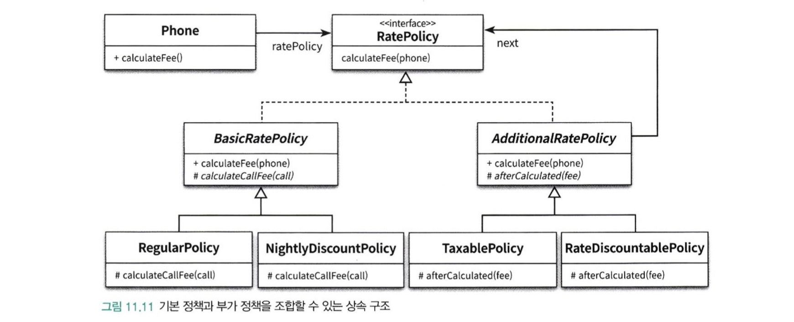

상속과 합성은 객체지향 프로그래밍에서 널리 사용되는 코드 재사용 기법이다.

상속이 부모클래스와 자식 클래스를 연결해서 부모클래스의 코드를 재사용하는데 비해 합성은 전체를 표현하는 객체가 부분을 표현하는 객체를 포함해서 부분 객체의 코드를 재사용한다.

- 상속에서 부모-자식 사이의 의존성은 컴파일 타임에 해결되고, 합성에서 두 객체 사이의 의존성은 런타임에 해결된다.

상속을 활용하기 위해서는 부모 클래스의 내부 구현에 알아야 하기 때문에 자식-부모 사이의 결합도가 높아질수밖에 없다.

합성은 구현에 의존하지 않고, 퍼블릭 인터페이스에 의존한다.

- 따라 합성을 이용하면 포함된 객체의 내부 구현이 변경되어도 영향을 최소화 할 수 있기 때문에 변경에 더 안정적인 코드를 얻을 수 있게된다.

상속은 클래스 사이의 정적인 관계고, 합성은 객체 사이의 동적인 관계다.

코드 작성 시점에 결정한 상속은 변경이 불가능 하지만, 합성 관계는 실행 시점에 동적으로 변할 수 있기 때문에 합성이 더 변경하기 쉽고 유연한 설계를 얻을 수 있게 해준다.

**[코드 재사용을 위해서는] 객체 합성이 클래스 상속보다 더 좋은 방법이다.**

상속은 부모 클래스의 구현된 코드 자체를 재사용하고 부모클래스의 내부가 자식클래스에 공개되기 때문에 화이트 박스 재사용이라고 부른다.

합성은 포함되는 객체의 퍼블릭 인터페이스를 재사용한다.

- 객체 내부는 공개되지 않고 인터페이스를 통해서만 재사용되기 때문에 블랙박스 재사용이라고 한다.

### 상속을 합성으로 변경하기

상속의 문제점 3가지

- 불필요한 인터페이스 상속
- 메서드 오버라이딩의 오작용 문제
- 부모 클래스와 자식 클래스의 동시 수정 문제

### 상속으로 인한 조합의 폭발적인 증가

일반적인 상황은 작은 기능들을 조합해서 더 큰 기능을 수행하는 객체를 만들어야 하는 경우다.

상속을 사용했을때 두가지 문제점

1. 하나의 기능을 추가하거나 수정하기 위해 불필요하게 많은 수의 클래스를 수정하거나 추가해야 한다.
2. 단일 상속만 지원하는 언어에서는 상속으로 인해 오히려 중복 코드의 양이 늘어날 수 있다.

이는 합성으로 해결할 수 있다.

### 기본 정책과 부가 정책 조합하기

기본 정책과 부가 정책을 정하고 이를 구현해보자.

기본정책은 일반요금제, 심야 할인 요금제가 있다.

부가 정책은 세금정책, 기본요금할인정책이 있다.

부가정책은 하나만 적용할수도, 둘 다 할수도, 안할수도 있으며 임의의 순서로 적용한다.

예시 따르면 총 10가지의 조합이 나오게 된다.

상속을 이용해서 기본 정책을 구현하면 상위 추상클래스에 세금계산을 적용할 수 있도록 추상 메서드를 만들고 이를 하위의 일반요금+세금정책, 심야요금 + 세금정책 등 클래스를 만들어 오버라이딩할 수 있다.

하지만, 클래스의 이름을 제외하면 대부분의 코드가 중복되는 문제가 발생한다.

- 이는 단일 상속만 지원하기 때문에 상속으로 인해 중복 코드 문제를 해결하기 쉽지 않다.

이는 세금정책 뿐만 아니라 기본요금 할인정책을 구현할때에도 같은 문제가 발생한다.

### 기본 정책에 기본 요금 할인 정책 조합하기

정책은 임의의 순서로 적용 할 수 있고, 둘 다 적용할 수 있다.

이를 상속으로 해결하려면 자식 클래스를 하나씩 추가해야한다.

- 그렇게 되면 많은 클래스가 생성되고, 계층 관계가 복잡해진다. 하지만 더 큰 문제는 새로운 정책을 추가하기 어렵다는 것이다.

만약 기본 정책에 고정 요금제라는 정책이 추가된다면 각 부가정책의 경우의 수에 따라 총 5개의 클래스가 생성되게 된다.

만약 부가 정책 “약정 할인 정책”을 추가한다고 가정하면 이에 따른 경우에 대한 새로운 클래스가 생성되어야 한다.

이렇게 하나의 기능을 추가하기 위해 필요 이상으로 많은 수의 클래스를 추가 해야하는 경우를 클래스 폭발 문제 또는 조합 폭발 문제라고 한다.

- 이는 자식 클래스가 부모 클래스의 구현에 강하게 결합되도록 강요하는 상속의 근본적인 한계 때문에 발생된다.

클래스 폭발 문제는 새로운 기능을 추가할 때뿐만 아니라, 기능을 수정할 때도 문제가 된다.

만약 세금 정책을 변경해야 한다면 어떻게 해야될까? → 세금 정책과 관련된 코드가 여러 클래스에 중복되어 있기 때문에 모든 클래스를 찾아 동일한 방식으로 수정해ㅑ 된다. 이중 하나라도 누락되면 세금이 부과되지 않는 버그가 발생하게 된다.

→ 이 문제를 해결하기 위한 방법은 상속을 포기하는 것이다.

### 합성 관계로 변경하기

컴파일 타임의 의존성과 런타임 의존성이 거리가 멀수록 유연해진다.

- 상속은 이 둘을 동일하게 만드는 것이다.

합성은 런타임에 동적으로 변경할 수 있어서 컴파일타임 의존성과 런타임 의존성을 다르게 할 수 있다.

합성은 조합을 구성하는 요소들을 개별 클래스로 구현 후 실행시점에 인스턴스를 조립하는 방법을 사용하는 것이라고 할 수 있다.

런타임과 컴파일타임의 의존성의 거리가 멀수록 설계의 복잡도가 상승하기 때문에 코드를 이해하기 어려울 수 있다.

하지만 **설계는 변경과 유지보수를 위해 존재하며 대부분 단순한 설계가 정답이지만 변경에 따르는 고통이 복잡성으로 인한 혼란을 넘어선다면 유연성의 손을 들어주는 것이 현명한 판단일 확률이 높다.**

- 또한, 아이러니하게 편리한 설계를 만들기 위해 복잡성을 더하고 나면 원래의 설계보다 단순해지는 경우도 볼 수 있다.

하지만 합성을 사용하면 컴파일 관계를 런타임 관계로 변경함으로써 이 문제를 해결한다.
합성을 사용하면 구현이 아닌 퍼블릭 인터페이스에 대해서만 의존할 수 있기 때문에 런타임에 객체의 관계를 변경할 수 있다.

따라서 합성을 사용하면 구현 시점에 관계를 고정시킬 필요가 없으며 실행 시점에 정책들의 관계를 유연하게 변경할 수 있다.
컴파일 의존성에 속박되지 않고 다양한 방식의 런타임 의존성을 구성할 수 있다는 것이 합성이 제공하는 가장 커다란 장점이다.

위의 상속관계로 나온 case를 합성을 사용하면 아래와 같이 사용할 수 있다.

합성을 이용한 구조

만약 새로운 정책이 추가된다면 그에 맞는 클래스 하나만 구현하면 된다.

또한, 수정을 하게 되면 여기저기 중복되어 있는 클래스 내의 코드를 모두 수정하는 것이 아니라, 하나의 클래스만 변경하면 된다.

상속은 하나의 책임이 여기저기에 흩어져있다→ 응집도가 낮다.

합성은 하나의 책임은 하나의 클래스에서 구현되어진다 → 응집도가 높다.

### 상속은 사용하면 안되나? 언제 사용해야되나?

이는 구현상속과 인터페이스 상속을 나누어야한다.

- 이번장의 단점은 모두 구현 상속에 국한되어진것이다.

이는 13장에서 인터페이스 상속에 대한 내용을..

### 믹스인

구체적인 코드를 재사용하기 때문에 상속은 변경하기 어려운 코드를 얻게 된다.

구체적인 코드를 재사용하면서 낮은 결합도를 유지할 수 있는 방법은 재사용에 적합한 추상화를 도입하는것이다.

믹스인은 객체를 생성할 때 코드 일부를 클래스 안에 섞어 넣어 재사용하는 기법을 가리키는 용어다.