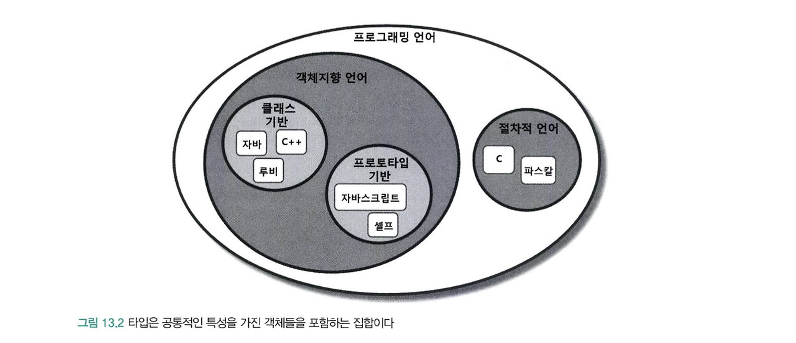
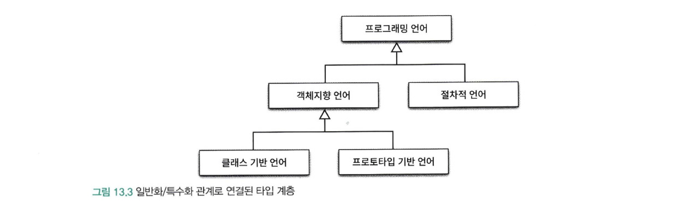

상속의 첫번째 용도는 **타입 계층**을 구현하는 것이다.

- 타입 계층에서 부모는 일반적인 개념을 구현하고 자식은 특수한 개념을 구현한다.
- 타입 계층 안에서 부모는 자식클래스의 일반화이고, 자식은 부모클래스의 특수화이다.

두번째 용도는 **코드 재사용**이다.

- 상속을 사용하면 부모클래스의 코드를 재사용할 수 있다.
- 하지만 부모 클래스와 자식 클래스가 강하게 결합되어 변경하기 어려운 코드를 얻게 될 확률이 높다.

상속을 사용하는 일차적인 목표는 코드 재사용이 아닌 타입 계층을 구현하는 것이어야 한다.

- 코드를 재사용 하는 목적으로 사용하면 부모-자식 간 결합도를 높여서 설계의 변경과 진화를 방해한다.
- 하지만, 타입계층을 목표로 하면 다형적으로 동작하는 객체들의 관계에 기반해 확장 가능하고 유연한 설계를 얻게 한다.

### 타입

개념 관점에서 타입은 사물의 종류를 의미한다.(타입은 사물을 분류하기 위한 틀로 사용된다.)

- ex. 자바, 루비, c 등은 프로그래밍 언어라는 타입으로 분류

어떤 대상이 타입으로 분류될 때 그 대상을 타입의 **인스턴스**라고 부른다.

- 일반적으로 타입의 인스턴스를 객체라고 부른다.

타입이 심볼 내연 외연의 세가지 요소로 구성된다.

- **심볼** : 타입에 이름을 붙인것이다.
    - ex) 프로그래밍 언어
- **내연** : 타입의 정의로서 타입에 속하는 객체들이 가지는 공통적인 속성이나 행동을 가리킨다.
    - ‘프로그래밍 언어’ 의 정의인 ‘컴퓨터에게 특정한 작업을 지시하기 위한 어휘와 문법적 규칙의 집합’이 내연에 속함
- **외연** : 타입에 속하는 객체들의 집합이다.
    - ex) 프로그래밍 언어 타입의 경우 자바, 루비, 자바스크립트가 속한 집합이 외연을 구성한다.

### 프로그래밍 언어 관점에서의 타입

프로그래밍 언어 관점에서 타입은 연속적인 비트에 언어와 제약을 부여하기 위해 사용한다.

- 프로그래밍 언어의 관점에서 타입은 비트 묶음에 의미를 부여하기 위해 정의된 제약과 규칙을 가리킨다.

타입에 수행될 수 있는 유효한 오퍼레이션의 집합을 정의한다.

- 자바에는 + 연산자는 숫자, 문자타입에서는 사용가능하나 다른 타입에서는 사용 불가하다. c# c++은 연산자 오버로딩을 통해 사용가능하다.
- 모든 객체지향 언어는 객체의 타입에 따라 적용가능한 종류를 제한함으로써 프로그래머의 실수를 막아준다는 것이다.

타입에 수행되는 오퍼레이션에 대해 미리 약속된 문맥을 제공한다.

- 자바에서 int 변수 a,b 에 대해서 + 연산을 하면 두 수를 더하지만, 문자열이라면 하나의 문자열로 합치게 된다.

### 객체지향 패러다임 관점의 타입

- 개념 관점에서 타입이란 공통의 특징을 공유하는 대상들의 분류다.
- 프로그래밍 언어 관점에서 타입이란 동일한 오퍼레이션을 적용할 수 있는 인스턴스들의 집합이다.

두 정의를 객체지향 패러다임의 관점에서 조합해보면 객체의 타입이란 객체가 수신할 수 있는 메시지의 종류를 정의하는 것이다.

- 객체가 수신할 수 있는 메시지의 집합 → **퍼블릭 인터페이스**
- 객체지향 프로그래밍에서 타입을 정의하는 것은 객체의 퍼블릭 인터페이스를 정의하는 것과 동일하다.

개념 관점에서 타입은 공통의 특성을 가진 객체들을 분류하기 위한 기준이다.

- 객체지향에서 공통의 특성은 객체가 수신할 수 있는 메시지를 기준으로 타입을 분류하기 때문에 동일한 퍼블릭 인터페이스를 가지는 객체들은 동일한 타입으로 분류할 수 있다.

객체의 퍼블릭 인터페이스가 객체의 타입을 결정한다.

- 따라서 동일한 퍼블릭 인터페이스를 제공하는 객체는 동일한 타입으로 분류된다.

객체에게 중요한것은 속성이 아니라 **행동이다.**

- 객체를 바라볼때는 객체가 외부에 제공하는 행동에 초점을 맞춰야한다.
- 타입을 결정하는 것은 내부의 속성이 아닌 객체가 외부에 제공하는 행동이다.

## 타입 계층

### 타입 사이의 포함 관계

수학에서 집합은 다른 집합을 포함할 수 있는 것처럼 타입 역시 객체들의 집합으로 다른 타입을 포함 가능하다.

- ex) 프로그래밍 언어 안에 절차지향 언어, 객체지향언어, 프로토타입 기반 언어 등등이 있을 수 있다.
- 이때, 포함하는 타입은 더 일반적이고 포함되는 타입은 좀 더 특수하다.





- 타입을 구성하는 두 타입간에 더 일반적인 타입을 **슈퍼타입** 이라고 부르고, 더 특수한 타입을 **서브타입** 이라고 부른다.

내연과 외연 관점에서 일반화와 특수화의 점의

**내연 관점**

객체의 정의를 의미하는 내연 관점에서 일반화란 어떤 타입의 정의를 좀 더 보편적이고, 추상적으로 만드는 과정을 의미한다.

반대로 특수화란 어떤 타입의 정의를 좀 더 구체적이고 문맥 종속적으로 만드는 과정을 의미한다.

**외연 관점**

집합을 의미하는 외연의 관점에서 일반적인 타입의 인스턴스 집합은 특수한 타입의 인스턴스 집합을 포함하는 슈퍼셋이다.

반대로 특수한 타입의 인스턴스 집합은 일반적인 타입의 인스턴스 집합에 포함된 서브셋이다.

일반화와 특수화의 정의

일반화는 다른 타입을 완전히 포함하거나 내포하는 타입을 식별하는 행위 또는 그 행위의 결과를 가리킨다.

특수화는 다른 타입안에 전체적으로 포함되거나 완전히 내포되는 타입을 식별하는 행위 또는 그 행위의 결과를 가리킨다.

### 객체지향 프로그래밍과 타입 계층

객체의 타입을 결정하는 것은 퍼블릭 인터페이스다

일반적인 타입이란 비교하려는 타입에 속한 객체들의 퍼블릭 인터페이스보다 더 일반적인 퍼블릭 인터페이스를 가지는 객체들의 타입을 의미한다.

퍼블릭 인터페이스의 관점에서 슈퍼타입과 서브타입을 다음과 같이 정의할 수 있다.

- **슈퍼타입** 이란 서브타입이 정의한 퍼블릭 인터페이스를 일반화 시켜 상대적으로 범용적이고 **넓은 의미** 로 정의한 것이다.
- **서브타입** 이란 슈퍼타입이 정의한 퍼블릭 인터페이스를 특수화 시켜 상대적으로 범용적이고 **좁은 의미** 로 정의한 것이다.

**서브타입의 인스턴스는 슈퍼타입의 인스턴스로 간주될 수 있다. // 이부분이 이번장의 핵심이며 상속과 다형성의 관계를 이해하기 위한 출발점!**

## 서브클래싱과 서브타이핑

객체지향 언어에서 일반적인 타입 구현 방법은 클래스고, 타입 계층을 구현한느 방법은 상속이다.

한마디로, 부모 클래스가 슈퍼타입 역할을, 자식클래스가 서브타입 역할을 수행하도록 클래스 사이의 관계를 정의하는 것이다.

## 언제 상속을 사용해야 하는가?

아래 질문에 모두 yes라고 답할 수 있을때만 상속을 사용한다

- 상속관계가 is-a 관계를 모델링하는가?
    - 일반적으로 **자식 클래스 is 부모 클래스** 라고 말해도 이상하지 않다면 상속을 사용할 후보로 간주할 수 있다.
- 클라이언트 입장에서 부모 클래스의 타입으로 자식 클래스를 사용해도 무방한가?
    - 상속 계층을 사용하는 클라이언트 입장에서 부모 클래스와 자식 클래스의 차이점을 몰라야 한다.
    - 이를 자식 클래스와 부모 클래스 사이의 **행동 호환성** 이라 부른다.

중요한 점은 **클라이언트 입장에서 부모 클래스의 타입으로 자식 클래스를 사용해도 무방한가?**이 질문에 포커스를 맞춰야 한다.

클라이언트 관점에서 두 클래스에 대해 기대하는 **행동**이 다르라면 is-a 관계가 성립하더라도 상속을 사용해서는 안된다.

### is-a 관계

두 클래스가 어휘적으로 **is-a** 관계를 모델링할 경우에만 상속을 사용해야 한다

하지만 is-a 관계가 직관적이고 명확하지는 않다

다음의 예는 is-a 관계가 직관적이지 않음을 보여주는 예시이다

- 펭귄은 새다
- 새는 날 수 있다

```java
public class Bird {
public void fly() {....}
}

public class Penguin extends Bird {

}
```

펭귄은 분명 새지만 날 수 없는 새이다. 하지만 코드에서는 **펭귄은 새이고 날 수 있다** 라고 표현되고 있다.

이 예는 어휘적인 정의가 아니라 기대되는 행동에 따라 타입 계층을 구성해야 한다는 사실을 잘 보여준다.

어휘적으로는 펭귄은 새지만 만약 새의 정의에 날 수 있다는 행동이 포함된다면 펭귄은 새의 서브타입이 될 수 없다.

타입 계층의 의미는 **행동** 이라는 문맥에 따라 달라질 수 있다.

따라서 슈퍼타입과 서브타입 관계에서는 is-a보다 **행동 호환성**이 더 중요하다

따라서, 두 대상을 언어적으로 is-a 라고 표현할 수 있더라도 일단은 상속을 사용할 **예비 후보** 정도로만 생각하라.

너무 빠르게 상속을 적용하려고 하지말고, 애플리케이션 안에서 두 가지 후보 개념이 어떤 방식으로 사용되고, 협력하는지 살펴본 후 상속의 적용 여부를 결정하는 것이 좋다.

### 행동 호환성

타입 사이에 개념적으로 어떤 연관성이 있다고 하더라도 행동에 연관성이 없다면 is-a 관계를 사용하지 말아야 한다.

결론은 두 타입 사이에 행동이 호환되는 경우에만 타입 계층으로 묶어야 한다.

행동의 호환 여부를 판단하는 기준은 **클라이언트 관점**이다.

클라이언트가 두 타입이 동일하게 행동할 것이라고 기대한다면 두 타입을 타입 계층으로 묶을 수 있다.

하지만 클라이언트가 두 타입이 동일하게 행동하지 않을 것이라고 기대한다면 두 타입을 타입 계층으로 묶어서는 안된다.

먄약 펭귄-새 관계를 상속 관계를 유지하면서 문제를 해결하려고 한다면, 클라이언트 입장에서 기대하는 행동을 하지 않게되어 올바른 타입 계층을 구성하지 않게 되거나, 예외 처리를 하게되어 구체적인 클래스에 대한 결합도를 높이게 될것이다.

### 클라이언트의 기대에 따라 계층 분리하기

클라이언트의 기대에 맞게 상속계층을 분리하면 문제를 해결할 수 있다.

클라이언트에 따라 인터페이스를 분리하면 변경에 대한 영향을 더 세밀하게 제어할 수 있다.

대부분의 경우 인터페이스는 **클라이언트의 요구가 바뀜에 따라 변경된다**

클라이언트에 따라 인터페이스를 분리하면 각 클라이언트의 요구가 바뀌더라도 영향의 파급효과를 효과적으로 제어할 수 있게 된다.

이처럼 **인터페이스를 클라이언트의 기대에 따라 분리함으로써 변경에 의해 영향을 제어** 하는 설계 원칙을 **인터페이스 분리 원칙(Interface Segregation Principle, ISP)** 라고 한다.

**비대한 인터페이스**

- 비대한 인터페이스를 가지는 클래스는 응집성이 없는 인터페이스를 가지는 클래스이다.
- 이런 클래스의 인터페이스는 메서드의 그룹으로 분해될 수 있고, 각 그룹은 각기 다른 클라이언트 집합을 지원한다.

**비대한 클래스**

- 클라이언트 사이에 이상하고 해로운 결합이 생기게 만든다
- 클라이언트가 비대한 클래스에 변경을 가하면 나머지 모든 클래스가 영향을 받는다

**비대한 인터페이스의 단점 해결하기**

- 클라이언트는 자신이 실제로 호출하는 메서드에만 의존해야 한다.
- 비대한 클래스의 인터페이스를 여러개로 분리함으로써 해결할 수 있다.
- 호출되지 않는 메서드에 대한 클라이언트의 의존성을 끊고 클라이언트가 서로에 대해 독립적이 되게 만들 수 있다.

주의할 점은 설계가 꼭 현실 세계를 반영할 필요는 없고, 중요한것은 설계가 반영할 도메인의 요구사항이고, 그 안에서 클라이언트가 객체에게 요구하는 행동이다.

- 만약 요구사항이 날 수 있느 행동에 관심이 없다면 상속 계층에 FlyingBird를 추가하는 것은 설계를 불필요하게 복잡하게 만든다. 현실을 정확하게 묘사하는 것이 아니라 요구사항을 실용적으로 수용하는 것을 목표로 삼아야 한다.

### 서브클래싱과 서브타이핑

- **서브클래싱(subclassing)** : 다른 클래스의 코드를 재사용할 목적으로 상속을 사용하는 경우
    - 자식 클래스와 부모 클래스의 행동이 호환되지 않기 때문에 자식 클래스의 인스턴스가 부모 클래스의 인스턴스를 대체할 수 없다.
    - 구현상속(implementation inheritance) 또는 클래스 상속 (class inheritance)이라고 부른다
- **서브타이핑(subtyping)** : 타입 계층을 구성하기 위해 상속을 사용하는 경우
    - 자식클래스와 부모 클래스의 행동이 호환되기 때문에 자식 클래스의 인스턴스가 부모 클래스의 인스턴스를 대체할 수 있다.
    - 서브타이핑을 인터페이스 상속 (interface inheritance) 이라고 한다
    - 서브타입이 슈퍼타입이 하는 모든 행동을 동일하게 할 수 있어야 한다
    - 행동 호환성을 만족 시켜야 한다.

슈퍼타입과 서브타입 사이의 관계에서 가장 중요한 것은 **퍼블릭 인터페이스**이다.

슈퍼타입 인스턴스를 요구하는 모든 곳에서 서브타입의 인스턴스를 대신 사용하기 위해 만족해야 하는 최소한의 조건은 서브타입의 퍼블릭 인터페이스가 슈퍼 타입에서 정의한 퍼블릭 인터페이스와 동일하거나 더 많은 오퍼레이션을 포함해야 한다.

따라서 개념적으로 서브타입이 슈퍼타입의 퍼블릭 인터페이스를 상속받는 것처럼 보이게 된다.

이것이 서브타이핑을 인터페이스 상속이라고 부르는 이유다.

그에 반해 서브 클래싱은 클래스의 내부 구현 자체를 상속 받는 것에 초점을 맞추기 때문에 구현 상속 또는 클래스 상속이라고 부른다.

자식 클래스가 부모 클래스를 대신할 수 있기 위해서 부모클래스가 사용되는 모든 문맥에서 자식클래스와 동일하게 행동할 수 잇어야하고, 부모 클래스를 새로운 자식 클래스로 대체 되더라도 문제 없이 동작을 할 것이라는 것을 보장해야 한다.

다시 말해, 자식-부모 간의 행동 호환성은 부모 클래스에 대한 자식 클래스의 **대체 가능성**을 포함한다.

## 리스코프 치환 원칙

상속 관계로 연결한 두 클래스가 서브타이핑 관계를 만족시키기 위해서는 다음의 조건을 만족해야 한다.

> S형의 각 객체 o1에 대해 T형의 객체 o2가 하나 있고,T에 의해 정의된 모든 프로그램 P에서 T가 S로 치환될 때 P의 동작이 변하지 않으면 S는 T의 서브타입이다.
>

리스코프 치환 원칙을 정리하면 **서브타입은 그것의 기반 타입에 대해 대체 가능해야 한다**

클라이언트가 차이점을 인식하지 못한 채 파생 클래스의 인터페이스를 통해 서브클래스를 사용할 수 있어야 한다는 것이다.

리스코프 치환 원칙은 **행동 호환성**을 설계 원칙으로 정리한 것이다.

따라서 **행동호환성을 유지함으로써 부모 클래스를 대체할 수 있도록 구현된 상속 관계**만을 서브타이핑이라고 해야한다.

Stack과 Vector는 리스코프 치환 원칙을 위반하는 전형적인 예이다.

**Stack과 Vector**

클라이언트가 부모 클래스인 Vector에 대해 기대하는 행동을 Stack에서는 기대할 수 없기 때문에 행동 호환성을 만족 시키지 않는다.

Vector와 Stack는 Vector의 코드를 재사용하는 목적만으로 상속을 사용했기 때문에 서브클래싱 관계이다.

리스코프 치환 원칙을 위반하는 가장 큰 이유는 상속으로 인해 Stack에 포함돼서는 안 되는 Vector의 퍼블릭 인터페이스가 Stack의 퍼블릭 인터페이스에 포함됐기 때문이다.

Vector를 사용하는 클라이언트의 관점에서 Stack의 행동은 Vector의 행동과 호환되지 않는다.

### 클라이언트와 대체 가능성

stack과 vector, Square와 rectangle 이 다른 이유는 클라이언트 관점에서 동일하지 않기 때문이다.

리스코프 치환 원칙은 자식 클래스가 부모 클래스를 대체하기 위해서는 부모클래스에 대한 클라이언트의 가정을 준수해야 한다는 것을 강조한다.

또한, “클라이언트와 격리한 채로 본 모델은 의미 있게 검증하는 것이 불가능하다” 어떤 모델의 유효성은 클라이언트의 관점에서만 검증 가능하다는 것이다.

상속 관계는 클라이언트의 관점에서 자식 클래스가 부모클래스를 대체할 수 있을 때만 올바르다.

상속이 적합한지를 판단하기 위해 두 가지 질문을 다시 한번 보면

- (클라이언트 입장에서) 상속관계가 is-a 관계를 모델링하는가?
- 클라이언트 입장에서 부모 클래스의 타입으로 자식 클래스를 사용해도 무방한가?

is-a 관계는 객체지향에서 중요한 것은 객체의 속성이 아니라 객체의 행동이라는 점을 강조한다.

일반적으로 클라이언트를 고려하지 않은 채 개념과 속성의 측면에서 상속 관계를 정할 경우 리스코프 치환 원칙을 위반하는 서브클래싱에 이르게 될 확률이 높다.

결론적으로 상속이 서브타이핑을 위해 사용될 경우에만 is-a 관계다.

서브클래싱을 구현하기 위해 상속을 사용했다면 is-a 관계라고 할 수 없다.

### 리스코프 치환 원칙을 유연한 설계의 기반이다.

리스코프 치환 원칙은 클라이언트가 어떤 자식 클래스와도 안정적으로 협력할 수 있는 상속 구조를 구현할 수 있는 가이드라인을 제공한다.

새로운 자식 클래스를 추가하더라도 클라이언트 입장에서 동일하게 행동하기만 한다면 클라이언트를 수정하지 않고도 상속 계층을 확장할 수 있다.

다시 말해서 클라이언트의 입장에서 퍼블릭 인터페이스와 행동 방식이 변경되지 않는다면 클라이언트의 코드를 변경하지 않고도 새로운 자식 클래스와 협력할 수 있게 된다는 것이다.

자식 클래스가 클라이언트 관점에서 부모 클래스를 대체할 수 있다면 기능 확장을 위해 자식 클래스를 추가하더라도 코드를 수정할 필요가 없어진다.

따라서 리스코프 치환 원칙은 **개방-폐쇄 원칙**을 만족하는 설계를 위한 전제 조건이다.

### 타입 계층과 리스코프 치환 원칙

클래스 상속은 타입 계층을 구현할 수 있는 다양한 방법중 하나일 뿐이다.

동적 타입 언어의 덕 타이핑 등의 기법을 사용하면 클래스 사이의 상속을 사용하지 않고 서브 타이핑 관계를 구현할 수 있다.

핵심은 구현 방법과 무관하게 클라이언트 관점에서 슈퍼타입에 대해 기대하는 모든 것이 서브타입에게도 적용되어야 한다.

## 계약에 의한 설계와 서브 타이핑

클라이언트와 서버 사이의 협력을 의무와 이익으로 구성된 계약의 관점에서 표현하는 것을 **계약에 의한 설계 (Design By Contract, DBC)** 라고 부른다.

계약에 의한 설계는 사전조건, 사후조건, 클래스 불변식 세 가지 요소로 구성된다.

- **사전조건(precondition)** : 클라이언트가 정상적으로 메서드를 실행하기 위해 만족시켜야 하는 조건
- **사후조건(postcondition)** : 메서드가 실행된 후에 클라이언트에게 보장해야 하는 조건
- **클래스 불변식(class invariant)** : 메서드 실행 전과 실행 후에 인스턴스가 만족시켜야 하는 조건

리스코프 치환 원칙은 어떤 타입이 서브타입이 되기 위해서는 슈퍼타입의 인스턴스와 협력하는 클라이언트 관점에서

서브타입의 인스턴스가 슈퍼타입을 대체하더라도 협력에 지장이 없어야 한다는 것을 의미한다

따라서 계약에 의한 설계를 사용하면 리스코프 치환 원칙이 강제하는 조건을 계약의 개념을 이용해 좀 더 명확하게 설명할 수 있다.

> 리스코프 치환 원칙과 계약에 의한 설계서브타입이 리스코프 치환 원칙을 만족시키기 위해서는 클라이언트와 슈퍼타입 간에 체결된 계약 을 준수해야한다.
>

## 서브타입과 계약

계약의 관점에서 상속이 초래하는 가장 큰 문제는 자식 클래스가 부모 클래스의 메서드를 오버라이딩할 수 있다는 것이다.

계약의 관점에서 볼때 아래의 규칙을 지켜야 한다.

- **서브타입에서 더 강력한 사전조건을 정의할 수 없다.**
    - 사전에 슈퍼타입에서 계약한 행동을 위반한다.
    - 예시)
        - 슈퍼타입 메서드의 파라미터는 정수만 들어올 수 있다.
        - 서브타입 메서드의 파라미터는 양수만 들어올 수 있다. (더 강한 사전조건)
            - 슈퍼타입에서는 음수도 들어올 수 있어서 **행동 호환성** 이 맞지 않는다.
- **서브타입에 슈퍼타입과 같거나 더 약한 사전조건을 정의할 수 있다.**
    - 예시)
        - 슈퍼타입 메서드의 파라미터는 양수만 들어올 수 있다.
        - 서브타입 메서드의 파라미터는 정수만 들어올 수 있다. (더 약한 사전조건)
            - 슈퍼타입을 사용하는 클라이언트는 어차피 양수만 넣을 것이다.
- **서브타입에 슈퍼타입과 같거나 더 강한 사후조건을 정의할 수 있다.**
    - 예시)
        - 슈퍼타입 메서드의 반환 값은 0보다 큰 값이다.
        - 서브타입 메서드의 반환 값은 1000보다 큰 값이다. (더 강한 사후조건)
            - 슈퍼타입을 사용하는 클라이언트는 어차피 0보다 큰 값이면 된다
- **서브타입에 더 약한 사후조건을 정의할 수 없다.**
    - 예시)
        - 슈퍼타입 메서드의 반환 값은 1000보다 큰 값이다.
        - 서브타입 메서드의 반환 값은 0보다 큰 값이다. (더 약한 사후조건)
            - 슈퍼타입을 사용하는 클라이언트는 1000보다 큰 값을 기대하기 때문에 **행동 호환성** 이 맞지 않는다.

위처럼 서브타이핑을 위해 상속을 사용하는 경우 슈퍼타입에서 클라이언트와 맺고 있는 계약에 대해 고민해야 한다.