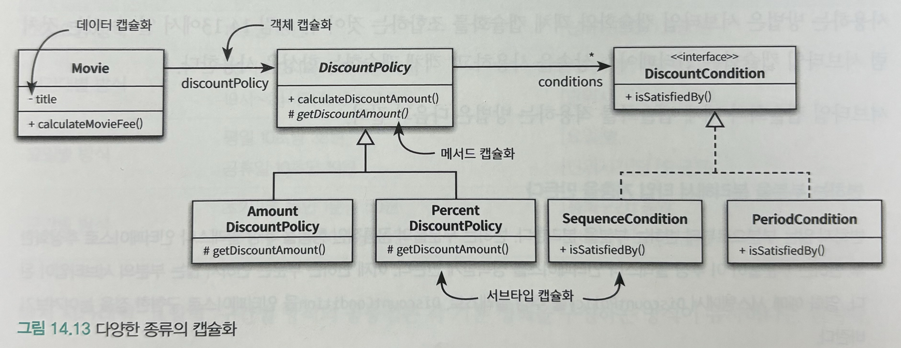

객체는 협력을 위해 존재하고, 협력은 객체가 존재하는 이유와 문맥을 제공한다.

객체지향 설계의 목표는 적절한 책임을 수행하는 객체들의 협력을 기반으로 결합도가 낮고 재사용 가능한 코드 구조를 창조하는 것이다.

객체지향 패러다임의 장점은 설계를 재사용할 수 있다는 것이다.

재사용을 위해서는 객체들의 협력 방식을 일관성 있게 만들어야 한다.

특정한 문제를 `유사한 방법`으로 해결하고 있다는 사실을 알면 문제를 이해하는 것만으로도 코드의 구조를 예상할 수 있게 된다.

대부분의 사람들은 `유사한 요구사항`을 구현하는 코드는 `유사한 방식`으로 구현될 것이라고 예상한다. 하지만 유사한 요구사항이 서로 다른 방식으로 구현돼 있다면 요구사항이 유사하다는 사실 자체도 의심하게 될 것이다.

결론은 유사한 기능을 서로 다른 방식으로 구현 해서는 안 된다는 것이다. `일관성 없는 설계`와 마주한 개발자는 여러 가지 해결 방법 중에서 현재의 요구사항을 해결하기에 가장 적절한 방법을 찾아야 하는 `부담`을 안게 된다.

유사한 기능은 유사한 방식으로 구현해야 한다. 객체 지향에서 기능을 구현하는 유일한 방법은 객체 사이의 `협력`을 만드는 것 뿐이므로 `유지보수` 가능한 시스템을 구축하는 첫걸음은 협력을 일관성 있게 만드는 것이다.

## 핸드폰 과금 시스템 변경하기

고정요금 방식, 시간대별 방식, 요일별 방식의 구현 클래스는 일관성이 없이 제각각 구현되어졌다

비일관성은 두가지 상황에서 발목을 잡는다 하나는 새로운 구현을 추가해야하는 경우, 하나는 기존의 구현을 이해해야 하는 경우다.

새로운 구현을 추가해야하는 경우 발행하는 문제점

- 각 기본 요금 정책은 일관성 없이 구현되어졌고, 새로운 정책이 추가되어도 어떤 방식으로도 구현하는 데는 문제가 없다.
- 하지만, 전체적인 일관성이라는 측면에서는 어떤 방식을 따르더라도 문제가 더 커지게 된다.
- 현재 설계는 새로운 기본 정책을 추가하면 할수록 일관성이 어긋나게 된다.

일관성 없는 코드가 가지는 두번째 문제점은 코드를 이해하기 어렵다는 것이다.

- 요일별 방식의 구현을 이해하면 시간대별 방식을 이해하는게 쉬운가? → 아니다. 서로 다른 구현 방식이 코드를 이해하는데 오히려 방해가 될 뿐이다.

유사한 요구사항을 구현하는 코드는 유사한 방식으로 구현될것이라고 예상하지만 서로 다르게 구현되어있다면, 요구사항이 유사하다는 사실도 의심하게 된다.

- 정말 유사한가? 그런데 왜 다르게 유현되었나? 유사한 요구사항을 구현한 서로 다른 코드 구조를 이해하는데 심리적 장벽이 생긴다.

유사한 기능은 유사한 방식으로 구현해야 한다.

- 객체지향에서 기능을 구현하는 유일한 방법은 객체 사이의 협력을 만드는 것뿐이므로 유지보수 가능한 시스템을 구축하는 첫걸음은 협력을 일관성 있게 만드는 것이다.

## 설계에 일관성 부여하기

협력을 일관성 있게 만들기 위한 기본 치침

- **`변하는 개념을 변하지 않는 개념으로부터 분리하라`.**
- **`변하는 개념을 캡슐화하라.`**

훌륭한 구조를 설계하기 위해 따라야하는 기본원칙이기도 하다.

바뀌는 부분을 따로 뽑아서 캡슐화한다 그러면 나중에 바뀌지 않는 부분에는 영향을 미치지 않은 채로 그 부분만 고치거나 확장할 수 있다.

### 조건 로직 대 객체 탐색

절차지향 프로그램 같이 변경을 처리하는 전통적인 방법은 조건문의 분기를 추가하거나 개별 분기 로직을 수정하는 것이다.

객체지향은 다른 방법이 존재하는데 객체지향에서 변경을 다루는 전통적인 방법은 조건 로직을 객체 사이의 이동으로 바꾸는 것이다.

영화예매 애플리케이션에서 Movie가 DiscountPolicy로 향하는 참조를 통해 메시지를 전달할뿐이며 메시지를 실행할 메서드를 결정하는 것은 메시지를 수신한 객체의 책임이다.

객체지향적인 코드는 조건을 판단하지 않는다. 단지 다음 객체로 이동할 뿐이다.

조건 로직을 객체 사이의 이동으로 대체하기 위해서는 커다란 클래스를 작은 클래스로 분리해야 한다.

그러면 어떤 기준이 좋을까? 가장 중요한 기준은 **변경의 이유와 주기이다**.

클래스는 명확히 하나의 이유에 의해서만 변경되어야 하고, 클래스 안의 모든 코드는 함께 변경 되어야 한다.

- 한마디로 단일 책임 원칙을 따르도록 클래스를 분리해야 한다.

Movie, DiscountPolicy, DiscountCondition 사이의 협력 패턴은 변경을 기준으로 클래스를 분리함으로써  어떻게 일관성 있는 협력을 얻을 수 있는지를 보여준다.

- 이 협력 패턴은 말 그대로 일관성이 있기 때문에 이해하기 쉽다.
- Movie, DiscountPolicy, DiscountCondition 사이의 협력 방식을 이해하면 새로운 할인 정책에 마주치더라도 설계를 쉽게 이해 할 수 있다.

일관성 있는 이 설계는 새로운 할인 정책과 조건을 추가하기도 용이하다.

- 할인 정책은 DiscountPolicy를, 할인 조건은 DiscountCondition을 구현하면 된다는 가이드를 제공하기 때문이다.

### 캡슐화 다시 살펴보기

`캡슐화`란 변하는 어떤 것이든 감추는 것이다. 캡슐화의 가장 대표적인 예는 객체의 `퍼블릭 인터페이스`와 구현을 분리하는 것이다.

다음과 같은 다양한 종류의 캡슐화가 공존한다.

- 데이터 캡슐화 : Movie 클래스의 인스턴스 변수 title의 가시성은 private이기 때문에 외부에서 직접 접근할 수 없다.
- 메서드 캡슐화 : DiscountPolicy 클래스에서 정의되어 있는 getDiscountAmount 메서드의 가시성은 protected이기 때문에 클래스 외부에서는 이 메서드에 직접 접근할 수 없고 클래스 내부와 서브 클래스에서만 접근이 가능하다.
- 객체 캡슐화 : Movie 클래스는 DiscountPolicy 타입의 인스턴스 변수 dicountPolicy를 포함한다. 객체와 객체 사이의 관계를 캡슐화한다. 이는 합성을 의미한다.
- 서브타입 캡슐화 : Movie는 DiscountPolicy에 대해서는 알고 있지만 하위 서브 클래스에 대해서는 알지 못한다. 서브타입 캡슐화는 다형성의 기반이 된다.

변경을 캡슐화할 수 있는 다양한 방법이 있지만 협력을 일관성 있게 만들기 위해 가장 일반적으로 사용하는 방법은 서브타입 캡슐화와 객체 캡슐화를 조합하는 것이다. 두가지 캡슐화를 적용하는 방법은 다음과 같다.

- 변하는 부분을 분리해서 타입 계층을 만든다.
    - 변하지 않는 부분으로부터 변하는 부분을 분리한다.
    - 변하는 부분들의 공통적인 행동을 추상 클래스나 인터페이스로 추상화한 후 변하는 부분들이 이 추상 클래스나 인터페이스를 상속받게 만든다.
- 변하지 않는 부분의 일부로 타입 계층을 합성한다.
    - 앞에서 구현한 타입 계층을 변하지 않는 부분에 합성한다.
    - 변하지 않는 부분에서는 변경되는 구체적인 사항에 결합돼서는 안된다.
    - 의존성 주입과 같이 결합도를 느슨하게 유지할 수 있는 방법을 이용해 오직 추상화에만 의존하게 만든다.

## 일관성 있는 기본 정책 구현

### 변경 분리하기

프로그램에서 변하는 부분과 변하지 않는 부분을 분리한다. 이 예시에서는 조건의 세부 내용이 변화에 해당하고 단위 요금에 해당한다.

### 변경 캡슐화하기

협력을 일관성 있게 만들기 위해서는 변경을 캡슐화해서 파급효과를 줄여야한다. 변경을 캡슐화하는 가장 좋은 방법은 변하지 않는 부분으로부터 변하는 부분을 분리하는 것이다. 물론 변하는 부분의 공통점을 추상화 하는것도 잊지 말아야 한다.

### 협력 패턴 설계하기

이제 객체들의 협력 방식을 고민해보자. 변하는 부분과 변하지 않는 부분을 분리하고, 변하는 부분을 추상화하고나면 각 객체 사이의 협력에 대해 이야기 할 수 있다. 구체적인 사항을 고려하지 않은 협력관계를 설계한다.

### 추상화 수준에서 협력 패턴 구하기

추상화된 객체들만을 사용해 협력패턴을 구현하는 단계다. 적당히 구현된 추상화된 클래스와 인터페이스들은 모두 변하지 않는 추상화에 해당한다. 이 요소들을 조합하면 전체적인 협력 구조가 완성된다. 다시 말해 변하지 않는 요소와 추상적인 요소만으로도 전체적인 협력 구조를 설명할 수 있다는 것이다.

### 구체적인 협력 구현하기

이제 구체적인 서브타입의 기능을 구현하면 된다. 여기서 중요한점은 서브타입을 추가할 때 규칙을 지키는 것보다 어기는 것이 더 어렵다는 점이다. 때문에 전체적으로 일관성있는 설계가 된다.

유사한 기능에 대해 유사한 협력 패턴을 적용하는 것은 객체지향 시스템에서 **개념적 무결성(Conceptual Integrity)**을 유지할 수 있는 가장 효과적인 방법이다.

### 협력 패턴에 맞추기

새로운 기능을 추가할 때 기존의 협력 방식에서 벗어날 수 밖에 없는 경우도 존재한다. 이런 경우에 또 다른 협력 태펀을 적용하기 보다는 가급적 기존의 협력 패턴에 맞추는 것이 가낭 좋은 방법이다.

### 패턴을 찾아라

지금까지 살펴본 것처럼 일관성 있는 협력의 핵심은 변경을 분리하고 캡슐화하는 것이다.

변경을 캡슐화하는 방법이 협력에 참여하는 객체들의 역할과 책임을 결정하고 이렇게 결정된 협력이 코드의 구조를 결정한다.

협력 패턴과 관련해서 가치 있는 두가지 개념이 있다. 하나는 패턴이고 다른 하나는 프레임워크이다.